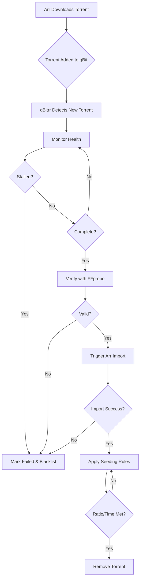

# MkDocs Implementation Plan for qBitrr

## Overview
This document outlines a comprehensive plan to add MkDocs documentation site for qBitrr, including project setup, content structure, deployment strategy, and integration with existing workflows.

---

## Phase 1: MkDocs Setup & Infrastructure

### 1.1 Install MkDocs Dependencies
**Goal:** Add MkDocs and required plugins to the project

**Tasks:**
- [ ] Add to `setup.cfg` under `[options.extras_require]`:
  ```ini
  docs =
      mkdocs>=1.5.3
      mkdocs-material>=9.5.0
      mkdocs-material-extensions>=1.3.0
      mkdocs-git-revision-date-localized-plugin>=1.2.0
      mkdocs-minify-plugin>=0.7.0
      mkdocs-redirects>=1.2.0
      mkdocs-include-markdown-plugin>=6.0.0
      pymdown-extensions>=10.0.0
      markdown-include>=0.8.0
  ```

- [ ] Create `requirements.docs.txt`:
  ```
  mkdocs>=1.5.3
  mkdocs-material>=9.5.0
  mkdocs-material-extensions>=1.3.0
  mkdocs-git-revision-date-localized-plugin>=1.2.0
  mkdocs-minify-plugin>=0.7.0
  mkdocs-redirects>=1.2.0
  mkdocs-include-markdown-plugin>=6.0.0
  pymdown-extensions>=10.0.0
  markdown-include>=0.8.0
  ```

**Why these plugins?**
- `mkdocs-material`: Modern, responsive theme with excellent features
- `git-revision-date-localized`: Shows last update dates on pages
- `minify-plugin`: Compresses HTML/CSS/JS for faster loading
- `redirects`: Handle URL redirects for moved pages
- `include-markdown`: Reuse content across multiple pages
- `pymdown-extensions`: Enhanced markdown features (tabs, admonitions, code blocks)

### 1.2 Create MkDocs Configuration
**Goal:** Set up `mkdocs.yml` with project-specific settings

**Create `mkdocs.yml`:**
```yaml
site_name: qBitrr Documentation
site_description: Intelligent automation for qBittorrent and *Arr apps (Radarr/Sonarr/Lidarr)
site_author: Feramance
site_url: https://feramance.github.io/qBitrr/
repo_name: Feramance/qBitrr
repo_url: https://github.com/Feramance/qBitrr
edit_uri: edit/master/docs/

# Copyright
copyright: Copyright &copy; 2025 Feramance

# Configuration
theme:
  name: material
  language: en
  logo: assets/logov2-clean.svg
  favicon: assets/logov2-clean.svg
  icon:
    repo: fontawesome/brands/github
  palette:
    # Light mode
    - media: "(prefers-color-scheme: light)"
      scheme: default
      primary: deep-orange
      accent: cyan
      toggle:
        icon: material/brightness-7
        name: Switch to dark mode
    # Dark mode
    - media: "(prefers-color-scheme: dark)"
      scheme: slate
      primary: deep-orange
      accent: cyan
      toggle:
        icon: material/brightness-4
        name: Switch to light mode
  features:
    - announce.dismiss
    - content.action.edit
    - content.action.view
    - content.code.annotate
    - content.code.copy
    - content.tooltips
    - navigation.expand
    - navigation.footer
    - navigation.indexes
    - navigation.instant
    - navigation.instant.prefetch
    - navigation.instant.progress
    - navigation.path
    - navigation.sections
    - navigation.tabs
    - navigation.tabs.sticky
    - navigation.top
    - navigation.tracking
    - search.highlight
    - search.share
    - search.suggest
    - toc.follow
    - toc.integrate

# Extensions
markdown_extensions:
  - abbr
  - admonition
  - attr_list
  - def_list
  - footnotes
  - md_in_html
  - tables
  - toc:
      permalink: true
      permalink_title: Anchor link to this section
  - pymdownx.arithmatex:
      generic: true
  - pymdownx.betterem:
      smart_enable: all
  - pymdownx.caret
  - pymdownx.details
  - pymdownx.emoji:
      emoji_index: !!python/name:material.extensions.emoji.twemoji
      emoji_generator: !!python/name:material.extensions.emoji.to_svg
  - pymdownx.highlight:
      anchor_linenums: true
      line_spans: __span
      pygments_lang_class: true
  - pymdownx.inlinehilite
  - pymdownx.keys
  - pymdownx.magiclink:
      normalize_issue_symbols: true
      repo_url_shorthand: true
      user: Feramance
      repo: qBitrr
  - pymdownx.mark
  - pymdownx.smartsymbols
  - pymdownx.snippets:
      auto_append:
        - includes/abbreviations.md
  - pymdownx.superfences:
      custom_fences:
        - name: mermaid
          class: mermaid
          format: !!python/name:pymdownx.superfences.fence_code_format
  - pymdownx.tabbed:
      alternate_style: true
      combine_header_slug: true
      slugify: !!python/object/apply:pymdownx.slugs.slugify
        kwds:
          case: lower
  - pymdownx.tasklist:
      custom_checkbox: true
  - pymdownx.tilde

# Plugins
plugins:
  - search:
      separator: '[\s\-,:!=\[\]()"`/]+|\.(?!\d)|&[lg]t;|(?!\b)(?=[A-Z][a-z])'
  - git-revision-date-localized:
      enable_creation_date: true
      type: timeago
  - minify:
      minify_html: true
      minify_js: true
      minify_css: true
      htmlmin_opts:
        remove_comments: true
  - redirects:
      redirect_maps:
        'old-page.md': 'new-page.md'

# Additional CSS/JS
extra_css:
  - stylesheets/extra.css

extra_javascript:
  - javascripts/extra.js

# Extra
extra:
  version:
    provider: mike
    default: stable
  social:
    - icon: fontawesome/brands/github
      link: https://github.com/Feramance/qBitrr
      name: GitHub Repository
    - icon: fontawesome/brands/docker
      link: https://hub.docker.com/r/feramance/qbitrr
      name: Docker Hub
    - icon: fontawesome/brands/python
      link: https://pypi.org/project/qBitrr2/
      name: PyPI Package
    - icon: fontawesome/brands/patreon
      link: https://patreon.com/qBitrr
      name: Support on Patreon
    - icon: fontawesome/brands/paypal
      link: https://www.paypal.me/feramance
      name: Donate via PayPal
  analytics:
    provider: google
    property: G-XXXXXXXXXX  # Replace with actual GA4 ID when available
  consent:
    title: Cookie consent
    description: >-
      We use cookies to recognize your repeated visits and preferences, as well
      as to measure the effectiveness of our documentation and whether users
      find what they're searching for. With your consent, you're helping us to
      make our documentation better.

# Page tree
nav:
  - Home:
    - index.md
    - Getting Started: getting-started/index.md
    - Features: features/index.md
    - FAQ: faq.md
    - Changelog: changelog.md

  - Getting Started:
    - getting-started/index.md
    - Installation:
      - getting-started/installation/index.md
      - getting-started/installation/docker.md
      - getting-started/installation/pip.md
      - getting-started/installation/systemd.md
      - getting-started/installation/binary.md
    - Quick Start: getting-started/quickstart.md
    - First Run: getting-started/first-run.md
    - Migration Guide: getting-started/migration.md

  - Configuration:
    - configuration/index.md
    - Configuration File: configuration/config-file.md
    - qBittorrent: configuration/qbittorrent.md
    - Arr Instances:
      - configuration/arr/index.md
      - configuration/arr/radarr.md
      - configuration/arr/sonarr.md
      - configuration/arr/lidarr.md
    - Torrent Settings: configuration/torrents.md
    - Search & Requests:
      - configuration/search/index.md
      - configuration/search/overseerr.md
      - configuration/search/ombi.md
    - Quality Profiles: configuration/quality-profiles.md
    - Seeding & Trackers: configuration/seeding.md
    - WebUI: configuration/webui.md
    - Environment Variables: configuration/environment.md

  - Features:
    - features/index.md
    - Torrent Health Monitoring: features/health-monitoring.md
    - Instant Imports: features/instant-imports.md
    - Automated Search: features/automated-search.md
    - Quality Upgrades: features/quality-upgrades.md
    - Request Integration: features/request-integration.md
    - Custom Format Scoring: features/custom-formats.md
    - Disk Space Management: features/disk-space.md
    - Auto Updates: features/auto-updates.md
    - Process Management: features/process-management.md

  - Web UI:
    - webui/index.md
    - Processes View: webui/processes.md
    - Logs View: webui/logs.md
    - Arr Views: webui/arr-views.md
    - Config Editor: webui/config-editor.md
    - API Reference: webui/api.md

  - Advanced:
    - advanced/index.md
    - Architecture: advanced/architecture.md
    - Database Schema: advanced/database.md
    - Event Loops: advanced/event-loops.md
    - FFprobe Integration: advanced/ffprobe.md
    - Multiprocessing: advanced/multiprocessing.md
    - Performance Tuning: advanced/performance.md
    - Custom Trackers: advanced/custom-trackers.md

  - Troubleshooting:
    - troubleshooting/index.md
    - Common Issues: troubleshooting/common-issues.md
    - Debug Logging: troubleshooting/debug-logging.md
    - Database Issues: troubleshooting/database.md
    - Docker Issues: troubleshooting/docker.md
    - Path Mapping: troubleshooting/path-mapping.md
    - Performance Issues: troubleshooting/performance.md

  - Development:
    - development/index.md
    - Contributing: development/contributing.md
    - Code Style: development/code-style.md
    - Testing: development/testing.md
    - Release Process: development/release-process.md
    - WebUI Development: development/webui.md

  - Reference:
    - reference/index.md
    - API Documentation: reference/api.md
    - CLI Reference: reference/cli.md
    - Configuration Schema: reference/config-schema.md
    - Error Codes: reference/error-codes.md
    - Glossary: reference/glossary.md
```

### 1.3 Create Documentation Directory Structure
**Goal:** Organize documentation files logically

**Create directory structure:**
```bash
docs/
├── index.md                           # Home page
├── faq.md                            # Frequently asked questions
├── changelog.md                       # Auto-generated from CHANGELOG.md
├── getting-started/
│   ├── index.md                      # Getting started overview
│   ├── installation/
│   │   ├── index.md                  # Installation overview
│   │   ├── docker.md                 # Docker installation
│   │   ├── pip.md                    # PyPI installation
│   │   ├── systemd.md                # Systemd service setup
│   │   └── binary.md                 # Binary installation
│   ├── quickstart.md                 # Quick start guide
│   ├── first-run.md                  # First run configuration
│   └── migration.md                  # Migration from older versions
├── configuration/
│   ├── index.md                      # Configuration overview
│   ├── config-file.md                # Config file structure
│   ├── qbittorrent.md                # qBittorrent settings
│   ├── arr/
│   │   ├── index.md                  # Arr overview
│   │   ├── radarr.md                 # Radarr configuration
│   │   ├── sonarr.md                 # Sonarr configuration
│   │   └── lidarr.md                 # Lidarr configuration
│   ├── torrents.md                   # Torrent-specific settings
│   ├── search/
│   │   ├── index.md                  # Search overview
│   │   ├── overseerr.md              # Overseerr integration
│   │   └── ombi.md                   # Ombi integration
│   ├── quality-profiles.md           # Quality profile configuration
│   ├── seeding.md                    # Seeding & tracker settings
│   ├── webui.md                      # WebUI configuration
│   └── environment.md                # Environment variables
├── features/
│   ├── index.md                      # Features overview
│   ├── health-monitoring.md          # Torrent health monitoring
│   ├── instant-imports.md            # Instant import functionality
│   ├── automated-search.md           # Automated search
│   ├── quality-upgrades.md           # Quality upgrade searches
│   ├── request-integration.md        # Request system integration
│   ├── custom-formats.md             # Custom format scoring
│   ├── disk-space.md                 # Disk space management
│   ├── auto-updates.md               # Auto-update system
│   └── process-management.md         # Process auto-restart
├── webui/
│   ├── index.md                      # WebUI overview
│   ├── processes.md                  # Processes view
│   ├── logs.md                       # Logs view
│   ├── arr-views.md                  # Radarr/Sonarr/Lidarr views
│   ├── config-editor.md              # Config editor
│   └── api.md                        # API reference
├── advanced/
│   ├── index.md                      # Advanced topics overview
│   ├── architecture.md               # System architecture
│   ├── database.md                   # Database schema
│   ├── event-loops.md                # Event loop design
│   ├── ffprobe.md                    # FFprobe integration
│   ├── multiprocessing.md            # Multiprocessing details
│   ├── performance.md                # Performance tuning
│   └── custom-trackers.md            # Custom tracker configuration
├── troubleshooting/
│   ├── index.md                      # Troubleshooting overview
│   ├── common-issues.md              # Common issues & solutions
│   ├── debug-logging.md              # Enable debug logging
│   ├── database.md                   # Database issues
│   ├── docker.md                     # Docker-specific issues
│   ├── path-mapping.md               # Path mapping issues
│   └── performance.md                # Performance problems
├── development/
│   ├── index.md                      # Development overview
│   ├── contributing.md               # Contributing guide
│   ├── code-style.md                 # Code style guide
│   ├── testing.md                    # Testing guide
│   ├── release-process.md            # Release workflow
│   └── webui.md                      # WebUI development
├── reference/
│   ├── index.md                      # Reference overview
│   ├── api.md                        # REST API reference
│   ├── cli.md                        # CLI reference
│   ├── config-schema.md              # Full config schema
│   ├── error-codes.md                # Error code reference
│   └── glossary.md                   # Glossary of terms
├── assets/                           # Images, diagrams, etc.
│   ├── logov2-clean.svg
│   └── screenshots/
├── includes/                         # Reusable snippets
│   ├── abbreviations.md
│   └── admonitions.md
├── stylesheets/
│   └── extra.css                     # Custom CSS
└── javascripts/
    └── extra.js                      # Custom JavaScript
```

---

## Phase 2: Content Migration & Creation

### 2.1 Migrate Existing Documentation
**Goal:** Convert existing docs to MkDocs format

**Tasks:**
- [ ] **README.md → docs/index.md**
  - Extract overview, features, badges
  - Add hero section with logo
  - Link to detailed pages
  - Keep high-level only

- [ ] **CHANGELOG.md → docs/changelog.md**
  - Add symlink or include directive
  - Style with Material theme

- [ ] **API_DOCUMENTATION.md → docs/reference/api.md**
  - Convert to structured format
  - Add code examples
  - Document all endpoints

- [ ] **SYSTEMD_SERVICE.md → docs/getting-started/installation/systemd.md**
  - Break into sections
  - Add troubleshooting

- [ ] **CONTRIBUTION.md → docs/development/contributing.md**
  - Expand with examples
  - Add development workflow

- [ ] **AGENTS.md → docs/development/code-style.md**
  - Structure for human readers
  - Add examples and rationale

- [ ] **config.example.toml → docs/reference/config-schema.md**
  - Document every option
  - Add examples and use cases

### 2.2 Create New Documentation Pages
**Goal:** Write comprehensive guides for all features

#### High Priority Pages

1. **docs/index.md** (Home Page)
   - Hero section with logo
   - Feature highlights with icons
   - Quick start CTAs
   - Recent updates
   - Community links

2. **docs/getting-started/quickstart.md**
   - 5-minute setup guide
   - Minimal configuration
   - First torrent walkthrough
   - Verification steps

3. **docs/getting-started/installation/docker.md**
   - Prerequisites
   - Docker run command
   - Docker Compose examples
   - Volume mapping best practices
   - Environment variables
   - Health checks
   - Updating containers

4. **docs/configuration/qbittorrent.md**
   - Connection settings
   - Version 4.x vs 5.x differences
   - Authentication
   - SSL/TLS
   - Common errors

5. **docs/configuration/arr/radarr.md**
   - URI and API key setup
   - Category configuration
   - Tag requirements
   - Quality profile selection
   - Custom format setup
   - Import mode options
   - RSS sync configuration

6. **docs/features/health-monitoring.md**
   - How it works (diagrams)
   - Stalled torrent detection
   - MaximumETA calculation
   - Failed torrent handling
   - Blacklisting logic
   - Auto-recheck functionality
   - File verification with FFprobe

7. **docs/features/automated-search.md**
   - Search modes (missing, upgrade, CF)
   - Search limits and throttling
   - Year-based ordering
   - Sonarr: series vs episode search
   - Request prioritization
   - Temporary quality profiles
   - Profile mapping configuration

8. **docs/features/auto-updates.md**
   - How updates work
   - Installation type detection
   - Cron schedule configuration
   - Manual update triggers
   - Version verification
   - Restart mechanism
   - Troubleshooting updates

9. **docs/webui/index.md**
   - Overview of tabs
   - Authentication setup
   - Keyboard shortcuts
   - Dark/light theme
   - Live updates
   - API integration

10. **docs/troubleshooting/common-issues.md**
    - Torrents not processing
    - Imports not triggering
    - Search not finding releases
    - High CPU/memory usage
    - Docker path issues
    - Update failures
    - Each with solution steps

#### Medium Priority Pages

11. **docs/getting-started/first-run.md**
    - Config generation
    - Required vs optional settings
    - Testing connections
    - First download walkthrough
    - Verifying logs

12. **docs/configuration/search/overseerr.md**
    - API key setup
    - 4K vs non-4K configuration
    - Approved vs all requests
    - Request status tracking
    - Troubleshooting

13. **docs/configuration/quality-profiles.md**
    - Profile selection
    - Temporary profiles
    - Profile mapping
    - Auto-reset behavior
    - Custom format scoring

14. **docs/configuration/seeding.md**
    - Global seeding limits
    - Per-tracker settings
    - Ratio vs time vs both
    - Tracker injection
    - Dead tracker cleanup
    - Super seed mode

15. **docs/advanced/architecture.md**
    - System diagram (Mermaid)
    - Process hierarchy
    - Communication flow
    - Database design
    - Event loop architecture

#### Low Priority Pages

16. **docs/advanced/performance.md**
    - Tuning search limits
    - Loop sleep timers
    - Database optimization
    - Log rotation
    - Resource monitoring

17. **docs/reference/cli.md**
    - Command-line arguments
    - Environment variables
    - Exit codes
    - Examples

18. **docs/reference/glossary.md**
    - Arr, CF, ETA, MaxETA, etc.
    - Links to detailed pages

19. **docs/faq.md**
    - Why isn't my torrent being processed?
    - How do I enable debug logging?
    - What's the difference between Move and Copy?
    - Can I use multiple Radarr instances?
    - Does qBitrr support private trackers?

### 2.3 Add Visual Assets
**Goal:** Enhance documentation with diagrams and screenshots

**Tasks:**
- [ ] Create architecture diagram (Mermaid or draw.io)
- [ ] Screenshot all WebUI tabs
- [ ] Create workflow diagrams:
  - Torrent lifecycle
  - Search decision tree
  - Import process flow
  - Auto-update sequence
- [ ] Add icon graphics for features
- [ ] Logo variations for dark/light mode

---

## Phase 3: CI/CD Integration

### 3.1 Add MkDocs Build Workflow
**Goal:** Automatically build and deploy docs on commits

**Create `.github/workflows/docs.yml`:**
```yaml
name: Build and Deploy Documentation

on:
  push:
    branches:
      - master
    paths:
      - 'docs/**'
      - 'mkdocs.yml'
      - '.github/workflows/docs.yml'
  pull_request:
    paths:
      - 'docs/**'
      - 'mkdocs.yml'
  workflow_dispatch:

permissions:
  contents: write
  pages: write
  id-token: write

jobs:
  build:
    name: Build documentation
    runs-on: ubuntu-latest
    steps:
      - name: Checkout repository
        uses: actions/checkout@v6
        with:
          fetch-depth: 0  # Needed for git-revision-date plugin

      - name: Set up Python
        uses: actions/setup-python@v6
        with:
          python-version: '3.12'
          cache: 'pip'

      - name: Install dependencies
        run: |
          python -m pip install --upgrade pip
          pip install -r requirements.docs.txt

      - name: Configure Git
        run: |
          git config user.name "github-actions[bot]"
          git config user.email "github-actions[bot]@users.noreply.github.com"

      - name: Build documentation
        run: mkdocs build --strict --verbose

      - name: Upload artifact
        uses: actions/upload-pages-artifact@v3
        with:
          path: site/

  deploy:
    name: Deploy to GitHub Pages
    needs: build
    if: github.ref == 'refs/heads/master' && github.event_name != 'pull_request'
    runs-on: ubuntu-latest
    environment:
      name: github-pages
      url: ${{ steps.deployment.outputs.page_url }}
    steps:
      - name: Deploy to GitHub Pages
        id: deployment
        uses: actions/deploy-pages@v4

  link-check:
    name: Check documentation links
    runs-on: ubuntu-latest
    steps:
      - name: Checkout repository
        uses: actions/checkout@v6

      - name: Set up Python
        uses: actions/setup-python@v6
        with:
          python-version: '3.12'

      - name: Install dependencies
        run: |
          pip install -r requirements.docs.txt
          pip install linkchecker

      - name: Build docs
        run: mkdocs build

      - name: Check links
        run: linkchecker site/ --check-extern --ignore-url="^https://api.github.com"
```

### 3.2 Add Documentation Version Control
**Goal:** Maintain docs for different versions

**Create `.github/workflows/docs-version.yml`:**
```yaml
name: Version Documentation

on:
  release:
    types: [published]
  workflow_dispatch:
    inputs:
      version:
        description: 'Version to deploy (e.g., 5.5.5)'
        required: true

jobs:
  version-docs:
    name: Deploy versioned documentation
    runs-on: ubuntu-latest
    steps:
      - name: Checkout repository
        uses: actions/checkout@v6
        with:
          fetch-depth: 0

      - name: Set up Python
        uses: actions/setup-python@v6
        with:
          python-version: '3.12'

      - name: Install dependencies
        run: |
          pip install -r requirements.docs.txt
          pip install mike

      - name: Configure Git
        run: |
          git config user.name "github-actions[bot]"
          git config user.email "github-actions[bot]@users.noreply.github.com"

      - name: Deploy version
        env:
          VERSION: ${{ github.event.inputs.version || github.event.release.tag_name }}
        run: |
          VERSION_NUM=${VERSION#v}  # Remove 'v' prefix
          mike deploy --push --update-aliases "${VERSION_NUM}" latest
          mike set-default --push latest
```

### 3.3 Update Release Workflow
**Goal:** Build docs as part of release process

**Add to `.github/workflows/release.yml`:**
```yaml
  build_docs:
    name: Build and publish documentation
    runs-on: ubuntu-latest
    needs:
      - prepare_release
    if: needs.prepare_release.result == 'success'
    steps:
      - uses: actions/checkout@v6
        with:
          fetch-depth: 0
          ref: master

      - name: Set up Python
        uses: actions/setup-python@v6
        with:
          python-version: '3.12'

      - name: Install dependencies
        run: |
          pip install -r requirements.docs.txt
          pip install mike

      - name: Configure Git
        run: |
          git config user.name "github-actions[bot]"
          git config user.email "github-actions[bot]@users.noreply.github.com"

      - name: Deploy documentation
        env:
          VERSION: ${{ needs.prepare_release.outputs.new_version }}
        run: |
          mike deploy --push --update-aliases "${VERSION}" latest
          mike set-default --push latest
```

---

## Phase 4: Enhancements & Polish

### 4.1 Add Search Functionality
**Goal:** Implement powerful search

- MkDocs Material search is excellent out-of-the-box
- Consider adding Algolia DocSearch for even better results
- Add search keywords/synonyms in frontmatter

### 4.2 Add Code Examples
**Goal:** Interactive code samples

**Example structure:**
````markdown
=== "Docker"

    ```bash
    docker run -d \
      --name qbitrr \
      -p 6969:6969 \
      -v /path/to/config:/config \
      feramance/qbitrr:latest
    ```

=== "Docker Compose"

    ```yaml
    services:
      qbitrr:
        image: feramance/qbitrr:latest
        container_name: qbitrr
        ports:
          - "6969:6969"
        volumes:
          - /path/to/config:/config
    ```

=== "pip"

    ```bash
    pip install qBitrr2
    qbitrr
    ```
````

### 4.3 Add Diagrams
**Goal:** Visual explanations using Mermaid

**Example: Torrent Lifecycle**


### 4.4 Add Admonitions
**Goal:** Highlight important information

**Types:**
```markdown
!!! note "Configuration Note"
    This setting requires qBittorrent 5.x or later.

!!! warning "Docker Users"
    Ensure your volume mounts match between qBittorrent, Arr, and qBitrr.

!!! danger "Data Loss Warning"
    Setting `AutoDelete = true` will permanently delete files!

!!! tip "Pro Tip"
    Use `SearchByYear = true` to prioritize recent releases.

!!! example "Example Configuration"
    ```toml
    [Radarr-Movies.Torrent]
    MaximumETA = 604800  # 7 days
    ```
```

### 4.5 Add Page Metadata
**Goal:** SEO and social sharing

**Frontmatter template:**
```markdown
---
title: Torrent Health Monitoring
description: Learn how qBitrr monitors torrent health and handles failures
icon: material/heart-pulse
status: new
tags:
  - features
  - monitoring
  - torrents
---
```

### 4.6 Custom CSS/JS
**Goal:** Brand consistency

**`docs/stylesheets/extra.css`:**
```css
:root {
  --md-primary-fg-color: #ff6600;
  --md-accent-fg-color: #00d9ff;
}

.md-header__title {
  display: flex;
  align-items: center;
}

.md-header__title img {
  height: 32px;
  margin-right: 8px;
}

.feature-grid {
  display: grid;
  grid-template-columns: repeat(auto-fit, minmax(280px, 1fr));
  gap: 1rem;
  margin: 2rem 0;
}

.feature-card {
  border: 1px solid var(--md-default-fg-color--lightest);
  border-radius: 8px;
  padding: 1.5rem;
  transition: transform 0.2s;
}

.feature-card:hover {
  transform: translateY(-4px);
  box-shadow: 0 4px 12px rgba(0, 0, 0, 0.1);
}
```

---

## Phase 5: Testing & Quality Assurance

### 5.1 Documentation Testing Checklist
- [ ] All internal links work
- [ ] All external links work
- [ ] Code examples are syntactically correct
- [ ] Screenshots are current (match latest version)
- [ ] Search returns relevant results
- [ ] Mobile responsiveness
- [ ] Dark/light mode works
- [ ] Print-friendly pages
- [ ] Accessibility (WCAG 2.1 AA)

### 5.2 User Testing
- [ ] New users can follow quickstart
- [ ] Docker users can deploy successfully
- [ ] Advanced users can find detailed info
- [ ] Troubleshooting guides resolve issues

### 5.3 Automated Checks
- [ ] Spell check (pyspelling)
- [ ] Link checker (linkchecker)
- [ ] Markdown linting (markdownlint)
- [ ] Vale prose linter

---

## Phase 6: Launch & Promotion

### 6.1 Pre-Launch Tasks
- [ ] Complete all high-priority pages
- [ ] Review and edit for consistency
- [ ] Add search analytics
- [ ] Test on multiple browsers
- [ ] Set up redirects from old docs

### 6.2 Launch Announcement
- [ ] Update README.md with docs link
- [ ] Add docs badge to README
- [ ] Announce in GitHub Discussions
- [ ] Update Docker Hub description
- [ ] Update PyPI description
- [ ] Social media posts (if applicable)

### 6.3 Post-Launch Maintenance
- [ ] Monitor search queries for gaps
- [ ] Collect user feedback
- [ ] Update docs with each release
- [ ] Keep screenshots current
- [ ] Address broken links promptly

---

## Implementation Timeline

### Week 1-2: Setup & Infrastructure
- Install MkDocs and dependencies
- Create directory structure
- Configure mkdocs.yml
- Set up CI/CD workflows
- Migrate existing docs

### Week 3-4: Core Content
- Write getting-started guides
- Document installation methods
- Create configuration guides
- Write feature documentation
- Add troubleshooting guides

### Week 5-6: Advanced Content
- Document architecture
- Create reference pages
- Write development guides
- Add visual assets
- Create diagrams

### Week 7-8: Polish & Testing
- Add code examples
- Enhance with admonitions
- Test all links
- Review for consistency
- User testing
- Fix issues

### Week 9: Launch
- Final review
- Deploy to production
- Announce to users
- Monitor feedback
- Iterate based on input

---

## Makefile Targets

**Add to `Makefile`:**
```makefile
.PHONY: docs-install docs-serve docs-build docs-deploy docs-clean

# Install documentation dependencies
docs-install:
	pip install -r requirements.docs.txt

# Serve documentation locally with hot reload
docs-serve:
	mkdocs serve --dev-addr 127.0.0.1:8000

# Build documentation site
docs-build:
	mkdocs build --strict

# Deploy documentation to GitHub Pages
docs-deploy:
	mkdocs gh-deploy --force

# Clean documentation build artifacts
docs-clean:
	rm -rf site/

# Check documentation links
docs-check:
	mkdocs build --strict
	linkchecker site/
```

**Usage:**
```bash
make docs-install   # First time setup
make docs-serve     # Local development
make docs-build     # Test build
make docs-deploy    # Publish to GitHub Pages
```

---

## Benefits of This Plan

### For Users
✅ Single source of truth for all documentation
✅ Searchable, indexed content
✅ Version-specific documentation
✅ Mobile-friendly reading experience
✅ Dark/light mode support
✅ Clear examples and diagrams
✅ Easy-to-find troubleshooting guides

### For Developers
✅ Markdown-based (easy to edit)
✅ Version-controlled with Git
✅ Automated builds and deployment
✅ Reusable content snippets
✅ Link checking prevents broken docs
✅ Integrates with GitHub workflow

### For Project Maintainers
✅ Professional appearance
✅ SEO-optimized pages
✅ Analytics for user behavior
✅ Reduced support burden
✅ Easier onboarding for contributors
✅ Improved project visibility

---

## Next Steps

1. **Review this plan** with project maintainers
2. **Prioritize sections** based on user needs
3. **Assign tasks** if working with a team
4. **Set milestones** for each phase
5. **Start with Phase 1** (setup) immediately
6. **Iterate based on feedback**

---

## Resources

- [MkDocs Documentation](https://www.mkdocs.org/)
- [Material for MkDocs](https://squidfunk.github.io/mkdocs-material/)
- [Mermaid Diagrams](https://mermaid.js.org/)
- [GitHub Pages](https://pages.github.com/)
- [Mike (versioning)](https://github.com/jimporter/mike)

---

**Last Updated:** 2025-11-25
**Plan Version:** 1.0
**Status:** Ready for Implementation
