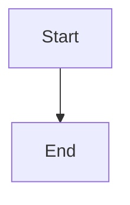

# MkDocs Setup Complete ✅

The MkDocs documentation infrastructure for qBitrr has been successfully set up!

## What's Been Installed

### Core Files
- ✅ `mkdocs.yml` - Main configuration file
- ✅ `requirements.docs.txt` - Documentation dependencies
- ✅ `.github/workflows/docs.yml` - Automated deployment workflow
- ✅ `docs/` - Complete directory structure

### Documentation Dependencies
All installed in your virtual environment:
- mkdocs 1.6.1
- mkdocs-material 9.7.0 (theme)
- mkdocs-material-extensions
- mkdocs-git-revision-date-localized-plugin
- mkdocs-minify-plugin
- mkdocs-redirects
- mkdocs-include-markdown-plugin
- pymdown-extensions
- markdown-include

### Created Documentation Pages
- `docs/index.md` - Beautiful home page with features
- `docs/faq.md` - Comprehensive FAQ (40+ questions)
- `docs/getting-started/index.md` - Installation overview
- `docs/getting-started/quickstart.md` - 5-minute setup guide
- `docs/changelog.md` - Symlinked to CHANGELOG.md
- Plus placeholder index files for all sections

### Makefile Targets
- `make docs-install` - Install dependencies
- `make docs-serve` - Local development server
- `make docs-build` - Build static site
- `make docs-deploy` - Deploy to GitHub Pages
- `make docs-clean` - Clean build artifacts
- `make docs-check` - Check links

## How to Use

### Local Development

1. **Start the development server:**
   ```bash
   make docs-serve
   ```
   Then open http://127.0.0.1:8000/qBitrr/ in your browser

2. **Edit markdown files** in `docs/` - changes appear immediately

3. **Build for testing:**
   ```bash
   make docs-build
   ```

### Deployment

#### Automatic (Recommended)
The documentation will automatically deploy to GitHub Pages when you:
1. Push changes to `docs/`, `mkdocs.yml`, or `.github/workflows/docs.yml`
2. Merge a pull request affecting these files
3. The workflow runs and deploys to https://feramance.github.io/qBitrr/

#### Manual
```bash
make docs-deploy
```

## GitHub Pages Setup

To enable the documentation site:

1. Go to your GitHub repository: https://github.com/Feramance/qBitrr
2. Click **Settings** → **Pages**
3. Under "Build and deployment":
   - Source: **GitHub Actions**
4. The docs will deploy automatically on next push!

## What's Next?

### High Priority Pages to Create

These pages are referenced in the nav but don't exist yet:

1. **Installation Guides**
   - `docs/getting-started/installation/docker.md`
   - `docs/getting-started/installation/pip.md`
   - `docs/getting-started/installation/systemd.md`
   - `docs/getting-started/installation/binary.md`

2. **Configuration Pages**
   - `docs/configuration/qbittorrent.md`
   - `docs/configuration/arr/radarr.md`
   - `docs/configuration/arr/sonarr.md`
   - `docs/configuration/arr/lidarr.md`
   - `docs/configuration/seeding.md`

3. **Feature Documentation**
   - `docs/features/health-monitoring.md`
   - `docs/features/automated-search.md`
   - `docs/features/instant-imports.md`

4. **Troubleshooting**
   - `docs/troubleshooting/common-issues.md`
   - `docs/troubleshooting/docker.md`
   - `docs/troubleshooting/path-mapping.md`

### Content to Migrate

Existing docs that can be moved/adapted:
- `API_DOCUMENTATION.md` → `docs/reference/api.md`
- `SYSTEMD_SERVICE.md` → `docs/getting-started/installation/systemd.md`
- `CONTRIBUTION.md` → `docs/development/contributing.md`
- `AGENTS.md` → `docs/development/code-style.md`

### Visual Assets

Add to `docs/assets/screenshots/`:
- WebUI screenshots (Processes, Logs, Arr Views, Config Editor)
- Configuration examples
- Installation steps

## Documentation Features

### Available Markdown Extensions

The following special features are available:

#### Tabs
```markdown
=== "Docker"
    Docker instructions...

=== "pip"
    pip instructions...
```

#### Admonitions
```markdown
!!! note "Title"
    Note content

!!! warning
    Warning content

!!! tip
    Tip content

!!! danger
    Danger content
```

#### Keyboard Keys
```markdown
Press ++ctrl+c++ to stop
```

#### Diagrams (Mermaid)
````markdown

````

#### Code Highlighting
````markdown
```python
def hello():
    print("Hello, world!")
```
````

#### Abbreviations
Automatically applied from `docs/includes/abbreviations.md`:
- Arr, CF, ETA, MaxETA, FFprobe, RSS, API, etc.

## Customization

### Theme Colors
Edit in `mkdocs.yml`:
```yaml
theme:
  palette:
    primary: deep-orange  # Change to your preference
    accent: cyan
```

### Custom CSS
Add styles to `docs/stylesheets/extra.css`

### Custom JavaScript
Add scripts to `docs/javascripts/extra.js`

### Logo
Replace `docs/assets/logov2-clean.svg` with your logo

## Building for Production

Before deploying:

1. **Test the build:**
   ```bash
   make docs-build
   ```

2. **Check for broken links:**
   ```bash
   make docs-check
   ```

3. **Preview the built site:**
   ```bash
   cd site && python -m http.server 8000
   ```

## Troubleshooting

### "Module not found" error
```bash
make docs-install
# or
./.venv/bin/python -m pip install -r requirements.docs.txt
```

### Warnings about missing pages
These are expected - create the pages or remove them from `nav:` in `mkdocs.yml`

### Git revision date warnings
These will disappear once files are committed to git

### Port already in use
Change the port in `make docs-serve` or use:
```bash
mkdocs serve --dev-addr 127.0.0.1:8001
```

## Resources

- [MkDocs Documentation](https://www.mkdocs.org/)
- [Material for MkDocs](https://squidfunk.github.io/mkdocs-material/)
- [Material Icons](https://squidfunk.github.io/mkdocs-material/reference/icons-emojis/)
- [Mermaid Diagrams](https://mermaid.js.org/)
- [PyMdown Extensions](https://facelessuser.github.io/pymdown-extensions/)

## Summary

🎉 **You're all set!** The documentation infrastructure is complete and ready to use.

To get started:
```bash
make docs-serve
```

Then open http://127.0.0.1:8000/qBitrr/ and start writing!

---

**Questions?** See `docs/README.md` or the [MkDocs documentation](https://www.mkdocs.org/).
