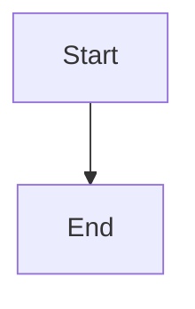

# qBitrr Documentation

This directory contains the source files for the qBitrr documentation site built with MkDocs Material.

## Documentation Structure

```
docs/
├── index.md                    # Home page
├── faq.md                     # Frequently Asked Questions
├── changelog.md               # Symlink to ../CHANGELOG.md
├── getting-started/           # Getting started guides
│   ├── index.md
│   ├── quickstart.md
│   └── installation/
├── configuration/             # Configuration guides
│   ├── index.md
│   ├── arr/
│   └── search/
├── features/                  # Feature documentation
├── webui/                     # Web UI documentation
├── advanced/                  # Advanced topics
├── troubleshooting/           # Troubleshooting guides
├── development/               # Development guides
├── reference/                 # API and reference docs
├── assets/                    # Images and static files
├── includes/                  # Reusable snippets
│   └── abbreviations.md
├── stylesheets/               # Custom CSS
│   └── extra.css
└── javascripts/               # Custom JavaScript
    └── extra.js
```

## Local Development

### Prerequisites

Install documentation dependencies:

```bash
make docs-install
# or
pip install -r requirements.docs.txt
```

### Serve Locally

Start the development server with hot reload:

```bash
make docs-serve
# or
mkdocs serve
```

Then open http://127.0.0.1:8000 in your browser.

### Build Documentation

Build the static site:

```bash
make docs-build
# or
mkdocs build
```

Output will be in the `site/` directory.

### Check Links

Verify all links are working:

```bash
make docs-check
```

## Deployment

Documentation is automatically deployed to GitHub Pages when changes are pushed to the `master` branch.

### Manual Deployment

To manually deploy:

```bash
make docs-deploy
# or
mkdocs gh-deploy --force
```

## Writing Documentation

### Page Front Matter

Add metadata to pages for better SEO:

```markdown
---
title: Page Title
description: Brief description
icon: material/icon-name
status: new  # or deprecated, experimental
tags:
  - feature
  - configuration
---
```

### Using Abbreviations

Abbreviations are automatically applied from `includes/abbreviations.md`. When you use terms like "Arr", "CF", "ETA", etc., they will have hover tooltips.

### Code Blocks with Tabs

Use tabs for multiple examples:

````markdown
=== "Docker"

    ```bash
    docker run ...
    ```

=== "pip"

    ```bash
    pip install ...
    ```
````

### Admonitions

Highlight important information:

```markdown
!!! note "Optional Title"
    Note content here

!!! warning
    Warning content here

!!! tip
    Tip content here

!!! danger
    Danger content here
```

### Diagrams

Use Mermaid for diagrams:

````markdown

````

## Style Guide

- Use clear, concise language
- Write in second person ("you") for tutorials
- Use present tense
- Include code examples for all features
- Add screenshots for UI features
- Link to related pages
- Keep paragraphs short (3-5 sentences)
- Use lists for steps and options

## Contributing

1. Create a new branch for your documentation changes
2. Edit or create markdown files in `docs/`
3. Test locally with `make docs-serve`
4. Submit a pull request

The documentation will be reviewed and automatically deployed once merged.

## Resources

- [MkDocs Documentation](https://www.mkdocs.org/)
- [Material for MkDocs](https://squidfunk.github.io/mkdocs-material/)
- [Markdown Guide](https://www.markdownguide.org/)
- [Mermaid Diagrams](https://mermaid.js.org/)

## Questions?

- Open an issue: https://github.com/Feramance/qBitrr/issues
- Start a discussion: https://github.com/Feramance/qBitrr/discussions
