# Architecture

Detailed overview of qBitrr's system architecture and design patterns.

## System Design

qBitrr uses a multi-process architecture designed for reliability, scalability, and isolation:

```mermaid
graph TB
    Main["🎛️ Main Process<br/>(qBitrr/main.py)"]

    Main -->|spawns| WebUI["🌐 WebUI Process<br/>(qBitrr/webui.py)"]
    Main -->|spawns| Radarr["📽️ Arr Manager<br/>(Radarr-4K)"]
    Main -->|spawns| Sonarr["📺 Arr Manager<br/>(Sonarr-TV)"]
    Main -->|spawns| Lidarr["🎵 Arr Manager<br/>(Lidarr-Music)"]

    WebUI -->|API calls| QBT["⚙️ qBittorrent<br/>(Torrent Client)"]
    Radarr -->|API calls| QBT
    Sonarr -->|API calls| QBT
    Lidarr -->|API calls| QBT

    Radarr -->|API calls| RadarrAPI["📡 Radarr API"]
    Sonarr -->|API calls| SonarrAPI["📡 Sonarr API"]
    Lidarr -->|API calls| LidarrAPI["📡 Lidarr API"]

    WebUI -.->|reads| DB[(🗄️ SQLite<br/>Database)]
    Radarr -.->|writes| DB
    Sonarr -.->|writes| DB
    Lidarr -.->|writes| DB

    subgraph "Main Process Responsibilities"
        M1["✅ Orchestrate worker processes"]
        M2["✅ Manage lifecycle (start/stop/restart)"]
        M3["✅ Monitor child process health"]
        M4["✅ Handle graceful shutdown"]
    end

    subgraph "WebUI Process Responsibilities"
        W1["✅ Flask REST API (/api/*)"]
        W2["✅ React SPA (Vite build)"]
        W3["✅ Token authentication"]
        W4["✅ Real-time log streaming"]
    end

    subgraph "Arr Manager Responsibilities"
        A1["✅ Independent event loop"]
        A2["✅ Health monitoring"]
        A3["✅ Import triggering"]
        A4["✅ Blacklist management"]
    end

    style Main fill:#4dabf7,stroke:#1971c2,color:#000
    style WebUI fill:#51cf66,stroke:#2f9e44,color:#000
    style Radarr fill:#ffa94d,stroke:#fd7e14,color:#000
    style Sonarr fill:#ffa94d,stroke:#fd7e14,color:#000
    style Lidarr fill:#ffa94d,stroke:#fd7e14,color:#000
    style QBT fill:#e599f7,stroke:#ae3ec9,color:#000
    style DB fill:#74c0fc,stroke:#1c7ed6,color:#000
```



**Key Architecture Principles:**

- **Process Isolation**: Each Arr instance runs independently - one crash doesn't affect others
- **Fault Tolerance**: Main process monitors and restarts failed child processes
- **Scalability**: CPU-bound work parallelized across cores (one process per Arr)
- **Simplicity**: No complex IPC - communication via SQLite and external APIs

### Core Processes

#### Main Process
**File:** `qBitrr/main.py`

Responsibilities:
- Initializes configuration and logging
- Spawns WebUI and Arr manager processes using `pathos.multiprocessing`
- Monitors child process health and restarts on failure
- Handles SIGTERM, SIGINT for graceful shutdown
- Coordinates cross-process communication via shared queue

#### WebUI Process
**File:** `qBitrr/webui.py`

Responsibilities:
- Serves Flask REST API on `/api/*` routes
- Hosts React SPA from `qBitrr/static/`
- Provides token-based authentication for API endpoints
- Streams logs in real-time via WebSocket (planned)
- Exposes health check endpoint for monitoring

#### Arr Manager Processes
**File:** `qBitrr/arss.py`

Each configured Arr instance (Radarr/Sonarr/Lidarr) runs in an isolated process:

Responsibilities:
- Runs independent event loop checking qBittorrent every N seconds
- Queries Arr API for media information
- Performs health checks on torrents
- Triggers imports when torrents complete
- Manages blacklisting and re-searching
- Tracks state in SQLite database

### Background Threads

#### Auto-Update Monitor
**File:** `qBitrr/auto_update.py`

- Runs in main process as daemon thread
- Checks GitHub releases for new versions
- Downloads and validates release packages
- Triggers restart when update is available
- Configurable update channel (stable/nightly)

#### Network Monitor
**File:** `qBitrr/main.py`

- Monitors connectivity to qBittorrent and Arr instances
- Retries connections with exponential backoff
- Logs connection state changes
- Triggers process restart on persistent failures

#### FFprobe Downloader
**File:** `qBitrr/ffprobe.py`

- Downloads ffprobe binary if not found
- Validates media files before import
- Runs in background to avoid blocking operations
- Caches results to reduce repeated checks

## Data Flow

### Torrent Processing Pipeline

```mermaid
sequenceDiagram
    participant QBT as ⚙️ qBittorrent
    participant AM as 📡 Arr Manager
    participant DB as 🗄️ Database
    participant ARR as 🎬 Arr API

    Note over AM: Every N seconds (CheckInterval)

    rect rgb(230, 245, 255)
        Note right of AM: 1. Detection Phase
        AM->>QBT: GET /api/v2/torrents/info?category=radarr-4k
        QBT-->>AM: List of torrents with tags
        AM->>AM: Filter by configured categories
    end

    rect rgb(211, 249, 216)
        Note right of AM: 2. Classification Phase
        AM->>DB: SELECT * FROM downloads WHERE hash IN (...)
        DB-->>AM: Tracked torrents
        AM->>AM: Determine state:<br/>downloading, stalled,<br/>completed, seeding
    end

    rect rgb(255, 243, 191)
        Note right of AM: 3. Health Check Phase
        AM->>QBT: GET torrent details (ETA, stall time, trackers)
        QBT-->>AM: Torrent health data
        AM->>AM: Check ETA vs MaxETA<br/>Check stall time vs StallTimeout<br/>Verify tracker status
    end

    rect rgb(255, 230, 230)
        Note right of AM: 4. Action Decision Phase
        alt Completed + Valid
            AM->>ARR: POST /api/v3/command (DownloadedMoviesScan)
            ARR-->>AM: Import queued
            Note over AM: ✅ Import triggered
        else Failed Health Check
            AM->>ARR: POST /api/v3/queue/blacklist (hash)
            ARR-->>AM: Blacklisted
            AM->>QBT: DELETE /api/v2/torrents/delete
            Note over AM: ❌ Blacklisted & deleted
        else Blacklisted Item
            AM->>ARR: POST /api/v3/command (MoviesSearch)
            ARR-->>AM: Search queued
            Note over AM: 🔍 Re-search triggered
        else Seeded Enough
            AM->>QBT: DELETE /api/v2/torrents/delete
            Note over AM: 🗑️ Cleaned up
        end
    end

    rect rgb(243, 232, 255)
        Note right of AM: 5. State Update Phase
        AM->>DB: UPDATE downloads SET state=?, updated_at=?
        AM->>DB: INSERT INTO expiry (entry_id, expires_at)
        DB-->>AM: State persisted
        Note over AM: 💾 Audit trail updated
    end
```



**Pipeline Stages:**

1. **Detection** - Poll qBittorrent for torrents matching configured categories/tags
2. **Classification** - Query database to determine tracking state and history
3. **Health Check** - Evaluate torrent health against configured thresholds
4. **Action Decision** - Choose appropriate action (import/blacklist/re-search/cleanup)
5. **State Update** - Persist state changes and actions to database for audit trail

### Configuration Flow

```mermaid
flowchart TD
    Start([🚀 Application Start])

    Start --> LoadTOML["📄 Load TOML File<br/>(config.toml)"]

    LoadTOML --> ParseTOML["🔍 Parse with tomli<br/>(config.py:MyConfig)"]

    ParseTOML --> CheckVersion{Config version<br/>matches?}

    CheckVersion -->|No| Migrate["⚙️ Apply Migrations<br/>(apply_config_migrations)"]
    CheckVersion -->|Yes| EnvVars

    Migrate --> EnvVars["🌍 Environment Override<br/>(env_config.py)"]

    EnvVars --> CheckEnv{QBITRR_*<br/>env vars?}

    CheckEnv -->|Yes| Override["✏️ Override TOML values<br/>(useful for Docker)"]
    CheckEnv -->|No| Validate

    Override --> Validate["✅ Validation<br/>(validate_config)"]

    Validate --> CheckRequired{Required<br/>fields present?}

    CheckRequired -->|No| Error["❌ Error: Missing Config<br/>(RequireConfigValue)"]
    CheckRequired -->|Yes| TestConn["🔌 Test Connections<br/>(qBittorrent, Arr APIs)"]

    TestConn --> ConnOK{Connections<br/>successful?}

    ConnOK -->|No| Warn["⚠️ Warning: Connection Failed<br/>(will retry at runtime)"]
    ConnOK -->|Yes| Singleton

    Warn --> Singleton["📦 Create CONFIG Singleton<br/>(global instance)"]

    Singleton --> MainProc["🎛️ Main Process<br/>(loads once)"]

    MainProc --> SpawnWebUI["Spawn → 🌐 WebUI Process<br/>(copies config)"]
    MainProc --> SpawnArr1["Spawn → 📡 Arr Manager 1<br/>(copies config)"]
    MainProc --> SpawnArr2["Spawn → 📡 Arr Manager 2<br/>(copies config)"]

    SpawnWebUI --> Runtime["⚡ Runtime<br/>(all processes share config)"]
    SpawnArr1 --> Runtime
    SpawnArr2 --> Runtime

    Error --> End([💥 Exit])
    Runtime --> End2([✅ Running])

    style Start fill:#dee2e6,stroke:#495057,color:#000
    style LoadTOML fill:#e7f5ff,stroke:#1971c2,color:#000
    style Migrate fill:#fff3bf,stroke:#fab005,color:#000
    style Override fill:#d3f9d8,stroke:#2f9e44,color:#000
    style Validate fill:#e7f5ff,stroke:#1971c2,color:#000
    style Error fill:#ffe3e3,stroke:#c92a2a,color:#000
    style Warn fill:#fff3bf,stroke:#fab005,color:#000
    style Singleton fill:#f3f0ff,stroke:#7950f2,color:#000
    style Runtime fill:#d3f9d8,stroke:#2f9e44,color:#000
```



**Configuration Precedence (highest to lowest):**

1. **Environment Variables** (`QBITRR_*`) - Highest priority
2. **TOML File** (`config.toml`) - Standard configuration
3. **Defaults** (in `gen_config.py`) - Fallback values

**Key Files:**

- `qBitrr/config.py` - Config parsing, validation, migrations
- `qBitrr/env_config.py` - Environment variable overrides
- `qBitrr/gen_config.py` - Default values and config generation

### API Request Flow

```mermaid
sequenceDiagram
    participant Client as 💻 Client<br/>(React App/API)
    participant Auth as 🔐 Auth Middleware
    participant Flask as 🌐 Flask API
    participant Logic as ⚙️ Backend Logic
    participant DB as 🗄️ Database
    participant ARR as 📡 Arr APIs

    Client->>Flask: HTTP Request<br/>GET /api/v1/processes

    rect rgb(255, 243, 191)
        Note right of Flask: Authentication Phase
        Flask->>Auth: Check X-API-Token header

        alt Token Valid
            Auth-->>Flask: ✅ Authenticated
        else Token Missing/Invalid
            Auth-->>Client: ❌ 401 Unauthorized
            Note over Client: Request rejected
        end
    end

    rect rgb(230, 245, 255)
        Note right of Flask: Request Processing Phase
        Flask->>Logic: Route to handler<br/>(e.g., get_processes())

        alt Read Operation
            Logic->>DB: SELECT * FROM downloads
            DB-->>Logic: Query results
        else Write Operation
            Logic->>DB: INSERT/UPDATE/DELETE
            DB-->>Logic: Rows affected
        else External Query
            Logic->>ARR: GET /api/v3/movie/123
            ARR-->>Logic: Movie metadata
        end
    end

    rect rgb(211, 249, 216)
        Note right of Flask: Response Phase
        Logic-->>Flask: Processed data
        Flask->>Flask: Serialize to JSON
        Flask-->>Client: 200 OK<br/>{ "data": [...] }
    end
```



**API Endpoints:**

- `/api/v1/processes` - List all Arr manager processes and their states
- `/api/v1/logs` - Stream logs in real-time
- `/api/v1/config` - Read/update configuration
- `/api/v1/downloads` - Query download history
- `/api/v1/searches` - Query search history

**Authentication:**

All `/api/*` endpoints require `X-API-Token` header matching `Settings.WebUIToken` from config.toml

## Component Interactions

### Multiprocessing Architecture

qBitrr uses `pathos.multiprocessing` for cross-platform compatibility:

**Why pathos instead of stdlib multiprocessing?**
- Better Windows support (no fork())
- Dill-based serialization (more flexible than pickle)
- Process pool management with restart capabilities

**Process Communication:**
- Each Arr manager is **isolated** - no shared memory between managers
- WebUI reads database directly for stats (no IPC needed)
- Logging uses thread-safe file handlers with `db_lock.py`

**Benefits:**
- **Fault Isolation** - One Arr instance crash doesn't affect others
- **Scalability** - CPU-bound work parallelized across cores
- **Simplicity** - No complex IPC protocols needed

### Database Architecture

**File:** `qBitrr/tables.py`

qBitrr uses **Peewee ORM** with **SQLite**:

#### Schema


**Table Descriptions:**

<div class="grid cards" markdown>

- :material-download:{ .lg .middle style="color: #4dabf7" } **DownloadsModel**

    ---

    Tracks all torrents qBitrr is managing

    - **Primary Key:** `hash` (torrent hash)
    - **Purpose:** Audit trail, state persistence
    - **Lifecycle:** Created when torrent detected → Updated during health checks → Deleted after expiry
    - **Indexes:** `(arr_type, arr_name, media_id)` for lookups

- :material-magnify:{ .lg .middle style="color: #51cf66" } **SearchModel**

    ---

    Records all automated searches qBitrr performs

    - **Primary Key:** `id` (auto-increment)
    - **Purpose:** Search history, debugging, analytics
    - **Lifecycle:** Created on search → Never updated → Auto-cleaned after 30 days
    - **Indexes:** `(arr_type, media_id, searched_at)` for deduplication

- :material-clock-alert:{ .lg .middle style="color: #ffa94d" } **EntryExpiry**

    ---

    Schedules cleanup of completed/failed downloads

    - **Primary Key:** `entry_id` (composite FK)
    - **Purpose:** Delayed cleanup, seeding time enforcement
    - **Lifecycle:** Created after import → Checked every loop → Deletes parent download
    - **Indexes:** `expires_at` for efficient cleanup queries

</div>

#### Locking Strategy

**File:** `qBitrr/db_lock.py`

All database access uses context manager:

```python
with locked_database():
    # Acquire exclusive lock
    DownloadsModel.create(...)
    # Released on exit
```

**Why locks are needed:**
- Multiple Arr manager processes write concurrently
- SQLite doesn't handle concurrent writes well by default
- Lock ensures ACID properties maintained

#### Migration Strategy

**File:** `qBitrr/config.py:apply_config_migrations()`

When schema changes:
1. Bump `CURRENT_CONFIG_VERSION` constant
2. Add migration logic to detect old version
3. Apply ALTER TABLE / data transformations
4. Update config version in database

### Event Loop Architecture

**File:** `qBitrr/arss.py:ArrManagerBase.run_loop()`

Each Arr instance runs this loop:

```mermaid
flowchart TD
    Start([⚡ Arr Manager Process Start])

    Start --> Init["🔧 Initialize<br/>(load config, connect APIs)"]

    Init --> LoopStart{Shutdown<br/>requested?}

    LoopStart -->|Yes| Shutdown([🛑 Graceful Shutdown])
    LoopStart -->|No| FetchTorrents["📥 Fetch Torrents<br/>qbt_client.get_torrents(category)"]

    FetchTorrents --> QueryDB["🗄️ Query Database<br/>SELECT * FROM downloads"]

    QueryDB --> ProcessLoop["🔄 Process Each Torrent"]

    ProcessLoop --> CheckTorrent{Torrent<br/>healthy?}

    CheckTorrent -->|Yes| Import["✅ Trigger Import<br/>POST /api/v3/command"]
    CheckTorrent -->|No| Blacklist["❌ Blacklist & Delete<br/>POST /api/v3/queue/blacklist"]
    CheckTorrent -->|Stalled| Retry["⚠️ Retry or Re-search"]

    Import --> UpdateDB
    Blacklist --> UpdateDB
    Retry --> UpdateDB

    UpdateDB["💾 Update State<br/>UPDATE downloads SET state=?"]

    UpdateDB --> Cleanup["🗑️ Cleanup Expired<br/>DELETE FROM downloads WHERE expires_at < NOW()"]

    Cleanup --> Sleep["💤 Sleep<br/>time.sleep(check_interval)"]

    Sleep --> LoopStart

    FetchTorrents -.->|DelayLoopException| DelayHandler["⏸️ Network Issue<br/>time.sleep(e.length)"]
    QueryDB -.->|DelayLoopException| DelayHandler

    DelayHandler -.-> LoopStart

    ProcessLoop -.->|RestartLoopException| ConfigReload["🔄 Config Changed<br/>reload_config()"]

    ConfigReload -.-> Init

    ProcessLoop -.->|SkipException| ProcessLoop

    FetchTorrents -.->|NoConnectionrException| Backoff["⚠️ Connection Failure<br/>exponential backoff"]

    Backoff -.-> DelayHandler

    style Start fill:#dee2e6,stroke:#495057,color:#000
    style Shutdown fill:#ffe3e3,stroke:#c92a2a,color:#000
    style FetchTorrents fill:#e7f5ff,stroke:#1971c2,color:#000
    style Import fill:#d3f9d8,stroke:#2f9e44,color:#000
    style Blacklist fill:#ffe3e3,stroke:#c92a2a,color:#000
    style Retry fill:#fff3bf,stroke:#fab005,color:#000
    style Sleep fill:#f3f0ff,stroke:#7950f2,color:#000
    style DelayHandler fill:#fff3bf,stroke:#fab005,color:#000
    style ConfigReload fill:#e7f5ff,stroke:#1971c2,color:#000
```



**Exception-Based Control Flow:**

<div class="grid cards" markdown>

- :material-pause-circle:{ .lg .middle style="color: #ffa94d" } **DelayLoopException**

    ---

    **Trigger:** Network issues, API rate limits

    **Action:** Pause loop temporarily

    **Duration:** Configurable (default: 60s)

    **Use Case:** Graceful handling of temporary failures

- :material-restart:{ .lg .middle style="color: #4dabf7" } **RestartLoopException**

    ---

    **Trigger:** Config file changed, reload requested

    **Action:** Restart loop from beginning

    **State:** Preserves database state, reloads config

    **Use Case:** Runtime configuration updates

- :material-skip-next:{ .lg .middle style="color: #51cf66" } **SkipException**

    ---

    **Trigger:** Single torrent processing error

    **Action:** Skip current torrent, continue loop

    **Logging:** Logs error, increments skip counter

    **Use Case:** Prevent one bad torrent from blocking queue

- :material-connection:{ .lg .middle style="color: #ff6b6b" } **NoConnectionrException**

    ---

    **Trigger:** qBittorrent/Arr API connection failure

    **Action:** Retry with exponential backoff

    **Backoff:** 5s → 10s → 20s → 40s → max 300s

    **Use Case:** Recover from service restarts

</div>

**Performance Tuning:**

- `check_interval` - How often to poll qBittorrent (default: 60s)
- Shorter intervals = faster response, higher CPU/network usage
- Longer intervals = lower overhead, slower detection

## Security Architecture

### Authentication

**WebUI Token:**
```toml
[Settings]
WebUIToken = "your-secure-token"
```

- All `/api/*` endpoints check `X-API-Token` header
- Token stored in config.toml (not in database)
- React app reads token from localStorage
- No session management needed (stateless)

### Network Binding

**Configuration:**
```toml
[Settings]
WebUIHost = "127.0.0.1"  # Localhost only
WebUIPort = 6969
```

- Default: `0.0.0.0` (all interfaces) for Docker
- Recommended: `127.0.0.1` for native installs behind reverse proxy
- No TLS built-in - use reverse proxy (nginx/Caddy) for HTTPS

### Input Validation

- All API inputs validated via Pydantic models (planned)
- SQL injection prevented by Peewee ORM parameterization
- File paths validated to prevent directory traversal
- Config values sanitized before passing to shell commands

## Performance Characteristics

### Resource Usage

**Typical Load (4 Arr instances, 50 torrents):**
- CPU: 1-2% average, 5-10% during health checks
- RAM: 150-250 MB
- Disk I/O: Minimal (SQLite writes are batched)
- Network: 1-5 KB/s (API polling)

**Scaling:**
- Each Arr instance adds ~30 MB RAM
- Check interval trades CPU for responsiveness
- Database size grows with torrent history (auto-vacuum mitigates)

### Bottlenecks

1. **SQLite Write Contention** - Mitigated by locking, future: PostgreSQL support
2. **Arr API Rate Limits** - Batched requests, exponential backoff
3. **qBittorrent API Overhead** - Fetch only needed fields, cache responses

## Extensibility

### Adding New Arr Types

1. Subclass `ArrManagerBase` in `arss.py`
2. Implement `_process_failed_individual()` method
3. Register in `main.py:start_arr_manager()`
4. Add config section to `gen_config.py:MyConfig`

### Custom Healthcheck Logic

Override in subclass:

```python
class CustomRadarrManager(RadarrManager):
    def _is_torrent_healthy(self, torrent):
        # Custom logic here
        return super()._is_torrent_healthy(torrent)
```

### Plugin System

Planned for v6.0:
- Pre/post hooks for all operations
- Python plugin API
- WebUI extensions via iframe

## Further Reading

- [Event Loops](event-loops.md) - Deep dive into loop mechanics
- [Database Schema](database.md) - Complete schema documentation
- [Multiprocessing](multiprocessing.md) - Process management details
- [Performance Tuning](performance.md) - Optimization strategies
