# Architecture

Detailed overview of qBitrr's system architecture and design patterns.

## System Design

qBitrr uses a multi-process architecture designed for reliability, scalability, and isolation:

```mermaid
graph TB
    Main["🎛️ Main Process<br/>(qBitrr/main.py)"]

    Main -->|starts| WebUI["🌐 WebUI Thread<br/>(qBitrr/webui.py)"]
    Main -->|spawns| Radarr["📽️ Arr Manager<br/>(Radarr-4K)"]
    Main -->|spawns| Sonarr["📺 Arr Manager<br/>(Sonarr-TV)"]
    Main -->|spawns| Lidarr["🎵 Arr Manager<br/>(Lidarr-Music)"]

    WebUI -->|API calls| QBT["⚙️ qBittorrent<br/>(Torrent Client)"]
    Radarr -->|API calls| QBT
    Sonarr -->|API calls| QBT
    Lidarr -->|API calls| QBT

    Radarr -->|API calls| RadarrAPI["📡 Radarr API"]
    Sonarr -->|API calls| SonarrAPI["📡 Sonarr API"]
    Lidarr -->|API calls| LidarrAPI["📡 Lidarr API"]

    WebUI -.->|reads| DB[(🗄️ SQLite<br/>Database)]
    Radarr -.->|writes| DB
    Sonarr -.->|writes| DB
    Lidarr -.->|writes| DB

    subgraph "Main Process Responsibilities"
        M1["✅ Orchestrate worker processes"]
        M2["✅ Manage lifecycle (start/stop/restart)"]
        M3["✅ Monitor child process health"]
        M4["✅ Handle graceful shutdown"]
    end

    subgraph "WebUI Thread Responsibilities"
        W1["✅ Flask REST API (/api/*)"]
        W2["✅ React SPA (Vite build)"]
        W3["✅ Token authentication"]
        W4["✅ Real-time log streaming"]
    end

    subgraph "Arr Manager Responsibilities"
        A1["✅ Independent event loop"]
        A2["✅ Health monitoring"]
        A3["✅ Import triggering"]
        A4["✅ Blacklist management"]
    end

    style Main fill:#4dabf7,stroke:#1971c2,color:#000
    style WebUI fill:#51cf66,stroke:#2f9e44,color:#000
    style Radarr fill:#ffa94d,stroke:#fd7e14,color:#000
    style Sonarr fill:#ffa94d,stroke:#fd7e14,color:#000
    style Lidarr fill:#ffa94d,stroke:#fd7e14,color:#000
    style QBT fill:#e599f7,stroke:#ae3ec9,color:#000
    style DB fill:#74c0fc,stroke:#1c7ed6,color:#000
```



**Key Architecture Principles:**

- **Process Isolation**: Each Arr instance runs independently - one crash doesn't affect others
- **Fault Tolerance**: Main process monitors and restarts failed child processes
- **Scalability**: CPU-bound work parallelized across cores (one process per Arr)
- **Simplicity**: No complex IPC - communication via SQLite and external APIs

### Core Processes

#### Main Process
**File:** `qBitrr/main.py`

Responsibilities:
- Initializes configuration and logging
- Spawns WebUI and Arr manager processes using `pathos.multiprocessing`
- Monitors child process health and restarts on failure
- Handles SIGTERM, SIGINT for graceful shutdown
- Coordinates cross-process communication via shared queue

#### WebUI Thread
**File:** `qBitrr/webui.py`

The WebUI runs as a **daemon thread** in the main process (not a separate process).

Responsibilities:
- Serves Flask REST API on `/api/*` routes
- Hosts React SPA from `qBitrr/static/`
- Provides token-based authentication for API endpoints
- Streams logs in real-time via WebSocket (planned)
- Exposes health check endpoint for monitoring

#### Arr Manager Processes
**File:** `qBitrr/arss.py`

Each configured Arr instance (Radarr/Sonarr/Lidarr) runs in an isolated process:

Responsibilities:
- Runs independent event loop checking qBittorrent every N seconds
- Queries Arr API for media information
- Performs health checks on torrents
- Triggers imports when torrents complete
- Manages blacklisting and re-searching
- Tracks state in SQLite database

### Background Threads

#### Auto-Update Monitor
**File:** `qBitrr/auto_update.py`

- Runs in main process as daemon thread
- Checks GitHub releases for new versions
- Downloads and validates release packages
- Triggers restart when update is available
- Configurable update channel (stable/nightly)

#### Network Monitor
**File:** `qBitrr/main.py`

- Monitors connectivity to qBittorrent and Arr instances
- Retries connections with exponential backoff
- Logs connection state changes
- Triggers process restart on persistent failures

#### FFprobe Downloader
**File:** `qBitrr/ffprobe.py`

- Downloads ffprobe binary if not found
- Validates media files before import
- Runs in background to avoid blocking operations
- Caches results to reduce repeated checks

## Data Flow

### Torrent Processing Pipeline


**Pipeline Stages:**

1. **Detection** - Poll qBittorrent for torrents matching configured categories/tags
2. **Classification** - Query database to determine tracking state and history
3. **Health Check** - Evaluate torrent health against configured thresholds
4. **Action Decision** - Choose appropriate action (import/blacklist/re-search/cleanup)
5. **State Update** - Persist state changes and actions to database for audit trail

### Configuration Flow


**Configuration Precedence (highest to lowest):**

1. **Environment Variables** (`QBITRR_*`) - Highest priority
2. **TOML File** (`config.toml`) - Standard configuration
3. **Defaults** (in `gen_config.py`) - Fallback values

**Key Files:**

- `qBitrr/config.py` - Config parsing, validation, migrations
- `qBitrr/env_config.py` - Environment variable overrides
- `qBitrr/gen_config.py` - Default values and config generation

### API Request Flow

```mermaid
sequenceDiagram
    participant Client as 💻 Client<br/>(React App/API)
    participant Auth as 🔐 Auth Middleware
    participant Flask as 🌐 Flask API
    participant Logic as ⚙️ Backend Logic
    participant DB as 🗄️ Database
    participant ARR as 📡 Arr APIs

    Client->>Flask: HTTP Request<br/>GET /api/processes

    rect rgb(255, 243, 191)
        Note right of Flask: Authentication Phase
        Flask->>Auth: Check Authorization header

        alt Token Valid
            Auth-->>Flask: ✅ Authenticated
        else Token Missing/Invalid
            Auth-->>Client: ❌ 401 Unauthorized
            Note over Client: Request rejected
        end
    end

    rect rgb(230, 245, 255)
        Note right of Flask: Request Processing Phase
        Flask->>Logic: Route to handler<br/>(e.g., get_processes())

        alt Read Operation
            Logic->>DB: SELECT * FROM downloads
            DB-->>Logic: Query results
        else Write Operation
            Logic->>DB: INSERT/UPDATE/DELETE
            DB-->>Logic: Rows affected
        else External Query
            Logic->>ARR: GET /api/v3/movie/123
            ARR-->>Logic: Movie metadata
        end
    end

    rect rgb(211, 249, 216)
        Note right of Flask: Response Phase
        Logic-->>Flask: Processed data
        Flask->>Flask: Serialize to JSON
        Flask-->>Client: 200 OK<br/>{ "data": [...] }
    end
```



**API Endpoints:**

- `/api/processes` - List all Arr manager processes and their states
- `/api/logs` - Stream logs in real-time
- `/api/config` - Read/update configuration
- `/api/downloads` - Query download history
- `/api/searches` - Query search history

**Authentication:**

All `/api/*` endpoints require `Authorization: Bearer` header matching `WebUI.Token` from config.toml

## Component Interactions

### Multiprocessing Architecture

qBitrr uses `pathos.multiprocessing` for cross-platform compatibility:

**Why pathos instead of stdlib multiprocessing?**
- Better Windows support (no fork())
- Dill-based serialization (more flexible than pickle)
- Process pool management with restart capabilities

**Process Communication:**
- Each Arr manager is **isolated** - no shared memory between managers
- WebUI reads database directly for stats (no IPC needed)
- Logging uses thread-safe file handlers with `db_lock.py`

**Benefits:**
- **Fault Isolation** - One Arr instance crash doesn't affect others
- **Scalability** - CPU-bound work parallelized across cores
- **Simplicity** - No complex IPC protocols needed

### Database Architecture

**File:** `qBitrr/tables.py`

qBitrr uses **Peewee ORM** with **SQLite**:

#### Schema


**Table Descriptions:**

<div class="grid cards" markdown>

- :material-download:{ .lg .middle style="color: #4dabf7" } **DownloadsModel**

    ---

    Tracks all torrents qBitrr is managing

    - **Primary Key:** `hash` (torrent hash)
    - **Purpose:** Audit trail, state persistence
    - **Lifecycle:** Created when torrent detected → Updated during health checks → Deleted after expiry
    - **Indexes:** `(arr_type, arr_name, media_id)` for lookups

- :material-magnify:{ .lg .middle style="color: #51cf66" } **SearchModel**

    ---

    Records all automated searches qBitrr performs

    - **Primary Key:** `id` (auto-increment)
    - **Purpose:** Search history, debugging, analytics
    - **Lifecycle:** Created on search → Never updated → Auto-cleaned after 30 days
    - **Indexes:** `(arr_type, media_id, searched_at)` for deduplication

- :material-clock-alert:{ .lg .middle style="color: #ffa94d" } **EntryExpiry**

    ---

    Schedules cleanup of completed/failed downloads

    - **Primary Key:** `entry_id` (composite FK)
    - **Purpose:** Delayed cleanup, seeding time enforcement
    - **Lifecycle:** Created after import → Checked every loop → Deletes parent download
    - **Indexes:** `expires_at` for efficient cleanup queries

</div>

#### Locking Strategy

**File:** `qBitrr/db_lock.py`

All database access uses context manager:

```python
with locked_database():
    # Acquire exclusive lock
    DownloadsModel.create(...)
    # Released on exit
```

**Why locks are needed:**
- Multiple Arr manager processes write concurrently
- SQLite doesn't handle concurrent writes well by default
- Lock ensures ACID properties maintained

#### Migration Strategy

**File:** `qBitrr/config.py:apply_config_migrations()`

When schema changes:
1. Bump `CURRENT_CONFIG_VERSION` constant
2. Add migration logic to detect old version
3. Apply ALTER TABLE / data transformations
4. Update config version in database

### Event Loop Architecture

**File:** `qBitrr/arss.py:ArrManagerBase.run_loop()`

Each Arr instance runs this loop:


**Exception-Based Control Flow:**

<div class="grid cards" markdown>

- :material-pause-circle:{ .lg .middle style="color: #ffa94d" } **DelayLoopException**

    ---

    **Trigger:** Network issues, API rate limits

    **Action:** Pause loop temporarily

    **Duration:** Configurable (default: 60s)

    **Use Case:** Graceful handling of temporary failures

- :material-restart:{ .lg .middle style="color: #4dabf7" } **RestartLoopException**

    ---

    **Trigger:** Config file changed, reload requested

    **Action:** Restart loop from beginning

    **State:** Preserves database state, reloads config

    **Use Case:** Runtime configuration updates

- :material-skip-next:{ .lg .middle style="color: #51cf66" } **SkipException**

    ---

    **Trigger:** Single torrent processing error

    **Action:** Skip current torrent, continue loop

    **Logging:** Logs error, increments skip counter

    **Use Case:** Prevent one bad torrent from blocking queue

- :material-connection:{ .lg .middle style="color: #ff6b6b" } **NoConnectionrException**

    ---

    **Trigger:** qBittorrent/Arr API connection failure

    **Action:** Retry with exponential backoff

    **Backoff:** 5s → 10s → 20s → 40s → max 300s

    **Use Case:** Recover from service restarts

</div>

**Performance Tuning:**

- `LOOP_SLEEP_TIMER` - How often to poll qBittorrent (default: 5s)
- Shorter intervals = faster response, higher CPU/network usage
- Longer intervals = lower overhead, slower detection

## Security Architecture

### Authentication

**WebUI Token:**
```toml
[WebUI]
Token = "your-secure-token"
```

- All `/api/*` endpoints check `Authorization: Bearer` header
- Token stored in config.toml (not in database)
- React app reads token from localStorage
- No session management needed (stateless)

### Network Binding

**Configuration:**
```toml
[WebUI]
Host = "127.0.0.1"  # Localhost only
Port = 6969
```

- Default: `0.0.0.0` (all interfaces) for Docker
- Recommended: `127.0.0.1` for native installs behind reverse proxy
- No TLS built-in - use reverse proxy (nginx/Caddy) for HTTPS

### Input Validation

- All API inputs validated via Pydantic models (planned)
- SQL injection prevented by Peewee ORM parameterization
- File paths validated to prevent directory traversal
- Config values sanitized before passing to shell commands

## Performance Characteristics

### Resource Usage

**Typical Load (4 Arr instances, 50 torrents):**
- CPU: 1-2% average, 5-10% during health checks
- RAM: 150-250 MB
- Disk I/O: Minimal (SQLite writes are batched)
- Network: 1-5 KB/s (API polling)

**Scaling:**
- Each Arr instance adds ~30 MB RAM
- Check interval trades CPU for responsiveness
- Database size grows with torrent history (auto-vacuum mitigates)

### Bottlenecks

1. **SQLite Write Contention** - Mitigated by locking, future: PostgreSQL support
2. **Arr API Rate Limits** - Batched requests, exponential backoff
3. **qBittorrent API Overhead** - Fetch only needed fields, cache responses

## Extensibility

### Adding New Arr Types

1. Subclass `ArrManagerBase` in `arss.py`
2. Implement `_process_failed_individual()` method
3. Register in `main.py:start_arr_manager()`
4. Add config section to `gen_config.py:MyConfig`

### Custom Healthcheck Logic

Override in subclass:

```python
class CustomRadarrManager(RadarrManager):
    def _is_torrent_healthy(self, torrent):
        # Custom logic here
        return super()._is_torrent_healthy(torrent)
```

### Plugin System

Planned for v6.0:
- Pre/post hooks for all operations
- Python plugin API
- WebUI extensions via iframe

## Process Model

This section provides a deeper look at qBitrr's multiprocessing implementation, expanding on the overview in [System Design](#system-design).

### Process Diagram

```
┌──────────────────────────────────────────────────────────┐
│              Main Process (PID 1)                        │
│  - Configuration management                               │
│  - Process lifecycle orchestration                        │
│  - Signal handling (SIGTERM, SIGINT, SIGHUP)             │
│  - Health monitoring of child processes                   │
└──────────────────┬───────────────────────────────────────┘
                   │
         ┌─────────┼─────────┬─────────────────┐
         │         │         │                 │
    ┌────▼───┐ ┌──▼───┐ ┌───▼────┐     ┌─────▼──────┐
    │ WebUI  │ │Radarr│ │ Sonarr │ ... │   Lidarr   │
    │Process │ │  Mgr │ │   Mgr  │     │    Mgr     │
    │        │ │      │ │        │     │            │
    │Flask+  │ │Event │ │ Event  │     │   Event    │
    │Waitress│ │Loop  │ │  Loop  │     │   Loop     │
    └────────┘ └──────┘ └────────┘     └────────────┘
         │         │         │                 │
         └─────────┴─────────┴─────────────────┘
                           │
                  ┌────────▼─────────┐
                  │  Shared Resources │
                  │  - SQLite DB      │
                  │  - Config file    │
                  │  - Log files      │
                  └───────────────────┘
```

### Pathos Multiprocessing

qBitrr uses `pathos.multiprocessing` instead of the standard library `multiprocessing` module:

| Feature | stdlib multiprocessing | pathos.multiprocessing |
|---------|----------------------|----------------------|
| Windows support | Limited (no fork) | Full support |
| Serialization | pickle (limited) | dill (comprehensive) |
| Process pools | Basic | Advanced management |
| Cross-platform | Platform-dependent | Unified API |

**Process spawning** (`qBitrr/main.py`):

```python
from pathos.multiprocessing import ProcessingPool as Pool
from pathos.multiprocessing import Process
import multiprocessing as mp

def start_arr_manager(arr_config, shutdown_event):
    """Entry point for Arr manager process."""
    manager = create_arr_manager(arr_config)
    manager.run_loop(shutdown_event)

def main():
    manager = mp.Manager()
    shutdown_event = manager.Event()

    processes = []

    webui_process = Process(
        target=start_webui,
        args=(CONFIG, shutdown_event),
        name="WebUI"
    )
    webui_process.start()
    processes.append(webui_process)

    for arr_config in CONFIG.get_arr_instances():
        arr_process = Process(
            target=start_arr_manager,
            args=(arr_config, shutdown_event),
            name=f"ArrManager-{arr_config.Name}"
        )
        arr_process.start()
        processes.append(arr_process)

    monitor_processes(processes, shutdown_event)
```

### Process Lifecycle

**Startup sequence:**

```
1. Main Process Init
   ├─ Load configuration
   ├─ Initialize logging
   ├─ Create shutdown event
   └─ Initialize database

2. Start WebUI Thread
   ├─ Initialize Flask app
   ├─ Start Waitress server in daemon thread
   └─ Enter serving loop

3. Spawn Arr Manager Processes (parallel)
   ├─ For each Arr instance in config
   │  ├─ Initialize Arr client
   │  ├─ Initialize qBittorrent client
   │  ├─ Load tracked torrents from DB
   │  └─ Enter event loop
   └─ Wait for all to initialize

4. Main Process Monitoring Loop
   ├─ Check process health every 30s
   ├─ Restart crashed processes
   └─ Wait for shutdown signal
```

**Graceful shutdown** -- the main process handles SIGTERM/SIGINT, signals all children via the shared event, then joins with increasing force:

```python
def signal_handler(signum, frame):
    shutdown_event.set()

    for process in processes:
        process.join(timeout=30)

        if process.is_alive():
            process.terminate()
            process.join(timeout=5)

            if process.is_alive():
                process.kill()

    sys.exit(0)

signal.signal(signal.SIGTERM, signal_handler)
signal.signal(signal.SIGINT, signal_handler)
```

**Auto-restart on crash** -- the monitoring loop detects dead children and respawns them:

```python
def monitor_processes(processes, shutdown_event):
    while not shutdown_event.is_set():
        for i, process in enumerate(processes):
            if not process.is_alive() and not shutdown_event.is_set():
                new_process = Process(
                    target=process._target,
                    args=process._args,
                    name=process.name
                )
                new_process.start()
                processes[i] = new_process

        time.sleep(30)
```

### Inter-Process Communication

qBitrr deliberately avoids shared memory between Arr managers. Coordination relies on:

- **Shutdown event** -- a `multiprocessing.Manager().Event()` shared across all processes for clean shutdown signaling.
- **SQLite with locking** -- all processes read/write the same database through `locked_database()` (see [Locking Strategy](#locking-strategy)). Write queries are serialized; concurrent reads are allowed.
- **Per-process logging** -- each process writes to its own log file (`Main.log`, `Radarr-4K.log`, etc.), avoiding contention on log output.

This design means one manager crash never corrupts another manager's state.

## Event Loop Architecture

This section provides implementation details for the event loop summarized in [Event Loop Architecture](#event-loop-architecture) above.

### Loop Phases

Each Arr manager's event loop runs six phases per iteration:

```
┌─────────────────────────────────────────────────────────┐
│                    Event Loop Start                      │
└──────────────────┬──────────────────────────────────────┘
                   │
       ┌───────────▼──────────┐
       │  1. FETCH PHASE      │
       │  - Query qBittorrent  │
       │  - Get torrents by    │
       │    category/tags      │
       └───────────┬──────────┘
                   │
       ┌───────────▼──────────┐
       │  2. CLASSIFY PHASE   │
       │  - Check database    │
       │  - Determine state   │
       │  - Match to Arr      │
       └───────────┬──────────┘
                   │
       ┌───────────▼──────────┐
       │  3. HEALTH CHECK     │
       │  - Check ETA         │
       │  - Monitor stalls    │
       │  - Verify trackers   │
       └───────────┬──────────┘
                   │
       ┌───────────▼──────────┐
       │  4. ACTION PHASE     │
       │  - Import completed  │
       │  - Blacklist failed  │
       │  - Re-search         │
       │  - Cleanup old       │
       └───────────┬──────────┘
                   │
       ┌───────────▼──────────┐
       │  5. UPDATE PHASE     │
       │  - Update database   │
       │  - Log actions       │
       │  - Record metrics    │
       └───────────┬──────────┘
                   │
       ┌───────────▼──────────┐
       │  6. SLEEP PHASE      │
       │  - Wait for interval │
       │  - Check shutdown    │
       └───────────┬──────────┘
                   │
                   └──────────────┐
                                  │
                   ┌──────────────▼────┐
                   │ Shutdown signal?  │
                   │   Yes: Exit       │
                   │   No: Loop back   │
                   └───────────────────┘
```

### Main Loop Implementation

**File:** `qBitrr/arss.py:ArrManagerBase.run_loop()`

```python
def run_loop(self):
    while not self.shutdown_event.is_set():
        try:
            # Phase 1: Fetch torrents
            torrents = self._fetch_torrents_from_qbittorrent()

            # Phase 2: Classify torrents
            tracked = self._get_tracked_torrents()
            new_torrents = self._identify_new_torrents(torrents, tracked)

            # Phase 3-4: Health checks and actions
            for torrent in torrents:
                try:
                    health_status = self._check_torrent_health(torrent)

                    if health_status == 'completed':
                        self._import_to_arr(torrent)
                    elif health_status == 'failed':
                        self._handle_failed_torrent(torrent)
                    elif health_status == 'stalled':
                        self._handle_stalled_torrent(torrent)

                except SkipException:
                    continue
                except Exception as e:
                    logger.error(f"Error processing {torrent['hash']}: {e}")
                    continue

            # Phase 5: Update database
            self._update_torrent_states(torrents)
            self._cleanup_expired_entries()

            # Phase 6: Sleep
            time.sleep(LOOP_SLEEP_TIMER)

        except DelayLoopException as e:
            logger.warning(f"Delaying loop for {e.length}s: {e.error_type}")
            time.sleep(e.length)

        except RestartLoopException:
            self._reload_config()
            continue

        except Exception as e:
            logger.exception(f"Unexpected error in event loop: {e}")
            time.sleep(60)  # Back off on unexpected errors
```

### Control Flow Exceptions

qBitrr uses exceptions for explicit loop control. Each exception type is defined in `qBitrr/errors.py`:

**SkipException** -- skip the current torrent and continue with the next one:

```python
class SkipException(qBitManagerError):
    """Dummy error to skip actions"""

# Usage: raised when a torrent doesn't match the manager's categories or tags
if torrent['category'] not in self.categories:
    raise SkipException("Not our category")
```

**DelayLoopException** -- pause the entire loop temporarily (e.g., connection failure):

```python
class DelayLoopException(qBitManagerError):
    def __init__(self, length: int, error_type: str):
        self.error_type = error_type  # Reason for delay
        self.length = length          # Seconds to delay

# Usage: raised when qBittorrent or an Arr API is unreachable
raise DelayLoopException(length=60, error_type="qbittorrent_offline")
```

**RestartLoopException** -- restart from the beginning after a config reload:

```python
class RestartLoopException(ArrManagerException):
    """Exception to trigger a loop restart"""
```

**NoConnectionrException** -- connection failure with retry/fatal modes (the typo is preserved for backward compatibility):

```python
class NoConnectionrException(qBitManagerError):
    def __init__(self, message: str, error_type: str = "delay"):
        self.message = message
        self.error_type = error_type  # "delay" or "fatal"
```

### Torrent State Machine

Each torrent progresses through a defined set of states within the loop:

```
        ┌─────────┐
        │ Detected│ (New torrent found in qBittorrent)
        └────┬────┘
             │
        ┌────▼─────────┐
        │ Downloading  │
        └────┬─────────┘
             │
    ┌────────┴────────┐
    │                 │
┌───▼────┐      ┌────▼─────┐
│Stalled │      │Completed │
└───┬────┘      └────┬─────┘
    │                │
┌───▼────┐      ┌────▼─────┐
│Failed  │      │Importing │
└───┬────┘      └────┬─────┘
    │                │
┌───▼────────┐  ┌────▼─────┐
│Blacklisted │  │Imported  │
└───┬────────┘  └────┬─────┘
    │                │
┌───▼────────┐  ┌────▼─────┐
│Re-searching│  │ Seeding  │
└────────────┘  └────┬─────┘
                     │
                ┌────▼─────┐
                │ Deleted  │ (After seed goals met)
                └──────────┘
```

**Key transitions:**

- **Downloading -> Completed** when `progress == 1.0` and state is `uploading`
- **Downloading -> Stalled** when ETA exceeds `MaxETA` or no progress for longer than `StallTimeout`
- **Completed -> Importing** after passing ffprobe validation (if enabled), triggers Arr import API
- **Failed -> Blacklisted** after retry limit exceeded; added to Arr blacklist
- **Blacklisted -> Re-searching** when `AutoReSearch` is enabled in config; triggers a new Arr search
- **Seeding -> Deleted** when seed ratio/time goals are met; removed from qBittorrent

## Further Reading

- [Database Schema](database.md) - Complete schema documentation
- [Performance Troubleshooting](../troubleshooting/performance.md) - Optimization strategies
