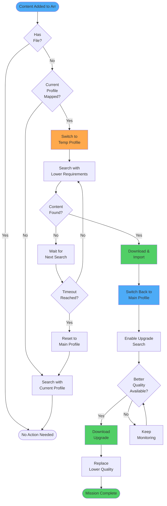
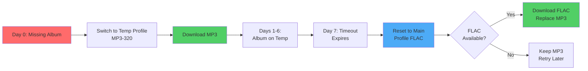
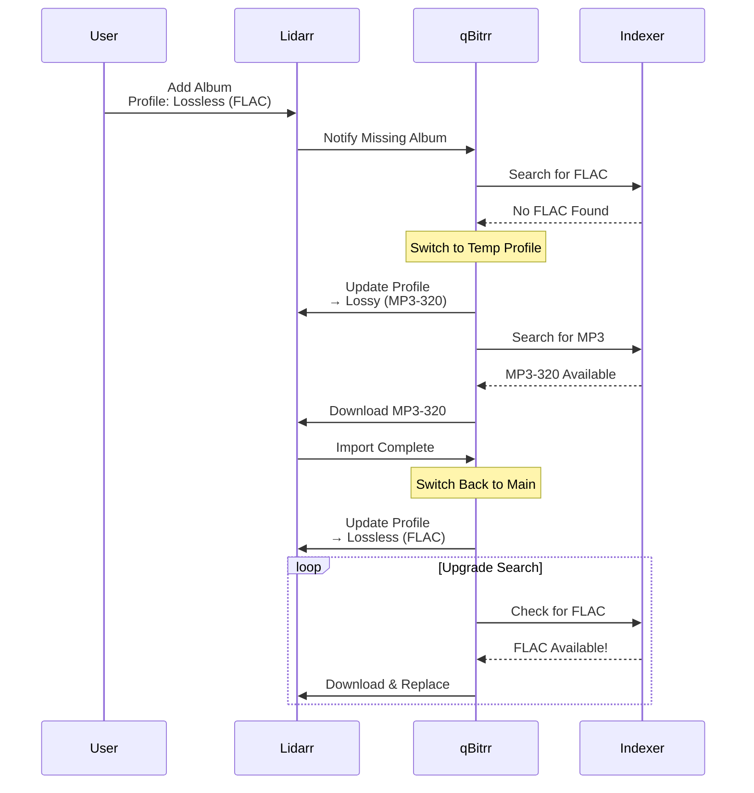
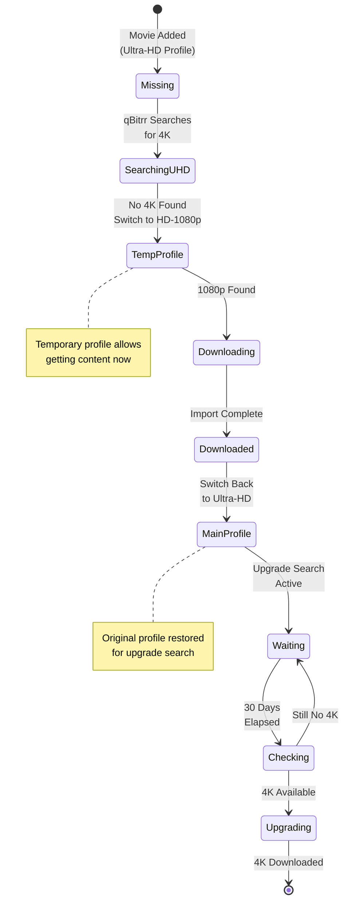

# Quality Profiles

Quality profiles in Radarr, Sonarr, and Lidarr control which media qualities are acceptable and when to upgrade. qBitrr's temporary quality profile feature allows dynamic profile switching for hard-to-find content.

---

## Overview

**What are quality profiles?**

Quality profiles (in Arr applications) define:

- **Allowed qualities** - Which quality tiers to download
- **Quality order** - Preference ranking for qualities
- **Cut-off quality** - Stop upgrading after reaching this quality
- **Upgrade behavior** - When to replace existing files

**qBitrr integration:**

- **Temporary profile switching** - Lower quality requirements temporarily for missing media
- **Profile reset** - Automatic reset to main profile after download
- **Timeout management** - Auto-reset after configurable duration
- **Upgrade facilitation** - Searches for upgrades using main profile

---

## How Quality Profiles Work in Arr

### Quality Profile Structure

```
Quality Profile: HD-1080p
├── Allowed Qualities
│   ├── WEBDL-1080p ✓
│   ├── Bluray-1080p ✓
│   ├── HDTV-1080p ✓
│   ├── WEBDL-720p ✓ (for missing content)
│   └── WEBDL-2160p ✗ (not in profile)
├── Quality Order (preference)
│   1. Bluray-1080p (most preferred)
│   2. WEBDL-1080p
│   3. HDTV-1080p
│   4. WEBDL-720p (least preferred)
├── Cutoff: Bluray-1080p
└── Upgrade Until Cutoff: Yes
```

**How it works:**

1. Arr searches for all allowed qualities
2. Downloads highest available quality
3. Continues searching for upgrades
4. Stops upgrading when cut-off quality is reached

---

### Example Quality Profiles

#### Radarr Quality Profiles

**4K Profile:**
```
Name: Ultra-HD
Allowed:
  - Remux-2160p (cut-off)
  - Bluray-2160p
  - WEBDL-2160p
  - WEBRip-2160p
Cutoff: Remux-2160p
```

**1080p Profile:**
```
Name: HD-1080p
Allowed:
  - Bluray-1080p (cut-off)
  - WEBDL-1080p
  - WEBRip-1080p
  - HDTV-1080p
Cutoff: Bluray-1080p
```

**Any Profile:**
```
Name: Any
Allowed:
  - All qualities from 480p to 2160p
Cutoff: WEBDL-1080p
```

---

#### Sonarr Quality Profiles

**WEB-DL 1080p:**
```
Name: WEB-1080p
Allowed:
  - WEBDL-1080p (cut-off)
  - WEBRip-1080p
  - HDTV-1080p
  - WEBDL-720p (fallback)
Cutoff: WEBDL-1080p
```

**Anime Profile:**
```
Name: Anime-1080p
Allowed:
  - Bluray-1080p (cut-off)
  - WEBDL-1080p
  - HDTV-1080p
Cutoff: Bluray-1080p
```

---

#### Lidarr Quality Profiles

**Lossless:**
```
Name: Lossless (FLAC)
Allowed:
  - FLAC (cut-off)
  - FLAC 24bit
  - WAV
Cutoff: FLAC
```

**Lossy:**
```
Name: Lossy (MP3-320)
Allowed:
  - MP3-320 (cut-off)
  - MP3-V0
  - AAC-320
Cutoff: MP3-320
```

**Any:**
```
Name: Any
Allowed:
  - FLAC (cut-off)
  - MP3-320
  - MP3-256
  - MP3-192
Cutoff: FLAC
```

---

## qBitrr Temporary Quality Profiles

### The Problem

**Scenario:** You want lossless music (FLAC only), but some rare albums don't have lossless releases.

**Without temporary profiles:**
- Album sits in "Wanted" forever
- Never downloads because no FLAC release exists
- You manually switch profile to "Any" to get MP3
- You forget to switch back
- Never upgrades to FLAC when it becomes available

**With temporary profiles:**
- qBitrr automatically switches to "Any" profile
- Downloads MP3 version
- Switches back to "Lossless" profile
- Continues searching for FLAC upgrade
- Automatically replaces MP3 with FLAC when found



---

### Configuration

Temporary profiles are configured in `[<Arr>-<Name>.EntrySearch]`:

```toml
[Lidarr-Music.EntrySearch]
# Enable temporary profile switching
UseTempForMissing = true

# Don't keep temp profile after download
KeepTempProfile = false

# Map main profiles to temporary profiles
QualityProfileMappings = {
  "Lossless (FLAC)" = "Any (MP3)",
  "Ultra-HD" = "HD-1080p"
}

# Reset all temp profiles on startup
ForceResetTempProfiles = false

# Auto-reset temp profiles after X minutes
TempProfileResetTimeoutMinutes = 10080  # 7 days

# Retry attempts for profile API calls
ProfileSwitchRetryAttempts = 3
```

---

### UseTempForMissing

```toml
UseTempForMissing = true
```

**Type:** Boolean
**Default:** `false`

Enable temporary quality profile switching for missing media.

**When enabled:**

1. qBitrr detects missing album/movie/episode
2. Checks if it's using a main profile (from mapping)
3. Switches to temporary profile
4. Arr searches with lowered quality requirements
5. Downloads whatever matches temp profile
6. After import, qBitrr switches back to main profile

**Requirement:** Must configure `QualityProfileMappings`.

**Recommendation:** Great for Lidarr (rare music), less needed for Radarr/Sonarr (better availability).

---

### QualityProfileMappings

```toml
QualityProfileMappings = {
  "Main Profile Name" = "Temporary Profile Name"
}
```

**Type:** Dictionary (main → temp profile names)
**Default:** `{}` (empty, no mappings)

Maps main quality profiles to temporary profiles for missing content.

**Profile names must match exactly as they appear in your Arr instance (case-sensitive).**

**Format:**

```toml
QualityProfileMappings = {"MainProfile" = "TempProfile", "Another" = "Fallback"}
```

**Examples:**

```toml
# Lidarr - Music
QualityProfileMappings = {
  "Lossless (FLAC)" = "Any (MP3-320)",
  "FLAC Only" = "Lossy"
}

# Radarr - Movies
QualityProfileMappings = {
  "Ultra-HD (4K)" = "HD-1080p",
  "Bluray-1080p" = "Any"
}

# Sonarr - TV
QualityProfileMappings = {
  "WEB-DL 1080p" = "HDTV-720p"
}
```

!!! warning "Exact Profile Names Required"
    Profile names must match **exactly** as shown in Arr:

    ```
    ✅ Correct: "Lossless (FLAC)"
    ❌ Wrong: "lossless (flac)"  # Case mismatch
    ❌ Wrong: "Lossless"  # Missing part of name
    ```

    To find exact names:
    - Radarr/Sonarr/Lidarr → Settings → Profiles
    - Copy profile names exactly

---

### KeepTempProfile

```toml
KeepTempProfile = false
```

**Type:** Boolean
**Default:** `false`

Control whether to switch back to main profile after download.

**When false (default):**
- Download completes
- qBitrr switches back to main profile
- Future upgrade searches use main profile criteria

**When true:**
- Download completes
- Profile stays as temp profile
- No automatic upgrades

**Use cases:**

- `false` - **(Recommended)** Enable upgrade workflow
- `true` - Permanently accept lower quality

**Example:**

```toml
# Enable upgrade workflow
KeepTempProfile = false

# Album flow:
# 1. Profile: "Lossless (FLAC)" → No releases found
# 2. Switch to: "Any (MP3-320)" → Downloads MP3
# 3. Import completes
# 4. Switch back to: "Lossless (FLAC)"
# 5. Future searches look for FLAC upgrade
```

---

### ForceResetTempProfiles

```toml
ForceResetTempProfiles = false
```

**Type:** Boolean
**Default:** `false`

Reset all items using temp profiles to main profiles on qBitrr startup.

**When true:**
- qBitrr starts up
- Queries Arr for all items
- Finds items using temp profiles (from mapping)
- Resets them to main profile

**Use cases:**

- Cleanup after testing
- Fix stuck temp profiles
- Reset after config changes

**Example:**

```toml
# Reset all temp profiles on startup
ForceResetTempProfiles = true
```

On next qBitrr start:
- Album was using "Any (MP3)" profile
- Gets reset to "Lossless (FLAC)"
- New upgrade searches triggered

---

### TempProfileResetTimeoutMinutes

```toml
TempProfileResetTimeoutMinutes = 10080  # 7 days
```

**Type:** Integer (minutes)
**Default:** `0` (disabled)

Automatically reset temp profiles to main profiles after X minutes.

**When enabled:**
- qBitrr tracks when temp profile was set
- After timeout duration, resets to main profile
- Triggers upgrade search

**Common values:**

<div class="grid cards" markdown>

-   :material-clock-outline:{ .lg .middle } **Disabled (0 minutes)**

    ---

    Manual reset only. Temp profiles remain until explicitly reset.

    **Use when:** You want full control over profile resets.

-   :material-clock-fast:{ .lg .middle } **1 Day (1440 minutes)**

    ---

    Quick retry for new releases.

    **Use when:** Content releases frequently (TV shows).

-   :material-clock:{ .lg .middle } **7 Days (10080 minutes)**

    ---

    Weekly upgrade check.

    **Use when:** Balanced approach for most content.

-   :material-clock-time-eight:{ .lg .middle } **30 Days (43200 minutes)**

    ---

    Monthly upgrade check.

    **Use when:** Rare content (4K movies, obscure music).

</div>

**Example:**

```toml
# Reset temp profiles after 7 days
TempProfileResetTimeoutMinutes = 10080
```

**Workflow:**



---

### ProfileSwitchRetryAttempts

```toml
ProfileSwitchRetryAttempts = 3
```

**Type:** Integer
**Default:** `3`

Number of retry attempts for profile switch API calls.

**Why retries?**

- Network issues
- Arr temporary unavailability
- API rate limiting
- Database locks

**Recommendation:** `3` is safe. Increase to `5` if you experience failures.

---

## Temporary Profile Workflows

### Workflow 1: Lidarr - Get Music Now, Upgrade Later

**Goal:** Download MP3 immediately, upgrade to FLAC when available

**Setup:**

```toml
[Lidarr-Music.EntrySearch]
UseTempForMissing = true
KeepTempProfile = false
QualityProfileMappings = {"Lossless (FLAC)" = "Lossy (MP3-320)"}
TempProfileResetTimeoutMinutes = 10080  # 7 days
SearchAgainOnSearchCompletion = true
DoUpgradeSearch = true
```

**Process:**



---

### Workflow 2: Radarr - 4K Then 1080p Fallback

**Goal:** Prefer 4K, accept 1080p if 4K unavailable

**Setup:**

```toml
[Radarr-4K.EntrySearch]
UseTempForMissing = true
KeepTempProfile = false
QualityProfileMappings = {"Ultra-HD" = "HD-1080p"}
TempProfileResetTimeoutMinutes = 43200  # 30 days
DoUpgradeSearch = true
```

**Process:**



---

### Workflow 3: Sonarr - New Episodes vs Back Catalog

**Goal:** Accept HD for new episodes, WEB-DL preferred for back catalog

**Setup:**

```toml
[Sonarr-TV.EntrySearch]
UseTempForMissing = true
KeepTempProfile = false
QualityProfileMappings = {"WEB-DL 1080p" = "HDTV-1080p"}
TempProfileResetTimeoutMinutes = 1440  # 1 day
PrioritizeTodaysReleases = true
```

**Process:**

1. New episode airs today
2. No WEB-DL available yet (too new)
3. Switch to HDTV profile
4. Download HDTV release
5. Switch back to WEB-DL after 1 day
6. WEB-DL becomes available
7. Upgrade to WEB-DL

---

## Best Practices

### 1. Create Appropriate Profiles in Arr First

Before configuring qBitrr:

1. Create main profiles (strict quality)
2. Create temp profiles (lenient quality)
3. Test manually in Arr
4. Then configure qBitrr mappings

**Example Arr setup:**

```
Profiles in Lidarr:
- "Lossless (FLAC)" → Main profile
- "Any (MP3-320)" → Temp profile
- "Lossy (MP3-256)" → Temp profile
```

---

### 2. Use Descriptive Profile Names

```toml
# Good - Clear purpose
QualityProfileMappings = {
  "Lossless (FLAC)" = "Lossy (MP3-320)"
}

# Bad - Ambiguous
QualityProfileMappings = {
  "Profile1" = "Profile2"
}
```

---

### 3. Start Without Temp Profiles

```toml
# Phase 1: Standard operation
UseTempForMissing = false

# Phase 2: After validating need
UseTempForMissing = true
```

Only enable if you frequently encounter missing content due to quality requirements.

---

### 4. Set Realistic Timeout

```toml
# Too short - Wastes searches
TempProfileResetTimeoutMinutes = 60  # 1 hour

# Good - Reasonable retry interval
TempProfileResetTimeoutMinutes = 10080  # 7 days

# Too long - Delays upgrades unnecessarily
TempProfileResetTimeoutMinutes = 525600  # 1 year
```

---

### 5. Monitor Profile Switches

Check logs for profile switching:

```bash
tail -f ~/logs/Lidarr-Music.log | grep -i "profile"
```

**Example log output:**

```
2025-11-27 10:00:00 - INFO - Switching profile for "Album Name": Lossless (FLAC) → Any (MP3-320)
2025-11-27 10:05:00 - INFO - Download complete for "Album Name"
2025-11-27 10:05:05 - INFO - Switching profile for "Album Name": Any (MP3-320) → Lossless (FLAC)
```

---

### 6. Test Profile Names

Verify exact profile names:

```bash
# Query Arr API for profile names
curl -H "X-Api-Key: your-key" http://localhost:8686/api/v1/qualityprofile

# Response shows exact names
[
  {"id": 1, "name": "Lossless (FLAC)"},
  {"id": 2, "name": "Any (MP3-320)"}
]
```

---

## Troubleshooting

### Profile Switches Not Working

**Symptom:** Profiles don't change

**Solutions:**

1. **Verify exact profile names:**
   ```bash
   # Check Arr API
   curl -H "X-Api-Key: key" http://localhost:8686/api/v1/qualityprofile
   ```

2. **Check mapping syntax:**
   ```toml
   # Correct
   QualityProfileMappings = {"Main" = "Temp"}

   # Wrong
   QualityProfileMappings = {Main = Temp}  # Missing quotes
   ```

3. **Enable debug logging:**
   ```toml
   [Settings]
   ConsoleLevel = "DEBUG"
   ```

4. **Review logs:**
   ```bash
   grep -i "profile\|switch" ~/logs/Lidarr-Music.log
   ```

---

### Profiles Don't Reset

**Symptom:** Temp profiles stay permanently

**Solutions:**

1. **Check KeepTempProfile:**
   ```toml
   KeepTempProfile = false  # Must be false
   ```

2. **Verify timeout set:**
   ```toml
   TempProfileResetTimeoutMinutes = 10080  # Not 0
   ```

3. **Force reset:**
   ```toml
   ForceResetTempProfiles = true
   ```
   Restart qBitrr

---

### API Errors

**Symptom:** "Failed to switch profile" in logs

**Solutions:**

1. **Increase retries:**
   ```toml
   ProfileSwitchRetryAttempts = 5  # Up from 3
   ```

2. **Check Arr API connectivity:**
   ```bash
   curl -H "X-Api-Key: key" http://localhost:8686/api/v1/qualityprofile
   ```

3. **Verify Arr logs:**
   - Radarr/Sonarr/Lidarr → System → Logs
   - Look for API errors

---

### Downloads But No Upgrade

**Symptom:** Temp profile downloads but never upgrades

**Solutions:**

1. **Verify profile reset:**
   - Check logs for "Switching profile back to..."
   - Ensure KeepTempProfile = false

2. **Enable upgrade search:**
   ```toml
   DoUpgradeSearch = true
   ```

3. **Check quality cutoff:**
   - In Arr quality profile
   - Cutoff must be higher than current quality

4. **Verify "Upgrade Until Cutoff" enabled:**
   - Arr → Quality Profile
   - Must have upgrade checkbox enabled

---

## Profile Strategy Guide

### For Radarr (Movies)

**Strategy:** Prefer 4K/1080p but accept SD temporarily

```toml
QualityProfileMappings = {
  "Ultra-HD" = "HD-1080p",
  "HD-1080p" = "SD"
}
TempProfileResetTimeoutMinutes = 43200  # 30 days
```

---

### For Sonarr (TV Shows)

**Strategy:** Get episodes fast, upgrade to WEB-DL later

```toml
QualityProfileMappings = {
  "WEB-DL 1080p" = "HDTV-1080p"
}
TempProfileResetTimeoutMinutes = 1440  # 1 day (for new episodes)
```

---

### For Lidarr (Music)

**Strategy:** Essential - Many albums lack lossless

```toml
QualityProfileMappings = {
  "Lossless (FLAC)" = "Any (MP3-320)",
  "FLAC 24bit" = "Lossless (FLAC)"
}
TempProfileResetTimeoutMinutes = 10080  # 7 days
```

**Highly recommended** for Lidarr due to limited lossless availability.

---

## See Also

- [Custom Formats](../features/custom-formats.md) - Advanced quality scoring
- [Automated Search](../features/automated-search.md) - Search configuration
- [Radarr Configuration](arr/radarr.md) - Radarr instance setup
- [Sonarr Configuration](arr/sonarr.md) - Sonarr instance setup
- [Lidarr Configuration](arr/lidarr.md) - Lidarr instance setup
- [Config File Reference](config-file.md) - All configuration options
