# Ombi Integration

Ombi is a self-hosted request management system for Plex, Emby, and Jellyfin. qBitrr can integrate with Ombi to automatically search for user-requested content, ensuring requests are fulfilled quickly and efficiently.

## Overview

When Ombi integration is enabled, qBitrr will:

- **Monitor Ombi Requests**: Check for new movie/TV show requests
- **Trigger Automated Searches**: Command Radarr/Sonarr to search for requested content
- **Respect Approval Status**: Only process approved requests (optional)
- **Filter by Request State**: Ignore already-fulfilled or denied requests

---

## How It Works

### Request Flow

```mermaid
graph LR
    A[User Requests Content in Ombi] --> B[Ombi Marks as Pending/Approved]
    B --> C[qBitrr Polls Ombi API]
    C --> D[qBitrr Filters by Approval Status]
    D --> E[qBitrr Triggers Search in Arr]
    E --> F[Arr Searches Indexers]
    F --> G[Torrent Downloaded to qBittorrent]
    G --> H[qBitrr Monitors & Imports]
    H --> I[Ombi Marks as Available]
```



### Key Features

1. **Approved-Only Mode**: Only search for admin-approved requests
2. **Request Filtering**: Skip denied or already-available requests
3. **Efficient Polling**: Batch API calls for better performance
4. **Multi-Instance Support**: Configure Ombi separately per Arr instance

---

## Configuration

### Basic Setup (Movies)

```toml
[Radarr-Movies]
Managed = true
URI = "http://localhost:7878"
APIKey = "your-radarr-api-key"
Category = "radarr-movies"

[Radarr-Movies.EntrySearch]
SearchMissing = true  # Must be enabled for request integration
SearchLimit = 5
SearchRequestsEvery = 3  # Check requests every 3 loops

[Radarr-Movies.EntrySearch.Ombi]
SearchOmbiRequests = true
OmbiURI = "http://localhost:3579"
OmbiAPIKey = "your-ombi-api-key"
ApprovedOnly = true  # Only search approved requests
```

### Basic Setup (TV Shows)

```toml
[Sonarr-Series]
Managed = true
URI = "http://localhost:8989"
APIKey = "your-sonarr-api-key"
Category = "sonarr-series"

[Sonarr-Series.EntrySearch]
SearchMissing = true
SearchLimit = 5
SearchRequestsEvery = 3

[Sonarr-Series.EntrySearch.Ombi]
SearchOmbiRequests = true
OmbiURI = "http://localhost:3579"
OmbiAPIKey = "your-ombi-api-key"
ApprovedOnly = true
```

---

## Configuration Reference

### Required Settings

| Setting | Type | Required | Description |
|---------|------|----------|-------------|
| `SearchOmbiRequests` | Boolean | Yes | Enable Ombi integration |
| `OmbiURI` | String | Yes | Full URL to Ombi (e.g., `http://localhost:3579`) |
| `OmbiAPIKey` | String | Yes | API key from Ombi settings |

### Optional Settings

| Setting | Type | Default | Description |
|---------|------|---------|-------------|
| `ApprovedOnly` | Boolean | `true` | Only process approved requests (ignore pending) |

### Parent Settings (Required)

Ombi integration **requires** these parent settings to be enabled:

```toml
[Radarr-Movies.EntrySearch]
SearchMissing = true  # REQUIRED: Enables search functionality
SearchRequestsEvery = 3  # Optional: How often to check (in loop iterations)
SearchLimit = 5  # Optional: Max concurrent searches
```

---

## Setup Instructions

### 1. Generate Ombi API Key

1. Open Ombi web interface (e.g., `http://localhost:3579`)
2. Navigate to **Settings** → **Configuration** → **API**
3. Find or generate your **API Key**
4. Copy the API key
5. Paste it into your qBitrr config as `OmbiAPIKey`

### 2. Verify Ombi Configuration

Ensure Ombi is properly configured:

- **Radarr/Sonarr Integration**: Ombi must be connected to your Arr instances
- **Default Quality Profiles**: Set default quality profiles in Ombi
- **Root Folders**: Configure root folders for Radarr/Sonarr
- **User Permissions**: Users should have permission to request content

### 3. Configure qBitrr

Add the `[EntrySearch.Ombi]` section to each Arr instance that should process Ombi requests:

```toml
[Radarr-Movies.EntrySearch.Ombi]
SearchOmbiRequests = true
OmbiURI = "http://localhost:3579"
OmbiAPIKey = "abc123def456"
ApprovedOnly = true
```

### 4. Restart qBitrr

```bash
# Docker
docker restart qbitrr

# systemd
sudo systemctl restart qbitrr

# Direct
# Stop and restart the qbitrr process
```

### 5. Verify Integration

Check logs for Ombi activity:

```bash
# Docker
docker logs -f qbitrr 2>&1 | grep -i ombi

# Native
tail -f ~/logs/Radarr-Movies.log | grep -i ombi
```

Expected log entries:
```
INFO - Ombi requests: 5 total, 3 pending approval
INFO - Triggering search for Ombi request: Movie Title (2024)
DEBUG - Ombi URI: http://localhost:3579
DEBUG - Ombi API Key: ***
```

---

## Request Processing Behavior

### Approved-Only Mode (`ApprovedOnly = true`)

qBitrr will **only** search for requests that have been:
- Approved by an admin in Ombi
- Not denied
- Not already available in your library

**Request States Processed:**
- ✅ **Approved** → qBitrr triggers search in Arr
- ❌ **Pending** → Ignored (awaiting admin approval)
- ❌ **Denied** → Ignored (explicitly rejected)
- ❌ **Available** → Ignored (already in library)

### All Requests Mode (`ApprovedOnly = false`)

qBitrr will search for **any** requests that are:
- Not denied
- Not already available in your library

**Request States Processed:**
- ✅ **Approved** → qBitrr triggers search
- ✅ **Pending** → qBitrr triggers search
- ❌ **Denied** → Ignored (explicitly rejected)
- ❌ **Available** → Ignored (already in library)

!!! warning "Automatic Approval"
    Setting `ApprovedOnly = false` effectively **auto-approves all requests**, as qBitrr will search for them immediately. Use with caution, especially on public instances.

---

## Advanced Configuration

### Example 1: Public Instance with Manual Approval

For public Plex servers where admins review all requests:

```toml
[Radarr-Movies.EntrySearch.Ombi]
SearchOmbiRequests = true
OmbiURI = "http://localhost:3579"
OmbiAPIKey = "your-api-key"
ApprovedOnly = true  # Admins must approve first

[Radarr-Movies.EntrySearch]
SearchMissing = true
SearchRequestsEvery = 5  # Check every 5 loops (slower polling)
SearchLimit = 3  # Limit concurrent searches
```

### Example 2: Private Instance with Auto-Approval

For family/friends servers where all requests are trusted:

```toml
[Radarr-Movies.EntrySearch.Ombi]
SearchOmbiRequests = true
OmbiURI = "http://localhost:3579"
OmbiAPIKey = "your-api-key"
ApprovedOnly = false  # Auto-approve all requests

[Radarr-Movies.EntrySearch]
SearchMissing = true
SearchRequestsEvery = 2  # Check every 2 loops (faster polling)
SearchLimit = 10  # Higher concurrent search limit
```

### Example 3: Multiple Arr Instances Sharing Ombi

Configure Ombi for both Radarr and Sonarr:

```toml
# Radarr for Movies
[Radarr-Movies]
Managed = true
URI = "http://localhost:7878"
APIKey = "radarr-api-key"
Category = "radarr-movies"

[Radarr-Movies.EntrySearch]
SearchMissing = true
SearchRequestsEvery = 3

[Radarr-Movies.EntrySearch.Ombi]
SearchOmbiRequests = true
OmbiURI = "http://localhost:3579"
OmbiAPIKey = "ombi-api-key"
ApprovedOnly = true

# Sonarr for TV Shows
[Sonarr-Series]
Managed = true
URI = "http://localhost:8989"
APIKey = "sonarr-api-key"
Category = "sonarr-series"

[Sonarr-Series.EntrySearch]
SearchMissing = true
SearchRequestsEvery = 3

[Sonarr-Series.EntrySearch.Ombi]
SearchOmbiRequests = true
OmbiURI = "http://localhost:3579"  # Same Ombi instance
OmbiAPIKey = "ombi-api-key"  # Same API key
ApprovedOnly = true
```

!!! tip "API Key Reuse"
    Multiple Arr instances can use the **same Ombi API key**. qBitrr filters requests based on the Arr type (movies vs TV shows).

---

## Troubleshooting

### Requests Not Being Searched

**Symptoms:** Ombi requests remain "Requested" or "Approved" but aren't searched

**Solutions:**

1. ✅ Verify `SearchMissing = true` in `[EntrySearch]` section
2. ✅ Check `SearchOmbiRequests = true`
3. ✅ Ensure `OmbiURI` is correct (include `http://` or `https://`)
4. ✅ Test API key manually:
   ```bash
   curl -H "ApiKey: your-api-key" http://localhost:3579/api/v1/Request/movie
   ```
5. ✅ Check qBitrr logs for Ombi errors:
   ```bash
   tail -f ~/logs/Radarr-Movies.log | grep -i ombi
   ```
6. ✅ Verify content is **approved** in Ombi (if `ApprovedOnly = true`)

---

### Connection Errors

**Symptoms:** "Couldn't connect to Ombi" in logs

**Solutions:**

1. ✅ Verify Ombi is running:
   ```bash
   curl http://localhost:3579
   ```
2. ✅ Check `OmbiURI` uses correct protocol (`http://` vs `https://`)
3. ✅ Ensure no trailing slashes in URI (`http://localhost:3579`, not `http://localhost:3579/`)
4. ✅ Verify firewall rules if Ombi is on a different machine
5. ✅ Check Docker network connectivity (if using containers):
   ```bash
   docker exec qbitrr ping ombi
   ```

---

### API Key Errors

**Symptoms:** "Unauthorized" or "403 Forbidden" errors

**Solutions:**

1. ✅ Verify API key is copied correctly (no extra spaces)
2. ✅ Regenerate API key in Ombi settings
3. ✅ Test API key manually:
   ```bash
   curl -H "ApiKey: your-api-key" http://localhost:3579/api/v1/Request/movie
   ```
4. ✅ Ensure Ombi API is enabled (Settings → Configuration → API → Enable API)

---

### Denied Requests Being Processed

**Symptoms:** qBitrr searches for requests marked as "Denied" in Ombi

**Explanation:** Ombi's "denied" flag handling differs for movies vs TV shows.

**Solutions:**

1. ✅ Verify `ApprovedOnly = true` in config
2. ✅ For **TV shows**, ensure entire series is denied (not individual episodes)
3. ✅ Check Ombi logs for request status
4. ✅ Restart qBitrr to refresh request cache:
   ```bash
   docker restart qbitrr  # Docker
   sudo systemctl restart qbitrr  # systemd
   ```

---

### Approved Requests Not Triggering

**Symptoms:** Requests approved in Ombi, but qBitrr doesn't search

**Solutions:**

1. ✅ Verify `ApprovedOnly = true` in config
2. ✅ Check request status in Ombi (must be "Approved", not "Pending")
3. ✅ Ensure content is not already marked "Available" in Ombi
4. ✅ Check Radarr/Sonarr has the content as "Monitored"
5. ✅ Review qBitrr search logs:
   ```bash
   tail -f ~/logs/Radarr-Movies.log | grep -i "search\|ombi"
   ```

---

## API Rate Limiting

Ombi has **no built-in rate limiting**, but qBitrr implements efficient polling:

- **Batch Requests**: Fetches all requests in a single API call
- **Configurable Polling**: `SearchRequestsEvery` controls check frequency

### Recommended Polling Intervals

| Instance Size | `SearchRequestsEvery` | Effective Check Interval |
|---------------|------------------------|--------------------------|
| Small (<10 requests/day) | 5 | ~1-2 minutes |
| Medium (10-50 requests/day) | 3 | ~30-60 seconds |
| Large (50+ requests/day) | 2 | ~20-40 seconds |

!!! tip "Optimize Performance"
    Higher `SearchRequestsEvery` values reduce API calls but increase latency for request processing. Balance based on your request volume and user expectations.

---

## Integration with Other Features

### Combined with Missing Search

Ombi requests work **alongside** regular missing content searches:

```toml
[Radarr-Movies.EntrySearch]
SearchMissing = true  # Search monitored missing content
SearchLimit = 10  # Total concurrent searches

[Radarr-Movies.EntrySearch.Ombi]
SearchOmbiRequests = true  # Also search Ombi requests
ApprovedOnly = true
```

qBitrr will:
1. Search for monitored missing content in Radarr
2. Search for approved Ombi requests
3. Respect total `SearchLimit` across both sources

---

### Quality Upgrades with Ombi

Combine Ombi requests with quality upgrades:

```toml
[Radarr-Movies.EntrySearch]
SearchMissing = true
DoUpgradeSearch = true  # Enable quality upgrades
QualityUnmetSearch = true  # Search for unmet quality profiles

[Radarr-Movies.EntrySearch.Ombi]
SearchOmbiRequests = true
ApprovedOnly = true
```

This ensures:
- New Ombi requests are searched immediately
- Existing content is upgraded when better releases appear

---

### Custom Formats with Ombi

Enforce custom format scores for Ombi requests:

```toml
[Radarr-Movies.EntrySearch]
SearchMissing = true
CustomFormatUnmetSearch = true  # Search for CF score improvements
ForceMinimumCustomFormat = true  # Block releases below CF threshold

[Radarr-Movies.EntrySearch.Ombi]
SearchOmbiRequests = true
ApprovedOnly = true
```

This ensures Ombi requests respect your custom format requirements (e.g., no hardcoded subs, proper codecs).

---

## Best Practices

### Security

- **Protect API Keys**: Never commit `OmbiAPIKey` to public repositories
- **Use Environment Variables**: Store sensitive keys in environment variables:
  ```bash
  export QBITRR_RADARR_MOVIES__ENTRYSEARCH__OMBI__OMBIAPIKEY="abc123"
  ```
- **HTTPS**: Use HTTPS for Ombi if exposed to the internet
- **Reverse Proxy**: Place Ombi behind a reverse proxy (Nginx, Caddy, Traefik)

### Performance

- **Adjust Polling**: Set `SearchRequestsEvery` based on request volume
- **Limit Searches**: Keep `SearchLimit` reasonable to avoid overwhelming indexers
- **Monitor Logs**: Watch for rate limiting or connection errors

### User Experience

- **Approval Workflow**: Use `ApprovedOnly = true` for public servers to control content
- **Auto-Approval**: Use `ApprovedOnly = false` for trusted users/family
- **Request Notifications**: Configure Ombi notifications to alert users when content is available

---

## Docker Compose Example

Complete Docker Compose setup with Ombi integration:

```yaml
version: '3.8'
services:
  ombi:
    image: linuxserver/ombi:latest
    container_name: ombi
    environment:
      - PUID=1000
      - PGID=1000
      - TZ=America/New_York
    ports:
      - "3579:3579"
    volumes:
      - /path/to/ombi/config:/config
    restart: unless-stopped

  qbitrr:
    image: feramance/qbitrr:latest
    container_name: qbitrr
    environment:
      - TZ=America/New_York
      # Ombi integration via environment variables
      - QBITRR_RADARR_MOVIES__ENTRYSEARCH__OMBI__SEARCHOMBIQUESTS=true
      - QBITRR_RADARR_MOVIES__ENTRYSEARCH__OMBI__OMBIURI=http://ombi:3579
      - QBITRR_RADARR_MOVIES__ENTRYSEARCH__OMBI__OMBIAPIKEY=your-api-key
      - QBITRR_RADARR_MOVIES__ENTRYSEARCH__OMBI__APPROVEDONLY=true
    volumes:
      - /path/to/qbitrr/config:/config
    depends_on:
      - ombi
    restart: unless-stopped
```

---

## Comparison: Ombi vs Overseerr

| Feature | Ombi | Overseerr |
|---------|------|-----------|
| **User Interface** | Older, Angular-based | Modern, React-based |
| **Media Discovery** | Basic | Advanced (TMDB integration) |
| **Request Management** | Basic approval | Full workflow (approve/decline/comment) |
| **4K Support** | Limited | Native |
| **User Permissions** | Basic roles | Granular (per-user quotas, limits) |
| **Performance** | Can be slow with many users | Fast, lightweight |
| **qBitrr Support** | Full support (approved mode only) | Full support (approved/unavailable modes, 4K) |

**Recommendation:** Use **Overseerr** for new setups (better UX, modern codebase, active development). Ombi is suitable for existing setups or simpler use cases.

---

## Ombi API Endpoints Used

qBitrr interacts with the following Ombi API endpoints:

### Movies

- **GET** `/api/v1/Request/movie/total` - Get total movie request count
- **GET** `/api/v1/Request/movie` - Fetch all movie requests

### TV Shows

- **GET** `/api/v1/Request/tv/total` - Get total TV request count
- **GET** `/api/v1/Request/tvlite` - Fetch all TV requests (lightweight)

### Request Data Structure

qBitrr processes the following fields from Ombi requests:

```json
{
  "theMovieDbId": 12345,  // For Radarr (movies)
  "tvDbId": 67890,  // For Sonarr (TV shows)
  "imdbId": "tt1234567",  // Fallback identifier
  "denied": false,  // Approval status
  "childRequests": [  // TV show episode requests
    {"denied": false}
  ]
}
```

---

## Limitations

### Ombi-Specific

1. **No 4K Support**: Ombi does not have native 4K request separation (unlike Overseerr)
2. **Limited TV Handling**: Partially approved TV shows (some episodes denied) may be skipped
3. **No Release Date Filtering**: Ombi does not provide release dates via API, so qBitrr cannot skip unreleased content

### qBitrr Ombi Integration

1. **Approved-Only Mode**: Only filters top-level approval status (not granular for TV episodes)
2. **No Status Updates**: qBitrr does not update Ombi request status (handled by Ombi ↔ Arr sync)

---

## Migration from Overseerr

If migrating from Overseerr to Ombi (or vice versa), update your config:

### From Overseerr to Ombi

```toml
# Before (Overseerr)
[Radarr-Movies.EntrySearch.Overseerr]
SearchOverseerrRequests = true
OverseerrURI = "http://localhost:5055"
OverseerrAPIKey = "overseerr-key"
ApprovedOnly = true
Is4K = false

# After (Ombi)
[Radarr-Movies.EntrySearch.Ombi]
SearchOmbiRequests = true
OmbiURI = "http://localhost:3579"
OmbiAPIKey = "ombi-key"
ApprovedOnly = true
```

!!! warning "4K Requests"
    If you use 4K requests in Overseerr, Ombi does **not** have equivalent functionality. You may need to manually configure separate Radarr/Sonarr instances.

---

## Next Steps

- **Configure Overseerr Integration:** [Overseerr Configuration](overseerr.md)
- **General Search Configuration:** [Search Configuration](index.md)
- **Radarr Setup:** [Radarr Configuration](../arr/radarr.md)
- **Sonarr Setup:** [Sonarr Configuration](../arr/sonarr.md)
- **Troubleshooting:** [Common Issues](../../troubleshooting/common-issues.md)
