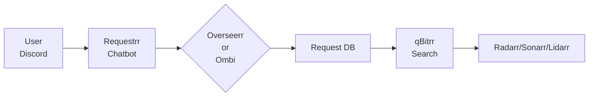

# Requestrr Integration

Requestrr is a Discord chatbot that allows users to request movies, TV shows, and music through Discord. qBitrr integrates with Requestrr **through Overseerr or Ombi** as the request management backend.

## How It Works

Requestrr is a chatbot interface - it doesn't have its own request database. Instead:
- Requestrr forwards user requests to Overseerr or Ombi
- Overseerr/Ombi stores requests in their database
- qBitrr polls Overseerr/Ombi API to find and search for requests



## Supported Backends

| Backend | Support Level | Notes |
|---------|--------------|-------|
| **Overseerr** | ✅ Full | Recommended - 4K support, release date filtering |
| **Ombi** | ✅ Full | Alternative - simpler setup |

## Setup Instructions

### Step 1: Configure Requestrr

Configure Requestrr to use **either** Overseerr or Ombi:

**Option A: Connect to Overseerr**
1. Open Requestrr settings
2. Navigate to **Overseerr** configuration
3. Enter Overseerr URI, API key, and user mapping
4. Save settings

**Option B: Connect to Ombi**
1. Open Requestrr settings
2. Navigate to **Ombi** configuration
3. Enter Ombi URI, API key, and user mapping
4. Save settings

For detailed Requestrr configuration, see the [Requestrr Wiki](https://github.com/thomst08/requestrr/wiki).

### Step 2: Configure Overseerr or Ombi

**If using Overseerr:**
- Connect Overseerr to your Radarr/Sonarr/Lidarr instances
- Configure quality profiles, root folders, and user permissions
- Requests will automatically appear in Overseerr

**If using Ombi:**
- Connect Ombi to your Radarr/Sonarr instances
- Configure quality profiles and root folders
- Requests will automatically appear in Ombi

### Step 3: Configure qBitrr

Configure qBitrr to poll the **same** Overseerr/Ombi instance:

**Option A: Overseerr Backend**
```toml
[Radarr-Movies.EntrySearch]
SearchMissing = true

[Radarr-Movies.EntrySearch.Overseerr]
SearchOverseerrRequests = true
OverseerrURI = "http://localhost:5055"
OverseerrAPIKey = "your-api-key"
ApprovedOnly = true
```

**Option B: Ombi Backend**
```toml
[Radarr-Movies.EntrySearch]
SearchMissing = true

[Radarr-Movies.EntrySearch.Ombi]
SearchOmbiRequests = true
OmbiURI = "http://localhost:3579"
OmbiAPIKey = "your-api-key"
ApprovedOnly = true
```

## Complete Docker Compose Example

```yaml
version: '3.8'
services:
  requestrr:
    image: thomst08/requestrr:latest
    container_name: requestrr
    environment:
      - TZ=America/New_York
      - REQUESTRR_PORT=4545
    ports:
      - "4545:4545"
    volumes:
      - /path/to/requestrr/config:/root/config
    restart: unless-stopped

  overseerr:
    image: sctx/overseerr:latest
    container_name: overseerr
    environment:
      - LOG_LEVEL=info
      - TZ=America/New_York
    ports:
      - "5055:5055"
    volumes:
      - /path/to/overseerr/config:/app/config
    restart: unless-stopped

  qbitrr:
    image: feramance/qbitrr:latest
    container_name: qbitrr
    environment:
      - TZ=America/New_York
      # Overseerr integration
      - QBITRR_RADARR_MOVIES__ENTRYSEARCH__OVERSEERR__SEARCHOVERSEERRQUESTS=true
      - QBITRR_RADARR_MOVIES__ENTRYSEARCH__OVERSEERR__OVERSEERRURI=http://overseerr:5055
      - QBITRR_RADARR_MOVIES__ENTRYSEARCH__OVERSEERR__OVERSEERRAPIKEY=overseerr-api-key
    volumes:
      - /path/to/qbitrr/config:/config
    depends_on:
      - overseerr
    restart: unless-stopped
```

## Frequently Asked Questions

### Does qBitrr know requests came from Requestrr?

**No.** qBitrr sees all requests from Overseerr/Ombi identically, regardless of whether they came from:
- The Overseerr/Ombi web interface
- The Requestrr Discord chatbot
- Any other integration

This is by design - qBitrr prioritizes all requests equally based on approval status and release date.

### Can Requestrr requests be prioritized differently?

Not currently. All requests from Overseerr/Ombi are processed equally. If you need Requestrr-specific prioritization, consider:
1. Filing a feature request with Requestrr for tag-based forwarding
2. Using different quality profiles for Requestrr requests

### What if I use both Requestrr and direct Overseerr/Ombi requests?

Both work together seamlessly. qBitrr will process all requests from Overseerr/Ombi, whether they originated from Requestrr, the web interface, or any other source.

## Troubleshooting

### Requests from Requestrr not appearing in qBitrr

1. Verify Requestrr is connected to Overseerr/Ombi (check Requestrr logs)
2. Verify Overseerr/Ombi is connected to Radarr/Sonarr/Lidarr
3. Verify qBitrr is connected to the same Overseerr/Ombi instance
4. Check qBitrr logs for connection errors

### Requestrr can't connect to Overseerr/Ombi

1. Verify Overseerr/Ombi is running and accessible
2. Check API key is correct in Requestrr settings
3. Verify network connectivity between containers
4. Check for CSRF protection issues (Overseerr requires CSRF to be disabled for Requestrr)

## Related Documentation

- [Overseerr Integration](overseerr.md) - Configure Overseerr backend
- [Ombi Integration](ombi.md) - Configure Ombi backend
- [Search Configuration](index.md) - General search settings
- [Request Integration](../../features/request-integration.md) - Request system overview
- [Requestrr Wiki](https://github.com/thomst08/requestrr/wiki) - Requestrr documentation
