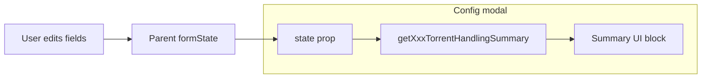

# Live Torrent Handling Description in Config View

## Goal

Show a human-readable, live-updating description of how torrents are handled for the instance being configured (any Arr instance or any qBit instance), covering: **torrent** rules (exclusions, ETA, deletable %, etc.), **stalled** handling, **trackers**, **seeding** (remove policy, ratio/time), and **HnR** (Hit and Run) rules. The text must update as the user changes fields, without saving.

## Current structure (reference)

- **Arr instance modal** (webui/src/pages/ConfigView.tsx): receives `state` = the Arr section (e.g. `Radarr-1`). Contains `Torrent.*`, `Torrent.SeedingMode.*`, `Torrent.Trackers[]`. Field groups: Torrent Handling, Seeding, Trackers.
- **Qbit instance modal**: receives `state` = the qBit section (e.g. `qBit`). Contains `CategorySeeding.*`, `Trackers[]`. No separate "Torrent" section; stalled/seeding/HnR live under CategorySeeding.
- Both modals receive `state` from the parent; when the user edits a field, parent updates `formState` and passes the updated section down, so the description can be derived from `state` and will re-render automatically.

## Implementation

### 1. Summary generator module

Add a new module, e.g. **webui/src/config/torrentHandlingSummary.ts**, that exports:

- **getArrTorrentHandlingSummary(state: ConfigDocument | null): string**
  Builds a multi-line description from the Arr section only (no need to resolve qBit.Trackers for inheritance in v1; we can say "N tracker override(s)" or "No tracker overrides" from `state.Torrent.Trackers`).
- **getQbitTorrentHandlingSummary(state: ConfigDocument | null): string**
  Builds a multi-line description from the qBit section: CategorySeeding (seeding + stalled + HnR) and Trackers.

**Data to summarize (align with qBitrr/gen_config.py and webui/src/config/tooltips.ts):**

| Area         | Arr (paths under section)                                                                                                                                                                            | qBit (paths under section)                                                                                                     |
| ------------ | ---------------------------------------------------------------------------------------------------------------------------------------------------------------------------------------------------- | ------------------------------------------------------------------------------------------------------------------------------ |
| **Torrent**  | `Torrent`: CaseSensitiveMatches, Folder/FileName/Extension exclusions, AutoDelete, IgnoreTorrentsYoungerThan, MaximumETA, MaximumDeletablePercentage, DoNotRemoveSlow, StalledDelay, ReSearchStalled | N/A (qBit modal has no Torrent subsection)                                                                                     |
| **Stalled**  | `Torrent.StalledDelay`, `Torrent.ReSearchStalled`                                                                                                                                                    | `CategorySeeding.StalledDelay`, `CategorySeeding.IgnoreTorrentsYoungerThan`                                                    |
| **Trackers** | `Torrent.Trackers[]` count; per-tracker overrides (HnR, rate limits) if present                                                                                                                      | `Trackers[]` count; same per-tracker summary                                                                                   |
| **Seeding**  | `Torrent.SeedingMode`: RemoveTorrent (-1/1/2/3/4), MaxUploadRatio, MaxSeedingTime, RemoveDeadTrackers, RemoveTrackerWithMessage                                                                      | `CategorySeeding`: RemoveTorrent, MaxUploadRatio, MaxSeedingTime, rate limits                                                  |
| **HnR**      | Per-tracker in `Torrent.Trackers[]`: HitAndRunMode, MinSeedRatio, MinSeedingTimeDays, HitAndRunMinimumDownloadPercent, HitAndRunPartialSeedRatio                                                     | `CategorySeeding`: HitAndRunMode, MinSeedRatio, MinSeedingTimeDays, HitAndRunMinimumDownloadPercent, HitAndRunPartialSeedRatio |


### Example descriptors (based on .config/config.toml)

These examples show the intended style and content of the generated summary for the real config.

**qBit instance (`[qBit]` with CategorySeeding + 2 trackers):**

```
How torrents are handled

Seeding: Remove when max seeding time is reached (2). Max ratio 2.0, max time 14d. No per-torrent rate limits.
Stalled: Stalled downloads in managed categories (autobrr) are removed after 1440 minutes; torrents younger than 600s are ignored.
HnR: Disabled at category level. Min ratio 1.0, min time 0 days, min download % 10, partial ratio 1.0.
Trackers: 2 configured (e.g. Fear No Peer, TorrentLeech). One with HnR "and" (ratio 1.0 and 8 days); others with HnR disabled.
```

**Arr instance – Sonarr-Anime (Torrent + SeedingMode, no tracker overrides):**

```
How torrents are handled

Torrent: Case-insensitive matches. Folder/file name exclusions and extension allowlist (.mp4, .mkv, …). Auto-delete non-media. Ignore torrents younger than 600s. Max ETA disabled. Deletable up to 99%. Slow torrents are not removed.
Stalled: After 1440 minutes torrents are treated as stalled; re-search is enabled before/after removal.
Seeding: Remove when max seeding time is reached (2). Max ratio 1.0, max time 14d. Dead trackers not removed; specific tracker messages trigger removal.
HnR: Disabled in SeedingMode. Min ratio 1.0, min time 0 days.
Trackers: No per-tracker overrides; using qBit instance defaults.
```

**Arr instance – Lidarr (different policy; from same config):**

```
How torrents are handled

Torrent: Case-insensitive. Folder/file exclusions and extension allowlist (.mp3, .flac, …). Auto-delete off. Ignore torrents younger than 600s. Max ETA 604800s (~7d). Deletable up to 99%. Slow torrents not removed.
Stalled: After 15 minutes torrents are treated as stalled; re-search disabled.
Seeding: Do not remove (-1). Max ratio 1.0, max time 14d. Dead trackers not removed; specific messages trigger removal.
HnR: Disabled. Min ratio 1.0, min time 0 days.
Trackers: No per-tracker overrides; using qBit instance defaults.
```

The generator should produce short, scannable lines like the above and format durations in human-friendly form (e.g. 1209600 → "14d", 600 → "600s" or "10m" as appropriate).

**Helper behavior:**

- Use `get(state, path)` for values; reuse **parseDurationToSeconds** / **parseDurationToMinutes** from webui/src/config/durationUtils.ts where the UI uses duration fields (e.g. StalledDelay in minutes, IgnoreTorrentsYoungerThan in seconds).
- Map `RemoveTorrent` numeric values to the same labels as REMOVE_TORRENT_OPTIONS in ConfigView.tsx (e.g. -1 → "Do not remove", 1 → "On max upload ratio", etc.).
- For HnR: describe "disabled" vs "and" (ratio and time required) vs "or" (either clears), and mention min ratio, min days, min download %, partial ratio when relevant.
- Defaults: match backend (e.g. -1 for disabled delays, RemoveTorrent -1, HnR "disabled" if missing). Avoid showing "undefined" or invalid numbers.

Output: plain string with newlines (`\n`) so the UI can render with `white-space: pre-line` or split into `<p>` segments.

### 2. UI placement and wiring

- **ArrInstanceModal** (ConfigView.tsx ~3165): At the top of `modal-body`, before the first `FieldGroup`, add a block that:
  - Calls `getArrTorrentHandlingSummary(state)` (e.g. in `useMemo(() => getArrTorrentHandlingSummary(state), [state])`).
  - Renders a short heading (e.g. "How torrents are handled") and the summary text. Use a neutral container (e.g. a `<div className="torrent-handling-summary">` or reuse an existing card/panel class) and style the text so it's readable (e.g. small type, muted color) and doesn't dominate the form.
- **QbitInstanceModal** (~3326): Same idea: at the top of `modal-body`, add a block that uses `getQbitTorrentHandlingSummary(state)` and the same heading + container.

No need to pass full `formState` into Arr modal for qBit inheritance in the first version; the summary can be based solely on the section being edited. If the Arr section has no `Torrent.Trackers` overrides, the summary can say something like "No per-tracker overrides; using qBit defaults" or "Tracker overrides: none".

### 3. Styling

- Add (or reuse) a class for the summary block so it's visually distinct but secondary (e.g. subtle background, padding, smaller font). Ensure it doesn't break layout on narrow viewports. If the project uses a design system (e.g. Mantine), use an appropriate Text/Paper component; otherwise a simple div with a class in the existing CSS is enough.

### 4. Documentation

- **AGENTS.md / docs**: No new config keys. If there is a WebUI or config-editor doc, add a short note that the config editor shows a live "How torrents are handled" summary for the selected Arr or qBit instance.

### 5. Testing / edge cases

- Empty or missing section: return a short fallback line (e.g. "No torrent handling rules configured.").
- Invalid or missing numeric values: treat as disabled/default (-1, 0, or "disabled" as appropriate) so the summary never shows raw undefined/NaN.
- Long tracker lists: summarize as "N trackers" and optionally "HnR/limits applied where configured" rather than listing every tracker name.

## Files to add/change

- **Add**: webui/src/config/torrentHandlingSummary.ts – summary generator functions.
- **Edit**: webui/src/pages/ConfigView.tsx – import summary helpers; add summary block in `ArrInstanceModal` and `QbitInstanceModal`; add/use CSS class for the summary block.
- **Edit** (optional): webui/src/App.css or wherever config modal styles live – class for `.torrent-handling-summary` if not reusing an existing one.

## Mermaid: Data flow



State is the current section (Arr or qBit); parent updates it on every change, so the summary recomputes and updates live without save.
