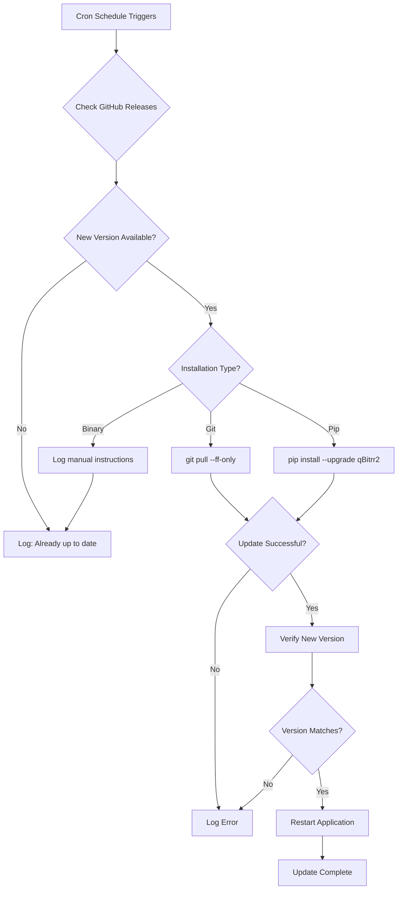

# Auto-Updates

qBitrr includes a built-in automatic update system that can check for new releases and upgrade your installation on a schedule. This feature supports multiple installation methods and provides a hands-off way to stay current with the latest bug fixes and features.

---

## Overview

The auto-update feature automatically:

1. **Checks** for new qBitrr releases on GitHub
2. **Downloads** and **installs** updates using the appropriate method
3. **Verifies** the installation succeeded
4. **Restarts** the application (if restart is enabled)

!!! note "Installation Method Support"
    Auto-update support varies by installation method:

    - **Git Installation**: ✅ Fully supported (`git pull` or tag checkout)
    - **PyPI/pip Installation**: ✅ Fully supported (`pip install --upgrade`)
    - **Binary Installation**: ⚠️ Manual update required (auto-update will notify only)

---

## Configuration

### Basic Setup

Auto-updates are configured in the `[Settings]` section of `config.toml`:

```toml
[Settings]
# Enable automatic updates on a schedule
AutoUpdateEnabled = false

# Cron expression for update schedule (default: weekly Sunday at 3 AM)
AutoUpdateCron = "0 3 * * 0"
```

### Configuration Options

#### `AutoUpdateEnabled`

**Type:** Boolean
**Default:** `false`
**Environment Variable:** `QBITRR_AUTO_UPDATE_ENABLED`

Enable or disable the automatic update worker.

```toml
AutoUpdateEnabled = true
```

!!! warning "Binary Installations"
    For binary installations, enabling this option will only log available updates. Manual download and installation is still required.

#### `AutoUpdateCron`

**Type:** String (cron expression)
**Default:** `"0 3 * * 0"` (weekly Sunday at 3 AM)
**Environment Variable:** `QBITRR_AUTO_UPDATE_CRON`

Cron expression defining when to check for and install updates.

**Common Schedules:**

```toml
# Daily at 3 AM
AutoUpdateCron = "0 3 * * *"

# Weekly on Sunday at 3 AM (default)
AutoUpdateCron = "0 3 * * 0"

# Weekly on Saturday at midnight
AutoUpdateCron = "0 0 * * 6"

# Twice per week (Wednesday and Sunday at 3 AM)
AutoUpdateCron = "0 3 * * 0,3"

# Monthly on the 1st at 2 AM
AutoUpdateCron = "0 2 1 * *"
```

!!! info "Cron Syntax"
    Standard cron syntax: `minute hour day_of_month month day_of_week`

    - `*` = any value
    - `0-23` = hour range
    - `0-6` = day of week (0=Sunday, 6=Saturday)
    - `,` = multiple values (e.g., `0,3` for Sunday and Wednesday)
    - `*/n` = every n units (e.g., `*/2` for every 2 hours)

---

## Installation Method Behavior

### Git Installation

**Detection:** Directory contains `.git/` folder

**Update Method:**

- **Without Target Version:** Runs `git pull --ff-only` to update to latest master
- **With Target Version:** Fetches tags and checks out specific version tag

**Process:**

```bash
# Default behavior (latest)
git pull --ff-only

# Specific version
git fetch --tags --force
git checkout v5.4.3
```

**Logs:**

```
[INFO] Installation type detected: git
[INFO] git pull output:
Updating abc1234..def5678
Fast-forward
 qBitrr/main.py | 15 +++++++++++----
 1 file changed, 11 insertions(+), 4 deletions(-)
[INFO] Update completed successfully
```

---

### PyPI/pip Installation

**Detection:** Not a binary, no `.git/` folder present

**Update Method:**

- **Without Target Version:** Runs `pip install --upgrade qBitrr2`
- **With Target Version:** Runs `pip install qBitrr2==5.4.3`

**Process:**

```bash
# Default behavior (latest)
python -m pip install --upgrade qBitrr2

# Specific version
python -m pip install qBitrr2==5.4.3
```

**Logs:**

```
[INFO] Installation type detected: pip
[INFO] PyPI installation detected
[DEBUG] Upgrading package: qBitrr2
[INFO] pip upgrade output:
Collecting qBitrr2
  Downloading qBitrr2-5.4.3-py3-none-any.whl (245 kB)
Installing collected packages: qBitrr2
Successfully installed qBitrr2-5.4.3
[INFO] Update completed successfully
```

---

### Binary Installation

**Detection:** Running as PyInstaller frozen executable (`sys.frozen` is True)

**Update Method:** **Manual only** - auto-update cannot replace running executable

**Process:**

When an update is available, qBitrr will log instructions:

```
[INFO] Binary installation detected - manual update required
[INFO] Update available: v5.4.3
[INFO] Download from: https://github.com/Feramance/qBitrr/releases/latest
[INFO] Instructions:
[INFO]   1. Download the binary for your platform
[INFO]   2. Extract the archive
[INFO]   3. Replace current executable with new binary
[INFO]   4. Restart qBitrr
```

**Supported Platforms:**

Binary builds are available for:

- `ubuntu-latest-x64` (Linux x86_64)
- `macOS-latest-arm64` (macOS Apple Silicon)
- `windows-latest-x64` (Windows x86_64)

!!! warning "Platform Availability"
    Binary builds are NOT available for:

    - Linux ARM64 (use Docker or pip)
    - macOS Intel x64 (use pip)
    - Windows ARM64 (use pip)

---

## Manual Updates

You can trigger an update manually via the WebUI or API without waiting for the cron schedule.

### Via WebUI

1. Navigate to **Settings** → **Updates**
2. Click **"Check for Updates"**
3. If an update is available, click **"Install Update"**
4. Monitor the **Logs** view for progress

### Via API

Trigger an update via the REST API:

```bash
# Check for updates
curl -X POST http://localhost:6969/api/check-updates \
  -H "Authorization: Bearer YOUR_TOKEN"

# Response
{
  "current_version": "5.4.2",
  "latest_version": "5.4.3",
  "update_available": true,
  "install_type": "pip"
}

# Install update
curl -X POST http://localhost:6969/api/install-update \
  -H "Authorization: Bearer YOUR_TOKEN"

# Response
{
  "success": true,
  "message": "Update completed successfully",
  "new_version": "5.4.3"
}
```

---

## Update Process Flow

### Automatic Updates



### Verification Steps

After installation, qBitrr verifies the update:

1. **Reload Version Module:** Clears `qBitrr.bundled_data` from `sys.modules`
2. **Re-import Version:** Imports fresh version string
3. **Compare Versions:** Checks installed version matches expected version
4. **Log Result:**
   - ✅ Success: `Update verified: version 5.4.3 installed successfully`
   - ❌ Failure: `Version mismatch after update: expected 5.4.3, got 5.4.2`

---

## Troubleshooting

### Invalid Cron Expression

**Symptom:**

```
[ERROR] Auto update disabled: invalid cron expression '0 25 * * *'
        (bad hour: 25 is not a valid hour)
```

**Solution:**

Fix the cron expression in `config.toml`. Hour must be 0-23.

```toml
# Incorrect (hour 25 doesn't exist)
AutoUpdateCron = "0 25 * * *"

# Correct (3 AM)
AutoUpdateCron = "0 3 * * *"
```

### Git Pull Fails (Merge Conflicts)

**Symptom:**

```
[ERROR] Failed to update repository via git: error: Your local changes to the following files would be overwritten by merge:
        qBitrr/config.py
Please commit your changes or stash them before you merge.
```

**Solution:**

You have uncommitted local changes. Either:

**Option 1: Stash Changes**

```bash
cd /path/to/qBitrr
git stash
# qBitrr will auto-update on next cron run

# Later, restore your changes:
git stash pop
```

**Option 2: Commit Changes**

```bash
cd /path/to/qBitrr
git add .
git commit -m "Local config changes"
git pull --rebase
```

**Option 3: Discard Changes**

```bash
cd /path/to/qBitrr
git reset --hard
# qBitrr will auto-update on next cron run
```

### Pip Upgrade Fails (Permission Denied)

**Symptom:**

```
[ERROR] Failed to upgrade package via pip: ERROR: Could not install packages due to an EnvironmentError: [Errno 13] Permission denied: '/usr/local/lib/python3.12/site-packages/...'
```

**Solution:**

Run qBitrr as a user with permission to install packages, or use a virtual environment:

**Option 1: Virtual Environment (Recommended)**

```bash
# Create venv if not already using one
python -m venv /opt/qbitrr/venv
source /opt/qbitrr/venv/bin/activate
pip install qBitrr2

# Start qBitrr (venv remains active for auto-updates)
qbitrr
```

**Option 2: User Install**

```bash
pip install --user qBitrr2
```

**Option 3: System Install with sudo**

```bash
sudo pip install qBitrr2
# Run qBitrr as root (not recommended for security)
```

### Update Available but Not Installing

**Symptom:**

```
[INFO] Update available: v5.4.3
[INFO] Binary installation detected - manual update required
```

**Solution:**

For **binary installations**, auto-update cannot replace the running executable. Download manually:

1. Go to https://github.com/Feramance/qBitrr/releases/latest
2. Download the appropriate binary for your platform:
   - Linux: `qBitrr-ubuntu-latest-x64.tar.gz`
   - macOS: `qBitrr-macOS-latest-arm64.tar.gz`
   - Windows: `qBitrr-windows-latest-x64.zip`
3. Extract and replace your current binary
4. Restart qBitrr

### Version Mismatch After Update

**Symptom:**

```
[WARNING] Version mismatch after update: expected 5.4.3, got 5.4.2
```

**Possible Causes:**

1. **Cache Issue:** Python module cache not cleared
2. **Multiple Installations:** Different qBitrr installations in PATH
3. **Partial Update:** Update partially succeeded

**Solution:**

**Check Installation:**

```bash
which qbitrr
pip show qBitrr2

# For git installations
cd /path/to/qBitrr && git describe --tags
```

**Force Reinstall (pip):**

```bash
pip install --force-reinstall qBitrr2==5.4.3
```

**Force Pull (git):**

```bash
cd /path/to/qBitrr
git fetch --tags --force
git checkout v5.4.3
```

### Update Worker Not Running

**Symptom:**

No update checks happening, no logs about auto-update

**Check Configuration:**

```bash
# Verify config
grep AutoUpdate config.toml
```

**Expected Output:**

```toml
AutoUpdateEnabled = true
AutoUpdateCron = "0 3 * * 0"
```

**Check Logs:**

```
[INFO] Auto update scheduled with cron '0 3 * * 0'.
[DEBUG] Next auto update scheduled for 2025-12-01T03:00:00
```

If you don't see these logs, auto-update is not enabled. Set `AutoUpdateEnabled = true` and restart.

---

## Docker Considerations

### Auto-Update in Docker

For Docker deployments, there are **two approaches** to auto-updates:

#### Approach 1: Update qBitrr Inside Container (Not Recommended)

You can enable `AutoUpdateEnabled = true` inside a Docker container, and qBitrr will update the **Python package** inside the container.

**Limitations:**

- Updates are **lost on container restart** (ephemeral)
- Container image remains outdated
- Not recommended for production

#### Approach 2: Update Docker Image (Recommended)

Use an external tool to update the Docker image itself:

**Option A: Watchtower**

Automatically pull and restart with new image:

```yaml
version: "3"
services:
  qbitrr:
    image: feramance/qbitrr:latest
    # ... other config ...

  watchtower:
    image: containrrr/watchtower:latest
    volumes:
      - /var/run/docker.sock:/var/run/docker.sock
    environment:
      - WATCHTOWER_CLEANUP=true
      - WATCHTOWER_SCHEDULE=0 3 * * 0  # Weekly Sunday 3 AM
    restart: unless-stopped
```

**Option B: Manual Update**

```bash
# Pull latest image
docker pull feramance/qbitrr:latest

# Recreate container
docker-compose down
docker-compose up -d
```

**Option C: Ouroboros**

Alternative to Watchtower:

```yaml
services:
  ouroboros:
    image: pyouroboros/ouroboros:latest
    volumes:
      - /var/run/docker.sock:/var/run/docker.sock
    environment:
      - CLEANUP=true
      - INTERVAL=86400  # Check daily
    restart: unless-stopped
```

!!! tip "Docker Auto-Update Best Practice"
    Disable qBitrr's internal auto-update (`AutoUpdateEnabled = false`) and use Watchtower or Ouroboros to manage Docker image updates.

---

## FFprobe Auto-Update

qBitrr also supports auto-updating the FFprobe binary used for media file verification.

### Configuration

```toml
[Settings]
# Enable automatic FFprobe binary updates
FFprobeAutoUpdate = true
```

### Behavior

- **Enabled (default):** qBitrr downloads FFprobe from https://ffbinaries.com/downloads on startup if not present
- **Disabled:** You must manually place `ffprobe` (or `ffprobe.exe` on Windows) in the data folder

**FFprobe Location:**

- **Linux/macOS:** `~/.config/qBitManager/ffprobe`
- **Windows:** `%APPDATA%\qBitManager\ffprobe.exe`
- **Docker:** `/config/qBitManager/ffprobe`

!!! info "FFprobe Updates"
    FFprobe updates are **separate** from qBitrr application updates. FFprobe is downloaded on-demand when needed, not on a schedule.

---

## Security Considerations

### Update Source Verification

qBitrr updates are pulled from official sources:

- **Git:** GitHub repository `Feramance/qBitrr`
- **PyPI:** Official package `qBitrr2`
- **Binary:** GitHub Releases with checksums

### Network Requirements

Auto-update requires outbound internet access to:

- `github.com` (for git installations and version checks)
- `pypi.org` (for pip installations)
- `ffbinaries.com` (for FFprobe downloads)

If running in an air-gapped environment, disable auto-update and manage updates manually.

### Authentication

GitHub API requests are unauthenticated (public API). If you hit rate limits (60 requests/hour), you can provide a GitHub token:

```bash
export GITHUB_TOKEN="ghp_YOUR_PERSONAL_ACCESS_TOKEN"
qbitrr
```

---

## Best Practices

### 1. Choose Appropriate Schedule

```toml
# Production: Weekly updates (stable)
AutoUpdateCron = "0 3 * * 0"  # Sunday 3 AM

# Development/Testing: Daily updates (latest features)
AutoUpdateCron = "0 3 * * *"  # Daily 3 AM

# Conservative: Monthly updates
AutoUpdateCron = "0 2 1 * *"  # 1st of month, 2 AM
```

### 2. Monitor Logs After Updates

Check logs after scheduled updates:

```bash
# Check for successful update
tail -100 /config/logs/Main.log | grep -i update

# Expected success output
[INFO] Auto update triggered
[INFO] Installation type detected: pip
[INFO] Update completed successfully
[INFO] Update verified: version 5.4.3 installed successfully
```

### 3. Test Updates in Staging First

For critical deployments:

1. Run a **staging qBitrr instance** with `AutoUpdateEnabled = true`
2. Test for 1-2 weeks
3. If stable, manually update production or enable auto-update

### 4. Pin Versions for Stability

If you need version stability (e.g., for LTS environments), **disable auto-update** and pin to a specific version:

**Git:**

```bash
git checkout v5.4.3
```

**Pip:**

```bash
pip install qBitrr2==5.4.3
```

**Docker:**

```yaml
services:
  qbitrr:
    image: feramance/qbitrr:5.4.3  # Pin to specific version
```

### 5. Backup Before Enabling

Before enabling auto-update for the first time, backup your configuration:

```bash
# Backup config
cp /config/config.toml /config/config.toml.backup

# Backup database
cp /config/qBitrr.db /config/qBitrr.db.backup
```

---

## API Reference

### Check for Updates

**Endpoint:** `POST /api/check-updates`
**Authentication:** Required (`Authorization: Bearer <token>`)

**Response:**

```json
{
  "current_version": "5.4.2",
  "latest_version": "5.4.3",
  "update_available": true,
  "install_type": "pip",
  "release_url": "https://github.com/Feramance/qBitrr/releases/tag/v5.4.3",
  "changelog": "Bug fixes and performance improvements"
}
```

### Install Update

**Endpoint:** `POST /api/install-update`
**Authentication:** Required (`Authorization: Bearer <token>`)

**Response:**

```json
{
  "success": true,
  "message": "Update completed successfully",
  "old_version": "5.4.2",
  "new_version": "5.4.3"
}
```

**Error Response:**

```json
{
  "success": false,
  "error": "Binary installation detected - manual update required",
  "install_type": "binary"
}
```

---

## Related Features

- **[Health Monitoring](health-monitoring.md)** - Monitors torrent and system health
- **[Disk Space Management](disk-space.md)** - Automatic pause/resume based on free space
- **[WebUI Configuration](../configuration/webui.md)** - Configure WebUI for update management

---

## Summary

- Auto-update supports **Git** and **PyPI** installations; binary installations require manual updates
- Configure schedule with **cron expressions** (`AutoUpdateCron`)
- Updates can be **triggered manually** via WebUI or API
- For **Docker**, use **Watchtower** or **Ouroboros** instead of internal auto-update
- Always **monitor logs** after updates to verify success
- **Backup config and database** before enabling auto-update
