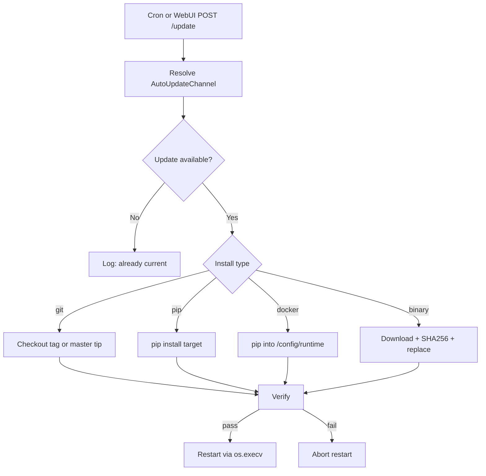

# Auto-Updates

qBitrr includes a built-in automatic update system that can check for new releases and upgrade your installation on a schedule. This feature supports multiple installation methods and provides a hands-off way to stay current with the latest bug fixes and features.

---

## Overview

The auto-update feature automatically:

1. **Checks** for new qBitrr releases on GitHub
2. **Downloads** and **installs** updates using the appropriate method
3. **Verifies** the installation succeeded
4. **Restarts** the application (if restart is enabled)

!!! note "Installation Method Support"
    Auto-update support by installation method:

    - **PyPI/pip**: Fully supported (`qBitrr2==version`, or git tip for nightly)
    - **Docker**: Fully supported via a persistent `/config/runtime` overlay (in-container; no image pull) — except **source-built** images
    - **Binary**: Fully supported for latest/stable (download + SHA256 verify + atomic replace); nightly is not available
    - **Source** (`.git` checkout, or `QBITRR_SOURCE_BUILD=1`): **Not supported** — auto-update is forced off

---

## Configuration

### Basic Setup

Auto-updates are configured in the `[Settings]` section of `config.toml`:

```toml
[Settings]
# Enable automatic updates on a schedule
AutoUpdateEnabled = false

# Cron expression for update schedule (default: weekly Sunday at 3 AM)
AutoUpdateCron = "0 3 * * 0"

# Release channel: latest | stable | nightly
AutoUpdateChannel = "latest"
```

### Configuration Options

#### `AutoUpdateEnabled`

**Type:** Boolean
**Default:** `false`
**Environment Variable:** `QBITRR_SETTINGS_AUTO_UPDATE_ENABLED`

Enable or disable the automatic update worker.

```toml
AutoUpdateEnabled = true
```

#### `AutoUpdateCron`

**Type:** String (cron expression)
**Default:** `"0 3 * * 0"` (weekly Sunday at 3 AM)
**Environment Variable:** `QBITRR_SETTINGS_AUTO_UPDATE_CRON`

Cron expression defining when to check for and install updates.

**Common Schedules:**

```toml
# Daily at 3 AM
AutoUpdateCron = "0 3 * * *"

# Weekly on Sunday at 3 AM (default)
AutoUpdateCron = "0 3 * * 0"

# Weekly on Saturday at midnight
AutoUpdateCron = "0 0 * * 6"

# Twice per week (Wednesday and Sunday at 3 AM)
AutoUpdateCron = "0 3 * * 0,3"

# Monthly on the 1st at 2 AM
AutoUpdateCron = "0 2 1 * *"
```

!!! info "Cron Syntax"
    Standard cron syntax: `minute hour day_of_month month day_of_week`

    - `*` = any value
    - `0-23` = hour range
    - `0-6` = day of week (0=Sunday, 6=Saturday)
    - `,` = multiple values (e.g., `0,3` for Sunday and Wednesday)
    - `*/n` = every n units (e.g., `*/2` for every 2 hours)

#### `AutoUpdateChannel`

**Type:** String (`latest` | `stable` | `nightly`)
**Default:** `"latest"`
**Environment Variable:** `QBITRR_SETTINGS_AUTO_UPDATE_CHANNEL`

| Channel | Meaning |
|---------|---------|
| `latest` | Newest GitHub/PyPI release (includes `[build]` bumps) |
| `stable` | Newest non-build release (build segment `1`), mirrors Docker `:stable` |
| `nightly` | Tip of `master` via git / pip-from-git; **not supported for binary installs** |

Optional GitHub API token for higher rate limits: `QBITRR_SETTINGS_GITHUB_TOKEN`, `GITHUB_TOKEN`, or `GH_TOKEN`.

---

## Installation Method Behavior

### Git / source Installation

**Detection:** Repository root contains `.git/`, **or** `QBITRR_SOURCE_BUILD` is set to a truthy value (`1` / `true` / `yes`). Checked **before** Docker so containers built from source are also classified as `source`.

**Update Method:** **Not supported.** Auto-update is forced off at runtime (config `AutoUpdateEnabled` is ignored). Update the working tree or rebuild the image manually.

For local Docker builds that exclude `.git` via `.dockerignore`, mark the image as source:

```bash
docker build --build-arg QBITRR_SOURCE_BUILD=1 -t qbitrr:local .
```

Official Hub images leave `QBITRR_SOURCE_BUILD=0` (default).

---

### PyPI/pip Installation

**Detection:** Not binary, not Docker, no `.git/` folder

**Update Method:**

- **latest / stable:** `python -m pip install --upgrade qBitrr2==X.Y.Z-N` (exact version required)
- **nightly:** `python -m pip install --upgrade "git+https://github.com/Feramance/qBitrr.git@master"`

---

### Docker Installation

**Detection:** `QBITRR_DOCKER_RUNNING=69420` / Docker runtime

**Update Method (in-container, persistent):**

- Installs into `/config/runtime` (volume-backed) with `pip install --target /config/runtime …`
- Entrypoint prepends `/config/runtime` to `PYTHONPATH`
- Survives container recreate as long as `/config` is mounted
- If a newer image is pulled later and is already ahead of the overlay, the overlay is cleared automatically

Pulling a new Docker image remains valid; built-in auto-update does **not** talk to the Docker socket.

---

### Binary Installation

**Detection:** Running as PyInstaller frozen executable (`sys.frozen` is True)

**Update Method:**

- **latest / stable:** Download the matching release asset, verify SHA256, atomically replace the executable, restart
- **nightly:** Not supported (no nightly binary assets)

**Supported Platforms:**

- `ubuntu-latest-x64` (Linux x86_64)
- `macOS-latest-arm64` (macOS Apple Silicon)
- `windows-2025-vs2026-x64` (Windows x86_64; older releases may use `windows-2025-x64` or `windows-latest-x64`)

!!! warning "Platform Availability"
    Binary builds are NOT available for Linux ARM64, macOS Intel x64, or Windows ARM64 (use Docker or pip).

---

## Manual Updates

You can trigger an update manually via the WebUI or API without waiting for the cron schedule.

### Via WebUI

1. Open the version / changelog modal from the WebUI
2. If an update is available, click **Update Now**
3. Monitor logs for progress; the app restarts after a successful verified update

### Via API

```bash
# Version / update metadata (includes channel + install type)
curl -H "Authorization: Bearer YOUR_TOKEN" \
  http://localhost:6969/api/meta

# Trigger update install
curl -X POST -H "Authorization: Bearer YOUR_TOKEN" \
  http://localhost:6969/api/update
```

---

## Update Process Flow

### Automatic Updates


```mermaid
graph TD
    A[Cron or WebUI POST /update] --> B[Resolve AutoUpdateChannel]
    B --> C{Update available?}
    C -->|No| D[Log: already current]
    C -->|Yes| E{Install type}
    E -->|git| F[Checkout tag or master tip]
    E -->|pip| G[pip install target]
    E -->|docker| H[pip into /config/runtime]
    E -->|binary| I[Download + SHA256 + replace]
    F --> J[Verify]
    G --> J
    H --> J
    I --> J
    J -->|pass| K[Restart via os.execv]
    J -->|fail| L[Abort restart]
```

### Verification Steps

After installation, qBitrr verifies the update:

1. **Reload Version Module:** Clears `qBitrr.bundled_data` from `sys.modules`
2. **Re-import Version:** Imports fresh version string
3. **Compare Versions:** Checks installed version matches expected version
4. **Log Result:**
   - ✅ Success: `Update verified: version 5.4.3 installed successfully`
   - ❌ Failure: `Version mismatch after update: expected 5.4.3, got 5.4.2`

---

## Troubleshooting

### Invalid Cron Expression

**Symptom:**

```
[ERROR] Auto update disabled: invalid cron expression '0 25 * * *'
        (bad hour: 25 is not a valid hour)
```

**Solution:**

Fix the cron expression in `config.toml`. Hour must be 0-23.

```toml
# Incorrect (hour 25 doesn't exist)
AutoUpdateCron = "0 25 * * *"

# Correct (3 AM)
AutoUpdateCron = "0 3 * * *"
```

### Source Build Detected (Auto-Update Disabled)

**Symptom:**

```
[INFO] Auto update disabled for source installation (source builds are never auto-updated)
```

or WebUI: "Source builds do not support auto-update".

**Cause:** qBitrr detected a `.git` directory or `QBITRR_SOURCE_BUILD=1`.

**Solution:** Update manually (`git pull` / rebuild), or for Docker built from source use an official Hub image (or rebuild without `--build-arg QBITRR_SOURCE_BUILD=1` and without baking `.git` into the image).

### Pip Upgrade Fails (Permission Denied)

**Symptom:**

```
[ERROR] Failed to upgrade package via pip: ERROR: Could not install packages due to an EnvironmentError: [Errno 13] Permission denied: '/usr/local/lib/python3.12/site-packages/...'
```

**Solution:**

Run qBitrr as a user with permission to install packages, or use a virtual environment:

**Option 1: Virtual Environment (Recommended)**

```bash
# Create venv if not already using one
python -m venv /opt/qbitrr/venv
source /opt/qbitrr/venv/bin/activate
pip install qBitrr2

# Start qBitrr (venv remains active for auto-updates)
qbitrr
```

**Option 2: User Install**

```bash
pip install --user qBitrr2
```

**Option 3: System Install with sudo**

```bash
sudo pip install qBitrr2
# Run qBitrr as root (not recommended for security)
```

### Update Available but Not Installing

**Symptom:** Update shows in WebUI / logs but Update Now is blocked or apply fails.

**Common causes:**

1. **Source build** (`.git` or `QBITRR_SOURCE_BUILD=1`) — auto-update is intentionally disabled; update the tree or rebuild manually.
2. **Binary + nightly channel** — switch to `latest` or `stable`, or download a release binary manually.
3. **Checksum / network failure** — check `Main.log` for SHA256 or download errors; ensure release assets include `.sha256` files.

### Version Mismatch After Update

**Symptom:**

```
[WARNING] Version mismatch after update: expected 5.4.3, got 5.4.2
```

**Possible Causes:**

1. **Cache Issue:** Python module cache not cleared
2. **Multiple Installations:** Different qBitrr installations in PATH
3. **Partial Update:** Update partially succeeded

**Solution:**

**Check Installation:**

```bash
which qbitrr
pip show qBitrr2

# For source checkouts (auto-update is disabled; update manually)
cd /path/to/qBitrr && git describe --tags
```

**Force Reinstall (pip):**

```bash
pip install --force-reinstall qBitrr2==5.4.3
```

**Manual update (source checkout):**

```bash
cd /path/to/qBitrr
git fetch --tags --force
git checkout v5.4.3
```

### Update Worker Not Running

**Symptom:**

No update checks happening, no logs about auto-update

**Check Configuration:**

```bash
# Verify config
grep AutoUpdate config.toml
```

**Expected Output:**

```toml
AutoUpdateEnabled = true
AutoUpdateCron = "0 3 * * 0"
```

**Check Logs:**

```
[INFO] Auto update scheduled with cron '0 3 * * 0'.
[DEBUG] Next auto update scheduled for 2025-12-01T03:00:00
```

If you don't see these logs, auto-update is not enabled. Set `AutoUpdateEnabled = true` and restart.

---

## Docker Considerations

### Built-in in-container updates

With `AutoUpdateEnabled = true`, Docker installs update **inside the container** into `/config/runtime`. That overlay is preferred via `PYTHONPATH` and persists across container recreate when `/config` is mounted.

Built-in auto-update does **not** pull Docker images or call the Docker API.

**Source-built images:** if the image was built from a git tree with `QBITRR_SOURCE_BUILD=1` (or somehow includes `.git`), install type is `source` and auto-update stays disabled.

### Optional: update the image itself

You can still pull a newer image (`feramance/qbitrr:stable`, `:latest`, or `:nightly`) with Watchtower, Ouroboros, or `docker compose pull`. If the image version is already ahead of the overlay, qBitrr clears the overlay on startup.

---

## FFprobe Auto-Update

qBitrr also supports auto-updating the FFprobe binary used for media file verification.

### Configuration

```toml
[Settings]
# Enable automatic FFprobe binary updates
FFprobeAutoUpdate = true
```

### Behavior

- **Enabled (default):** qBitrr downloads FFprobe from https://ffbinaries.com/downloads on startup if not present
- **Disabled:** You must manually place `ffprobe` (or `ffprobe.exe` on Windows) in the data folder

**FFprobe Location:**

- **Linux/macOS:** `~/.config/qBitManager/ffprobe`
- **Windows:** `%APPDATA%\qBitManager\ffprobe.exe`
- **Docker:** `/config/qBitManager/ffprobe`

!!! info "FFprobe Updates"
    FFprobe updates are **separate** from qBitrr application updates. FFprobe is downloaded on-demand when needed, not on a schedule.

---

## Security Considerations

### Update Source Verification

qBitrr updates are pulled from official sources:

- **Git:** GitHub repository `Feramance/qBitrr`
- **PyPI:** Official package `qBitrr2`
- **Binary:** GitHub Releases with checksums

### Network Requirements

Auto-update requires outbound internet access to:

- `github.com` (for git installations and version checks)
- `pypi.org` (for pip installations)
- `ffbinaries.com` (for FFprobe downloads)

If running in an air-gapped environment, disable auto-update and manage updates manually.

### Authentication

GitHub API requests are unauthenticated (public API). If you hit rate limits (60 requests/hour), you can provide a GitHub token:

```bash
export GITHUB_TOKEN="ghp_YOUR_PERSONAL_ACCESS_TOKEN"
qbitrr
```

---

## Best Practices

### 1. Choose Appropriate Schedule

```toml
# Production: Weekly updates (stable)
AutoUpdateCron = "0 3 * * 0"  # Sunday 3 AM

# Development/Testing: Daily updates (latest features)
AutoUpdateCron = "0 3 * * *"  # Daily 3 AM

# Conservative: Monthly updates
AutoUpdateCron = "0 2 1 * *"  # 1st of month, 2 AM
```

### 2. Monitor Logs After Updates

Check logs after scheduled updates:

```bash
# Check for successful update
tail -100 /config/logs/Main.log | grep -i update

# Expected success output
[INFO] Auto update triggered
[INFO] Installation type detected: pip
[INFO] Update completed successfully
[INFO] Update verified: version 5.4.3 installed successfully
```

### 3. Test Updates in Staging First

For critical deployments:

1. Run a **staging qBitrr instance** with `AutoUpdateEnabled = true`
2. Test for 1-2 weeks
3. If stable, manually update production or enable auto-update

### 4. Pin Versions for Stability

If you need version stability (e.g., for LTS environments), **disable auto-update** and pin to a specific version:

**Git:**

```bash
git checkout v5.4.3
```

**Pip:**

```bash
pip install qBitrr2==5.4.3
```

**Docker:**

```yaml
services:
  qbitrr:
    image: feramance/qbitrr:5.4.3  # Pin to specific version
```

### 5. Backup Before Enabling

Before enabling auto-update for the first time, backup your configuration:

```bash
# Backup config
cp /config/config.toml /config/config.toml.backup

# Backup database
cp /config/qBitrr.db /config/qBitrr.db.backup
```

---

## API Reference

### Version metadata

**Endpoint:** `GET /api/meta` (also `/web/meta`)
**Authentication:** Required when auth is enabled

Returns current/latest version, `update_available`, `installation_type`, `update_channel`, and optional binary download fields.

### Install update

**Endpoint:** `POST /api/update` (also `/web/update`)
**Authentication:** Required when auth is enabled

Starts the same update pipeline as the cron worker (channel-aware). Restarts only after verification succeeds.

---

## Related Features

- **[Health Monitoring](health-monitoring.md)** - Monitors torrent and system health
- **[Disk Space Management](disk-space.md)** - Automatic pause/resume based on free space
- **[WebUI Configuration](../configuration/webui.md)** - Configure WebUI for update management

---

## Summary

- Auto-update supports **pip**, **Docker** (`/config/runtime` overlay), and **binary** (latest/stable)
- **Source builds** (`.git` or `QBITRR_SOURCE_BUILD=1`, including Docker-from-source) never auto-update
- Choose channel with **`AutoUpdateChannel`**: `latest`, `stable`, or `nightly`
- Configure schedule with **`AutoUpdateCron`**
- Updates can be triggered manually via WebUI or `POST /api/update`
- Verification must succeed before restart
- Backup config and database before enabling auto-update
