# Automated Search

qBitrr can automatically search your Arr instances for missing media and quality upgrades, eliminating manual intervention for building and maintaining your library.

---

## Overview

Instead of manually clicking "Search All Missing" in Radarr/Sonarr/Lidarr, qBitrr continuously searches for:

- Missing movies/episodes/albums
- Quality upgrades for existing media
- Custom format score requirements
- Media requests from Overseerr/Ombi

**Key benefits:**

- Set it and forget it - library builds automatically
- Continuous searching finds content as it becomes available
- Smart ordering prioritizes recent releases
- Respects indexer rate limits with configurable delays
- Optional temporary quality profiles for hard-to-find media

---

## How It Works

### Search Loop


**Process:**

1. qBitrr queries Arr API for missing media
2. Filters based on your configuration (monitored, specials, etc.)
3. Sorts items by priority (year, release date, etc.)
4. Sends search command to Arr for each item
5. Waits `SearchLoopDelay` seconds between individual searches (default: 30s)
6. Repeats until all missing items are searched
7. Optionally restarts loop to find newly available releases

!!! note "SearchRequestsEvery vs SearchLoopDelay"
    - **SearchLoopDelay** (global setting): Delay between individual search commands for missing media
    - **SearchRequestsEvery** (per-Arr setting): Delay between complete request check cycles for Overseerr/Ombi

---

## Basic Configuration

Enable automated search in the `[<Arr>-<Name>.EntrySearch]` section:

```toml
[Radarr-Movies.EntrySearch]
# Enable searching for missing movies
SearchMissing = true

# Restart loop after completion
SearchAgainOnSearchCompletion = true
```

Then configure the delay between individual search commands globally:

```toml
[Settings]
# Delay between individual search commands (seconds, -1 = use default 30s)
SearchLoopDelay = 30
```

That's the minimum! qBitrr will now continuously search for missing movies with a 30-second delay between each search command.

---

## Search Settings

### SearchMissing

```toml
SearchMissing = true
```

**Type:** Boolean
**Default:** `false`

Master toggle for automated searching.

When `true`:

- qBitrr searches for missing media
- All other EntrySearch settings become active
- Search loop runs continuously

When `false`:

- No automated searching
- You must manually trigger searches in Arr

**Recommendation:** `true` for automated library management.

---

### SearchRequestsEvery

```toml
SearchRequestsEvery = 300  # 5 minutes in seconds
```

**Type:** Integer (seconds)
**Default:** `300` (5 minutes)

⚠️ **This setting ONLY applies to Overseerr/Ombi request integration.**

Controls how frequently qBitrr checks for new requests from Overseerr/Ombi and triggers searches.

**What it does:**
- After processing all pending requests, qBitrr waits this many seconds before checking for new requests again
- Does NOT affect regular missing media searches (those use `SearchLoopDelay` for individual delays)

**Why delay?**

- Prevents excessive API calls to Overseerr/Ombi
- Reduces Arr load from constant request checks
- Balances responsiveness vs resource usage

**Recommended values:**

<div class="grid cards" markdown>

- :material-tortoise:{ .lg .middle style="color: #51cf66" } **Low Activity (600s / 10 min)**

    ---

    **For infrequent requests**

    - ✅ Minimal API load
    - ✅ Low resource usage
    - ⚠️ Slower to process new requests
    - **Use for:** Small user base, occasional requests

- :material-scale-balance:{ .lg .middle style="color: #4dabf7" } **Balanced (300s / 5 min)** ⭐

    ---

    **Default - works well for most setups**

    - ✅ Checks every 5 minutes
    - ✅ Reasonable responsiveness
    - ✅ Minimal overhead
    - **Use for:** General purpose, moderate request volume

- :material-rabbit:{ .lg .middle style="color: #ffa94d" } **High Activity (120s / 2 min)**

    ---

    **Fast response to new requests**

    - ✅ Quick processing of incoming requests
    - ⚠️ More frequent API calls
    - ✅ Better user experience
    - **Use for:** Active user base, many requests

- :material-rocket-launch:{ .lg .middle style="color: #ff6b6b" } **Very High Activity (60s / 1 min)**

    ---

    **Near-instant request processing**

    - ✅ Fastest possible response time
    - ⚠️ Increased API load
    - ⚠️ Higher resource usage
    - **Use for:** Very active communities, high request volume

</div>

!!! info "Request Volume Considerations"
    Adjust based on your request patterns:

    - **Low volume (<10 requests/day)**: 300-600s works well
    - **Medium volume (10-50 requests/day)**: 120-300s recommended
    - **High volume (50+ requests/day)**: 60-120s for responsiveness

    Calculate: `3600 / SearchRequestsEvery = requests per hour`

    Example: `3600 / 300 = 12 requests/hour` (safe for most indexers)

---

### SearchAgainOnSearchCompletion

```toml
SearchAgainOnSearchCompletion = true
```

**Type:** Boolean
**Default:** `true`

Restart search loop after all missing items are searched.

When `true`:

- Continuous searching
- Finds newly released content
- Automatically fills library as content becomes available

When `false`:

- One-time search through missing items
- Stops after completing search list
- Useful for initial library population

**Use cases:**

- `true` - Ongoing library maintenance
- `false` - One-time backfill of old content

---

## Search Ordering

### SearchByYear (Radarr/Sonarr)

```toml
SearchByYear = true
```

**Type:** Boolean
**Default:** `true` (Radarr), varies (Sonarr)

Order search results by release year.

**Radarr:**

- Orders movies by theatrical release year
- `false` - Oldest first (1920s → 2020s)
- `true` - Newest first (2020s → 1920s)

**Sonarr:**

- Orders by episode air date year
- Prioritizes recent seasons

**Recommendation:** `true` for most users (recent content first).

---

### SearchInReverse

```toml
SearchInReverse = false
```

**Type:** Boolean
**Default:** `false`

Reverse the search order.

**Interaction with SearchByYear:**

```mermaid
flowchart TD
    Start([Configure Search Order])

    Start --> CheckYear{SearchByYear?}

    CheckYear -->|true| YearTrue[Order by Year DESC<br/>2024 → 2023 → 2022...]
    CheckYear -->|false| YearFalse[Order by Year ASC<br/>2020 → 2021 → 2022...]

    YearTrue --> CheckReverse1{SearchInReverse?}
    YearFalse --> CheckReverse2{SearchInReverse?}

    CheckReverse1 -->|false| Result1[✅ Newest → Oldest<br/>2024, 2023, 2022...]
    CheckReverse1 -->|true| Result2[✅ Oldest → Newest<br/>2020, 2021, 2022...]

    CheckReverse2 -->|false| Result3[✅ Oldest → Newest<br/>2020, 2021, 2022...]
    CheckReverse2 -->|true| Result4[✅ Newest → Oldest<br/>2024, 2023, 2022...]

    style Result1 fill:#51cf66,stroke:#2f9e44,color:#000
    style Result2 fill:#4dabf7,stroke:#1971c2,color:#000
    style Result3 fill:#4dabf7,stroke:#1971c2,color:#000
    style Result4 fill:#51cf66,stroke:#2f9e44,color:#000
    style Start fill:#dee2e6,stroke:#495057,color:#000
```



**Quick Reference:**

| SearchByYear | SearchInReverse | Result |
|:------------:|:---------------:|:------:|
| `true` | `false` | **Newest → Oldest** (most common) |
| `true` | `true` | Oldest → Newest |
| `false` | `false` | Oldest → Newest |
| `false` | `true` | **Newest → Oldest** |

**Use cases:**

- `false` - Prioritize recent releases (normal)
- `true` - Fill in older content first (backfilling)

---

### PrioritizeTodaysReleases (Sonarr only)

```toml
PrioritizeTodaysReleases = true
```

**Type:** Boolean
**Default:** `true` (Sonarr only)

Search for today's episode releases before processing the main missing queue.

**How it works:**

1. qBitrr checks for episodes airing today
2. Searches those episodes first
3. Then continues with regular missing queue

**Benefit:** Watch tonight's episode as soon as it's available!

**Recommendation:** `true` for actively airing shows.

---

## Sonarr-Specific Settings

### AlsoSearchSpecials

```toml
AlsoSearchSpecials = false
```

**Type:** Boolean
**Default:** `false`

Include special episodes (Season 00) in searches.

**What are specials?**

- Season 0 / "Specials"
- OVAs, ONAs (anime)
- Bonus content
- Behind-the-scenes
- Interviews

**Recommendation:**

- `false` - Skip specials (most users)
- `true` - Include specials (completionists)

---

### Unmonitored

```toml
Unmonitored = false
```

**Type:** Boolean
**Default:** `false`

Search for unmonitored episodes/series.

When `true`:

- Searches ALL series, even unmonitored
- Can find content you weren't actively seeking

When `false`:

- Only searches monitored content
- More controlled library growth

**Recommendation:** `false` to avoid unwanted downloads.

---

### SearchLimit

```toml
SearchLimit = 5
```

**Type:** Integer
**Default:** `5`
**Applies to:** Radarr, Sonarr

Maximum number of simultaneous search tasks qBitrr will queue for this Arr instance.

**Important Notes:**
- **Sonarr:** Has a hardcoded limit of 3 concurrent tasks. Values above 3 won't increase actual concurrency but qBitrr will queue them.
- **Radarr:** Default limit is 3, but can be increased up to 10 by setting `THREAD_LIMIT` environment variable (unsupported by Radarr developers).
- **Lidarr:** Does not support SearchLimit (Lidarr manages its own task queue internally).

**Recommendation:** `5` (allows queueing beyond default Arr limits).

---

### SearchBySeries (Sonarr only)

```toml
SearchBySeries = "smart"
```

**Type:** String
**Default:** `"smart"`
**Options:** `true`, `false`, `"smart"`

Control series vs episode search mode.

**Modes:**

- `true` - **Always** series search (entire series/season at once)
- `false` - **Always** episode search (individual episodes)
- `"smart"` - **Automatic** (series for seasons, episode for singles)

**Comparison:**

```mermaid
%%{init: {'theme':'base', 'themeVariables': { 'primaryColor':'#4dabf7','primaryTextColor':'#000','primaryBorderColor':'#1971c2','lineColor':'#868e96','secondaryColor':'#51cf66','tertiaryColor':'#ffa94d'}}}%%
graph LR
    subgraph Series["🎬 Series Search"]
        direction TB
        S1["⚡ Speed: FAST<br/>(1 search per series)"]
        S2["🎯 Precision: LOWER<br/>(bulk matching)"]
        S3["⚙️ Quality Control: LIMITED<br/>(ignores QualityUnmetSearch)"]
        S4["📦 Use Case:<br/>Batch downloading<br/>entire series/seasons"]
    end

    subgraph Episode["📺 Episode Search"]
        direction TB
        E1["🐌 Speed: SLOWER<br/>(1 search per episode)"]
        E2["🎯 Precision: HIGHER<br/>(exact matching)"]
        E3["⚙️ Quality Control: FULL<br/>(respects all settings)"]
        E4["🔍 Use Case:<br/>Selective upgrading<br/>missing episodes"]
    end

    Series -.->|vs| Episode

    style Series fill:#e7f5ff,stroke:#1971c2,stroke-width:2px
    style Episode fill:#d3f9d8,stroke:#2f9e44,stroke-width:2px
```



**Decision Guide:**

<div class="grid cards" markdown>

- :material-fast-forward:{ .lg .middle style="color: #4dabf7" } **Use Series Search When:**

    ---

    - ✅ Entire series/season is missing
    - ✅ Fast bulk downloads needed
    - ✅ Quality doesn't matter (grab anything)
    - ⚠️ You don't need upgrade searches

- :material-target:{ .lg .middle style="color: #51cf66" } **Use Episode Search When:**

    ---

    - ✅ Only specific episodes missing
    - ✅ Quality precision matters
    - ✅ Upgrading existing files
    - ✅ Respecting QualityUnmetSearch settings

- :material-auto-fix:{ .lg .middle style="color: #ffa94d" } **Use Smart Mode (Default):**

    ---

    - ⭐ **Automatic selection** based on context
    - ✅ Series search for bulk missing
    - ✅ Episode search for selective needs
    - ✅ Best balance of speed + precision

</div>

**Smart mode logic:**

```
If entire series/season is missing:
  → Series search (fast)
Else if single episodes missing:
  → Episode search (precise)
```

**Recommendation:** `"smart"` for best balance.

---

## Quality Upgrade Searches

### DoUpgradeSearch

```toml
DoUpgradeSearch = false
```

**Type:** Boolean
**Default:** `false`

Search for better quality versions of media you already have.

**Example scenarios:**

- You have 720p, want 1080p
- You have x264, want x265
- You have MP3, want FLAC (Lidarr)

When `true`:

- qBitrr queries for all media (not just missing)
- Sends upgrade search commands to Arr
- Arr downloads better quality if found

**Recommendation:**

- `false` - Satisfied with current quality
- `true` - Building a high-quality library

!!! warning "Bandwidth Usage"
    Upgrade searches can download a LOT of data. A 1080p→4K upgrade can be 50+ GB per movie.

---

### QualityUnmetSearch

```toml
QualityUnmetSearch = false
```

**Type:** Boolean
**Default:** `false`

Search for media that hasn't met quality profile requirements.

**How it works:**

1. You set quality profile to "1080p Minimum"
2. Arr downloads 720p (better than nothing)
3. qBitrr detects quality not met
4. Searches for 1080p version
5. Arr upgrades when found

**Difference from DoUpgradeSearch:**

- `DoUpgradeSearch` - Always looks for better
- `QualityUnmetSearch` - Only searches if quality target not met

**Recommendation:** `true` to enforce quality standards.

---

### CustomFormatUnmetSearch

```toml
CustomFormatUnmetSearch = false
```

**Type:** Boolean
**Default:** `false`

Search for media that hasn't met custom format score requirements.

**What are custom formats?**

Radarr/Sonarr v3+ feature for advanced filtering:

- Proper/Repack releases
- Scene vs P2P
- HDR vs SDR
- Release group preferences
- Audio codec preferences

**Example:**

1. Custom format requires score ≥ 100 for "Proper"
2. Downloaded release scores 50
3. qBitrr triggers search for higher-scoring release

**Recommendation:** `true` if you use custom formats extensively.

---

### ForceMinimumCustomFormat

```toml
ForceMinimumCustomFormat = false
```

**Type:** Boolean
**Default:** `false`

Automatically **remove** torrents that don't meet minimum custom format score.

When `true`:

- qBitrr checks custom format scores
- Removes torrents below minimum
- Blacklists release
- Triggers new search

**Very aggressive!** Only enable if:

- You have strict quality requirements
- Your custom formats are well-configured
- You're confident in your scoring

**Recommendation:** `false` unless you need strict enforcement.

---

## Temporary Quality Profiles

### UseTempForMissing

```toml
UseTempForMissing = false
```

**Type:** Boolean
**Default:** `false`

Temporarily lower quality requirements for missing items.

**Use case:** "Get *something* now, upgrade later"

**Example workflow:**

1. Album missing, profile = "Lossless (FLAC only)"
2. qBitrr switches to "Any (MP3 acceptable)"
3. Lidarr finds and downloads MP3
4. qBitrr switches back to "Lossless"
5. Future upgrade searches look for FLAC

**Requirement:** Must configure `QualityProfileMappings`.

---

### QualityProfileMappings

```toml
QualityProfileMappings = {"Lossless" = "Any", "HD-1080p" = "SD"}
```

**Type:** Dictionary (Main → Temp profile names)
**Default:** `{}` (empty)

Map main quality profiles to temporary profiles.

**Format:**

```toml
QualityProfileMappings = {
  "Main Profile Name" = "Temporary Profile Name"
}
```

**Profile names must match exactly as they appear in your Arr instance.**

**Examples:**

```toml
# Lidarr - Music
QualityProfileMappings = {
  "Lossless (FLAC)" = "Lossy (MP3-320)"
}

# Radarr - Movies
QualityProfileMappings = {
  "Ultra HD" = "HD-1080p",
  "HD-1080p" = "SD"
}

# Sonarr - TV
QualityProfileMappings = {
  "WEB-1080p" = "WEB-720p"
}
```

---

### KeepTempProfile

```toml
KeepTempProfile = false
```

**Type:** Boolean
**Default:** `false`

Don't switch back to main profile after download.

When `false` (default):

- Download completes → Switch back to main profile
- Allows future upgrades

When `true`:

- Keep temporary profile permanently
- No automatic upgrades

**Recommendation:** `false` for upgrade workflow.

---

### ForceResetTempProfiles

```toml
ForceResetTempProfiles = false
```

**Type:** Boolean
**Default:** `false`

Reset all items using temp profiles back to main profiles on qBitrr startup.

**Use case:** Clean up after testing or configuration changes.

---

### TempProfileResetTimeoutMinutes

```toml
TempProfileResetTimeoutMinutes = 0
```

**Type:** Integer (minutes)
**Default:** `0` (disabled)

Automatically reset temp profiles after X minutes.

**Example:**

```toml
TempProfileResetTimeoutMinutes = 10080  # 7 days
```

After 7 days with temp profile, qBitrr resets to main profile.

---

### ProfileSwitchRetryAttempts

```toml
ProfileSwitchRetryAttempts = 3
```

**Type:** Integer
**Default:** `3`

Number of retry attempts for profile switch API calls.

**Why retries?**

- Network issues
- Arr temporary unavailability
- API rate limiting

**Recommendation:** `3` is safe.

---

## Request Integration

Search for media requested via Overseerr or Ombi.

### Overseerr Configuration

```toml
[Radarr-Movies.EntrySearch.Overseerr]
# Enable Overseerr integration
SearchOverseerrRequests = false

# Overseerr URL
OverseerrURI = "http://localhost:5055"

# Overseerr API key
OverseerrAPIKey = "your-api-key"

# Only approved requests
ApprovedOnly = true

# 4K instance flag
Is4K = false
```

For details, see the Overseerr configuration section in [Radarr](../configuration/arr/radarr.md) or [Sonarr](../configuration/arr/sonarr.md) configuration guides.

---

### Ombi Configuration

```toml
[Sonarr-TV.EntrySearch.Ombi]
# Enable Ombi integration
SearchOmbiRequests = false

# Ombi URL
OmbiURI = "http://localhost:5000"

# Ombi API key
OmbiAPIKey = "your-api-key"

# Only approved requests
ApprovedOnly = true
```

**Note:** If both Overseerr and Ombi are enabled, Overseerr takes priority.

---

## Complete Configuration Examples

### Example 1: New Library (Fast Fill)

Fill a new library quickly:

```toml
[Radarr-Movies.EntrySearch]
SearchMissing = true
SearchByYear = true  # Recent movies first
SearchInReverse = false
SearchRequestsEvery = 180  # 3 minutes (aggressive)
DoUpgradeSearch = false  # Just fill library
QualityUnmetSearch = false
SearchAgainOnSearchCompletion = true  # Continuous
```

---

### Example 2: Quality-Focused Library

Build a high-quality library:

```toml
[Radarr-4K.EntrySearch]
SearchMissing = true
SearchRequestsEvery = 600  # 10 minutes (conservative)
DoUpgradeSearch = true  # Always seek better
QualityUnmetSearch = true  # Enforce quality
CustomFormatUnmetSearch = true  # Enforce formats
ForceMinimumCustomFormat = true  # Strict
SearchAgainOnSearchCompletion = true
```

---

### Example 3: Backfill Old Content

Fill in classic movies/TV:

```toml
[Radarr-Classics.EntrySearch]
SearchMissing = true
SearchByYear = true
SearchInReverse = true  # Start with oldest
SearchRequestsEvery = 300
DoUpgradeSearch = false
SearchAgainOnSearchCompletion = false  # One pass
```

---

### Example 4: Sonarr with Today's Releases

Stay current with airing shows:

```toml
[Sonarr-TV.EntrySearch]
SearchMissing = true
AlsoSearchSpecials = false
Unmonitored = false
SearchLimit = 5
SearchByYear = true
SearchInReverse = false
SearchRequestsEvery = 180  # 3 minutes
PrioritizeTodaysReleases = true  # Today's episodes first
SearchBySeries = "smart"
DoUpgradeSearch = false
SearchAgainOnSearchCompletion = true
```

---

### Example 5: Lidarr with Temp Profiles

Music library - get MP3 now, upgrade to FLAC later:

```toml
[Lidarr-Music.EntrySearch]
SearchMissing = true
SearchInReverse = false
SearchRequestsEvery = 300
DoUpgradeSearch = true
QualityUnmetSearch = true

# Temp profile strategy
UseTempForMissing = true
KeepTempProfile = false
QualityProfileMappings = {"Lossless (FLAC)" = "Any (MP3)"}
TempProfileResetTimeoutMinutes = 10080  # 7 days
SearchAgainOnSearchCompletion = true
```

---

## Monitoring Searches

### WebUI

View search activity in the WebUI:

1. Open `http://localhost:6969/ui`
2. Navigate to Arr tab (Radarr/Sonarr/Lidarr)
3. Watch for "Searching..." status

---

### Logs

Monitor search activity in logs:

```bash
# Main log
tail -f ~/logs/Main.log | grep -i search

# Specific Arr instance
tail -f ~/logs/Radarr-Movies.log | grep -i search
```

**Example log output:**

```
2025-11-27 10:00:00 - INFO - Searching for missing movies: 45 items
2025-11-27 10:00:05 - INFO - Search command sent for: The Matrix (1999)
2025-11-27 10:05:10 - INFO - Search command sent for: Inception (2010)
2025-11-27 10:10:15 - INFO - Search command sent for: Interstellar (2014)
...
2025-11-27 14:30:00 - INFO - All missing items searched, restarting loop
```

---

## Search Performance

### Estimating Search Time

Calculate how long to search through your missing queue:

```
Total Time = (Number of Missing Items) × (SearchRequestsEvery)
```

**Performance Visualization:**


**Quick Reference Table:**

| Missing Items | SearchRequestsEvery | Total Time | Requests/Hour |
|:-------------:|:-------------------:|:----------:|:-------------:|
| 100 movies | 300s (5 min) | **8.3 hours** | 12/hr |
| 100 movies | 180s (3 min) | **5 hours** | 20/hr |
| 100 movies | 60s (1 min) | **1.7 hours** ⚠️ | 60/hr |
| 500 movies | 300s (5 min) | **25 hours** | 12/hr |
| 500 movies | 180s (3 min) | **15 hours** | 20/hr |
| 1000 episodes | 300s (5 min) | **83 hours** (3.5 days) | 12/hr |
| 1000 episodes | 180s (3 min) | **50 hours** (2.1 days) | 20/hr |

!!! tip "Performance Calculation"
    **Formula:** `Total Time = Missing Items × SearchRequestsEvery / 60` (minutes)

    **Rate Limit Check:** `Requests/Hour = 3600 / SearchRequestsEvery`

    - ✅ Safe: < 20 requests/hour
    - ⚠️ Moderate risk: 20-40 requests/hour
    - ❌ High risk: > 40 requests/hour

**With continuous searching (`SearchAgainOnSearchCompletion = true`):**

- First pass: Full time above
- Subsequent passes: Only search new missing items
- Ongoing: Finds content as it becomes available

---

### Optimizing Search Speed

**Faster (higher risk of rate limits):**

```toml
SearchRequestsEvery = 60  # 1 minute
```

- 60 requests/hour
- Risky for many indexers
- Good for private trackers with high limits

**Balanced:**

```toml
SearchRequestsEvery = 300  # 5 minutes
```

- 12 requests/hour
- Safe for most setups
- Default recommendation

**Conservative:**

```toml
SearchRequestsEvery = 600  # 10 minutes
```

- 6 requests/hour
- Very safe
- Slow library fill

---

## Troubleshooting

### Searches Not Triggering

**Symptom:** qBitrr doesn't search for missing items

**Solutions:**

1. **Enable SearchMissing:**
   ```toml
   SearchMissing = true
   ```

2. **Check Arr has missing items:**
   - Open Radarr/Sonarr/Lidarr
   - Go to Wanted/Missing
   - Ensure items are monitored

3. **Review logs:**
   ```bash
   grep -i "search" ~/logs/Radarr-Movies.log
   ```

4. **Verify Arr API connectivity:**
   - Check URI and APIKey in config
   - Test with: `curl -H "X-Api-Key: your-key" http://localhost:7878/api/v3/wanted/missing`

---

### Rate Limit Errors

**Symptom:** Indexer errors in Arr logs

**Solutions:**

1. **Increase delay:**
   ```toml
   SearchRequestsEvery = 600  # Up from 300
   ```

2. **Check indexer limits:**
   - Review indexer documentation
   - Some have daily/hourly caps

3. **Stagger across multiple instances:**
   - Don't search all Arr instances simultaneously
   - Offset search times

---

### Temp Profiles Not Working

**Symptom:** Profiles don't switch

**Solutions:**

1. **Verify exact profile names:**
   ```toml
   # Must match EXACTLY (case-sensitive)
   QualityProfileMappings = {"Lossless (FLAC)" = "Any (MP3)"}
   ```

2. **Check Arr logs for errors:**
   - Profile not found
   - Permission issues

3. **Enable debug logging:**
   ```toml
   [Settings]
   ConsoleLevel = "DEBUG"
   ```

4. **Check retry attempts:**
   ```toml
   ProfileSwitchRetryAttempts = 5  # Up from 3
   ```

---

### Searches Too Slow

**Symptom:** Takes forever to search queue

**Solutions:**

1. **Decrease delay (carefully):**
   ```toml
   SearchRequestsEvery = 180  # Down from 300
   ```

2. **Use one-time search:**
   ```toml
   SearchAgainOnSearchCompletion = false
   ```

3. **Manual batch search in Arr:**
   - For initial library fill
   - Then enable qBitrr for maintenance

---

## Best Practices

### 1. Start Conservative

```toml
SearchRequestsEvery = 600  # 10 minutes
```

Monitor for a few days, then decrease if no issues.

---

### 2. Enable Continuous Search

```toml
SearchAgainOnSearchCompletion = true
```

Finds content as it becomes available on indexers.

---

### 3. Use Smart Search (Sonarr)

```toml
SearchBySeries = "smart"
```

Best balance of speed and precision.

---

### 4. Prioritize Recent Content

```toml
SearchByYear = true
SearchInReverse = false
```

Unless backfilling classics.

---

### 5. Monitor Indexer Health

- Check Arr → System → Tasks → Indexer logs
- Watch for rate limit warnings
- Adjust `SearchRequestsEvery` accordingly

---

### 6. Use Temp Profiles Selectively

Only for hard-to-find content:

```toml
UseTempForMissing = true  # Rare albums/movies
```

Not needed if indexers have good coverage.

---

## Integration with Other Features

### Instant Imports

After automated search finds content:

1. Search triggers download
2. qBittorrent downloads file
3. **Instant import** triggers (see [Instant Imports](instant-imports.md))
4. Media available within seconds of download

---

### Health Monitoring

If automated search downloads fail:

1. Health monitoring detects failure
2. Triggers re-search automatically
3. Downloads alternative release

See [Health Monitoring](health-monitoring.md).

---

### Request Systems

Overseerr/Ombi workflow:

1. User requests media
2. Automated search finds it
3. Instant import processes it
4. User notified within minutes

---

## Temporary Profile Troubleshooting

### Why did my item stay on temp profile after searching?

**Answer:** If a search was performed but no suitable release was found, the item remains on the temp profile to continue searching with lowered requirements.

**What happens:**

1. Item switches to temp profile (e.g., SD instead of HD-1080p)
2. qBitrr performs search
3. No releases match temp profile criteria (e.g., no SD releases available either)
4. Profile stays as temp for future search attempts
5. Once a release is found and downloaded, profile reverts to main

**Solution:** This is expected behavior. The temp profile will remain active until:

- Content is found and downloaded
- `TempProfileResetTimeoutMinutes` timeout expires (if configured)
- `ForceResetTempProfiles=true` triggers on qBitrr restart
- You manually reset the profile in Arr

---

### Why is my Sonarr series on a temp profile when some episodes have files?

**Answer:** Missing episodes take priority. If ANY episodes are missing, the entire series uses the temp profile to maximize chances of finding the missing content.

**How it works:**

Sonarr only supports quality profiles at the **series level** (not episode level). All episodes inherit the series profile. This is a Sonarr limitation, not a qBitrr design choice.

**Example:**

```
Series: Breaking Bad
Episodes:
  ✅ S01E01 - Has file
  ✅ S01E02 - Has file
  ❌ S01E03 - Missing
  ✅ S01E04 - Has file
  ❌ S01E05 - Missing
```

**qBitrr logic:**

- ANY episodes missing → Series uses temp profile
- Entire series switched to "HDTV-720p" (from "WEB-DL 1080p")
- Search for S01E03 and S01E05 with lowered quality
- Once all episodes downloaded → Series reverts to main profile

**Why this is correct:**

1. **Finding missing content is priority #1** - Get the episodes first
2. **Sonarr prevents downgrades** - Won't replace existing HD files with SD
3. **Custom Format protection** - Won't import lower CF score than existing
4. **Series-level only option** - Individual episode profiles not supported by Sonarr

**Solution:** This is expected and correct behavior. Existing high-quality episodes are protected; only missing episodes will download at lower quality.

---

### Temp profiles not switching at all?

**Check these:**

1. **Verify exact profile names:**
   ```bash
   curl -H "X-Api-Key: your-key" http://localhost:8686/api/v1/qualityprofile
   ```
   Profile names in config must match API response exactly (case-sensitive).

2. **Check UseTempForMissing enabled:**
   ```toml
   UseTempForMissing = true
   ```

3. **Verify mappings configured:**
   ```toml
   QualityProfileMappings = {"Main Profile" = "Temp Profile"}
   ```

4. **Review logs:**
   ```bash
   grep -i "temp\|profile" ~/logs/Radarr-Movies.log
   ```

---

### Profiles stuck on temp permanently?

**Solutions:**

1. **Enable auto-reset timeout:**
   ```toml
   TempProfileResetTimeoutMinutes = 10080  # 7 days
   ```

2. **Force reset on startup:**
   ```toml
   ForceResetTempProfiles = true
   ```
   Restart qBitrr.

3. **Manual reset in Arr:**
   - Go to Movies/Series/Artists
   - Bulk select items
   - Edit → Quality Profile → Select main profile

---

### API errors during profile switches?

**Increase retry attempts:**

```toml
ProfileSwitchRetryAttempts = 5  # Up from default 3
```

**Check Arr connectivity:**

```bash
# Test Arr API
curl -H "X-Api-Key: your-key" http://localhost:7878/api/v3/qualityprofile

# Check qBitrr logs
tail -f ~/logs/Radarr-Movies.log | grep -i "failed\|error"
```

---

## FAQ

### Q: Should I use temp profiles for all content types?

**A:** No. Recommended by use case:

- **Lidarr (Music)**: ✅ **Highly recommended** - Many albums lack lossless
- **Radarr (Movies)**: ⚠️ **Optional** - Use for 4K → 1080p fallback
- **Sonarr (TV)**: ⚠️ **Optional** - Use for WEB-DL → HDTV fallback on new episodes

**General rule:** Only enable if you frequently encounter missing content due to quality requirements being too strict.

---

### Q: What's the difference between temp profiles and just lowering my main profile?

**A:** Temp profiles enable automatic upgrades:

**Without temp profiles (lowered main profile):**

1. Set Lidarr profile to "Any (MP3-320)"
2. Downloads MP3 for all albums
3. **Never searches for FLAC upgrades**
4. Stuck with MP3 forever

**With temp profiles:**

1. Main profile: "Lossless (FLAC)"
2. Temp profile: "Any (MP3-320)"
3. Missing album → Switch to temp → Download MP3
4. Switch back to main → **Continue searching for FLAC**
5. FLAC becomes available → Automatic upgrade

**Benefit:** Get content now, upgrade automatically later.

---

### Q: Can I have different timeout values for different Arr instances?

**A:** Yes! Configure per-instance:

```toml
[Radarr-4K.EntrySearch]
TempProfileResetTimeoutMinutes = 43200  # 30 days for 4K

[Sonarr-TV.EntrySearch]
TempProfileResetTimeoutMinutes = 1440  # 1 day for TV

[Lidarr-Music.EntrySearch]
TempProfileResetTimeoutMinutes = 10080  # 7 days for music
```

---

### Q: Does KeepTempProfile=true prevent all upgrades?

**A:** Yes. When `KeepTempProfile=true`:

- Download completes
- Profile stays as temp
- No automatic switch back to main
- Upgrade searches use temp profile criteria (lower quality)
- Manual intervention required to restore main profile

**Recommendation:** Always use `KeepTempProfile=false` unless you intentionally want to accept lower quality permanently.

---

### Q: What happens if I delete a profile that's referenced in my mappings?

**A:** qBitrr handles this gracefully:

1. Profile deleted in Arr
2. qBitrr logs warning: "Profile 'ProfileName' not found"
3. Skips that mapping
4. Continues with other valid mappings

**No crashes or errors.** Fix by updating your config to use valid profile names.

---

### Q: Can I use the same temp profile for multiple main profiles?

**A:** Yes! Example:

```toml
QualityProfileMappings = {
  "Ultra-HD (4K)" = "HD-1080p",
  "HD-1080p" = "HD-720p",
  "HD-720p" = "SD"
}
```

This creates a quality hierarchy:
- 4K → 1080p fallback
- 1080p → 720p fallback
- 720p → SD fallback

---

## See Also

- [Instant Imports](instant-imports.md) - Fast media import
- [Health Monitoring](health-monitoring.md) - Torrent health checks
- [Custom Formats](custom-formats.md) - Advanced filtering
- [Quality Profiles](../configuration/quality-profiles.md) - Detailed temp profile configuration
- [Radarr Configuration](../configuration/arr/radarr.md) - Radarr setup
- [Sonarr Configuration](../configuration/arr/sonarr.md) - Sonarr setup
- [Lidarr Configuration](../configuration/arr/lidarr.md) - Lidarr setup
