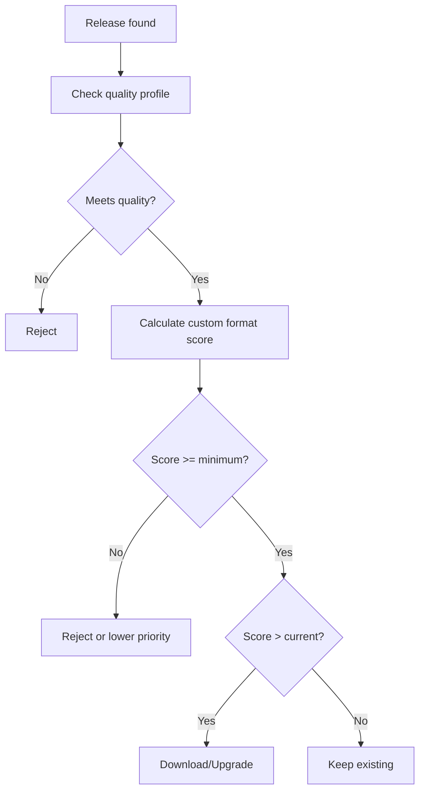

# Custom Formats

Custom formats provide advanced filtering and scoring for media releases in Radarr and Sonarr v3+, allowing you to prioritize specific codecs, release groups, HDR formats, and more. qBitrr integrates seamlessly with custom formats for automated quality enforcement.

---

## Overview

**What are custom formats?**

Custom formats are an advanced Radarr/Sonarr feature that lets you:

- **Score releases** based on attributes (codec, release group, HDR, etc.)
- **Prioritize preferred releases** over others
- **Enforce minimum quality standards** beyond basic quality profiles
- **Automatically upgrade** to better-scoring releases
- **Reject releases** that don't meet criteria

**qBitrr integration:**

- Searches for releases meeting custom format score requirements
- Automatically removes torrents below minimum scores
- Triggers re-searches when custom format criteria aren't met
- Supports custom format-based upgrade searches

!!! note "Arr Version Requirements"
    Custom formats are only available in:

    - Radarr v3+
    - Sonarr v3+

    Lidarr has limited custom format support (profiles only, not scoring).

---

## Custom Format Basics

### How Custom Formats Work



### Custom Format Components

1. **Format Definition** - Rules that match release attributes
2. **Scoring** - Points assigned when format matches
3. **Quality Profile Integration** - Minimum score requirements
4. **Upgrade Until** - Maximum score to upgrade to

**Example custom format:**

```json
{
  "name": "HDR",
  "includeCustomFormatWhenRenaming": true,
  "specifications": [
    {
      "name": "HDR",
      "implementation": "ReleaseTitleSpecification",
      "negate": false,
      "required": false,
      "fields": {
        "value": "\\bHDR\\b|\\bHDR10\\b"
      }
    }
  ]
}
```

**Scoring in quality profile:**

- HDR format: +100 points
- Dolby Vision: +150 points
- Minimum custom format score: 100

---

## qBitrr Custom Format Settings

Configure custom format integration in the `[<Arr>-<Name>.EntrySearch]` section.

### Complete Custom Format Configuration

```toml
[Radarr-4K.EntrySearch]
# Enable custom format-based searches
CustomFormatUnmetSearch = true

# Automatically remove torrents below minimum score
ForceMinimumCustomFormat = true

# Enable upgrade searches
DoUpgradeSearch = true
```

---

### CustomFormatUnmetSearch

```toml
CustomFormatUnmetSearch = true
```

**Type:** Boolean
**Default:** `false`

Search for media that hasn't met custom format score requirements.

**How it works:**

1. qBitrr queries Arr for media with custom format scores below the minimum
2. Sends search commands to find better-scoring releases
3. Arr downloads when higher-scoring release is found

**Example scenario:**

1. Quality profile requires minimum custom format score of 100
2. Current release scores 50 (lacks HDR)
3. qBitrr detects score unmet
4. Triggers search
5. Arr finds HDR release (score: 150)
6. Downloads and replaces

**Recommendation:** `true` if you use custom formats extensively.

---

### ForceMinimumCustomFormat

```toml
ForceMinimumCustomFormat = false
```

**Type:** Boolean
**Default:** `false`

Automatically remove torrents that don't meet minimum custom format score.

**When enabled:**

- qBitrr monitors custom format scores
- Removes torrents below quality profile minimum
- Blacklists the release
- Triggers immediate re-search

**Very aggressive!** Only enable if:

- Your custom formats are well-configured
- You have multiple indexers
- You're confident in minimum score requirements

**Example:**

```toml
# Strict custom format enforcement
ForceMinimumCustomFormat = true
```

- Movie downloads with score 50
- Minimum required: 100
- qBitrr removes torrent immediately
- Searches for release with score ≥ 100

!!! danger "Use With Caution"
    This can result in:

    - Constant downloading/removing cycle if no releases meet criteria
    - Wasted bandwidth
    - Never getting some media

    **Test thoroughly before enabling!**

---

## Common Custom Format Use Cases

### Use Case 1: HDR/Dolby Vision Preference

**Goal:** Prioritize HDR and Dolby Vision releases

**Custom formats:**

- **HDR10** - +100 points
- **Dolby Vision** - +150 points
- **SDR** - 0 points

**Quality profile:**

- Minimum score: 0 (accept SDR if nothing better)
- Upgrade until score: 150 (stop at Dolby Vision)

**qBitrr config:**

```toml
[Radarr-4K.EntrySearch]
DoUpgradeSearch = true
CustomFormatUnmetSearch = false  # Accept SDR initially
ForceMinimumCustomFormat = false
```

**Result:** Downloads SDR if available, upgrades to HDR/DV when found.

---

### Use Case 2: Release Group Preferences

**Goal:** Prefer specific release groups

**Custom formats:**

- **Tier 1 Groups (FLUX, CtrlHD)** - +200 points
- **Tier 2 Groups (HiFi, DON)** - +100 points
- **Scene releases** - -50 points

**Quality profile:**

- Minimum score: 50
- Upgrade until: 200

**qBitrr config:**

```toml
[Radarr-Movies.EntrySearch]
DoUpgradeSearch = true
CustomFormatUnmetSearch = true  # Search if below 50
ForceMinimumCustomFormat = true  # Reject scene releases
```

**Result:** Only downloads Tier 1/2 groups, automatically upgrades to Tier 1.

---

### Use Case 3: Codec Preferences

**Goal:** Prefer modern codecs (x265, AV1)

**Custom formats:**

- **AV1** - +150 points
- **x265/HEVC** - +100 points
- **x264** - 0 points

**Quality profile:**

- Minimum score: 0
- Upgrade until: 150

**qBitrr config:**

```toml
[Radarr-Movies.EntrySearch]
DoUpgradeSearch = true
CustomFormatUnmetSearch = false
ForceMinimumCustomFormat = false
```

**Result:** Accepts x264, upgrades to x265/AV1 when available.

---

### Use Case 4: Strict Quality Enforcement

**Goal:** Only download releases meeting strict criteria

**Custom formats:**

- **Proper/Repack** - +50 points
- **Trusted groups** - +100 points
- **HDR** - +50 points
- **Minimum total score:** 150

**Quality profile:**

- Minimum score: 150
- Upgrade until: 200

**qBitrr config:**

```toml
[Radarr-4K.EntrySearch]
CustomFormatUnmetSearch = true
ForceMinimumCustomFormat = true
DoUpgradeSearch = true
```

**Result:** Only downloads releases scoring ≥150, rejects everything else.

---

## Setting Up Custom Formats in Arr

### Creating a Custom Format (Radarr/Sonarr)

1. **Navigate to Settings** → **Custom Formats**
2. Click **Add Custom Format** (+ icon)
3. **Name your format** (e.g., "HDR", "Preferred Groups")
4. **Add specifications:**
   - **Release Title** - Regex matching in release name
   - **Indexer** - Specific indexers
   - **Quality** - Quality tiers
   - **Language** - Audio/subtitle languages
   - **Size** - File size ranges

**Example: HDR format**

```
Name: HDR
Specifications:
  - Type: Release Title
    Regex: \b(HDR|HDR10|HDR10Plus)\b
    Required: No
```

5. **Save the custom format**

---

### Assigning Scores in Quality Profiles

1. **Navigate to Settings** → **Profiles**
2. Select or create a **Quality Profile**
3. Scroll to **Custom Formats** section
4. **Assign scores** to each format:
   - Positive scores = preferred
   - Negative scores = avoid
   - Zero = neutral
5. Set **Minimum Custom Format Score**
6. Set **Upgrade Until Custom Format Score**
7. **Save profile**

**Example quality profile:**

```
Profile: 4K HDR
Qualities: 2160p (Remux, Bluray, Web)
Custom Formats:
  - Dolby Vision: +150
  - HDR10+: +120
  - HDR10: +100
  - x265: +50
  - Proper: +25
  - Scene: -50
Minimum Score: 100
Upgrade Until: 150
```

---

## Custom Format Examples

### Example 1: TraSH Guides Import

TraSH Guides (https://trash-guides.info) provides pre-made custom format JSON files.

**How to import:**

1. Download custom format JSON from TraSH Guides
2. In Radarr/Sonarr → Settings → Custom Formats
3. Click **Import Custom Format**
4. Paste JSON
5. Save

**Popular TraSH custom formats:**

- HDR Formats (Dolby Vision, HDR10+, etc.)
- Audio Formats (Atmos, DTS-X, TrueHD)
- Release Groups (tiers 1-3)
- Unwanted content (hardcoded subs, LQ releases)
- Streaming service tags (Netflix, Disney+, etc.)

---

### Example 2: Audio Quality

```
Custom Format: Lossless Audio
Specifications:
  - Release Title: \b(TrueHD|DTS-HD|LPCM|FLAC)\b

Custom Format: Lossy Audio
Specifications:
  - Release Title: \b(AAC|DD|AC3|MP3)\b

Quality Profile Scoring:
  - Lossless Audio: +100
  - Lossy Audio: 0
  - Minimum: 50
```

**Result:** Prefers lossless audio but accepts lossy if needed.

---

### Example 3: Streaming Service Tags

```
Custom Format: Netflix
Specifications:
  - Release Title: \bNF\b|\bNETFLIX\b
Score: +50

Custom Format: Disney+
Specifications:
  - Release Title: \bDSNP\b|\bDISNEY\b
Score: +60

Custom Format: Amazon
Specifications:
  - Release Title: \bAMZN\b|\bAMAZON\b
Score: +55
```

**Result:** Prioritizes Disney+ releases, then Amazon, then Netflix.

---

## Monitoring Custom Format Scores

### Radarr/Sonarr UI

View custom format scores:

1. Go to **Movies/Series** list
2. Click a movie/episode
3. Scroll to **Files** tab
4. View **Custom Format Score** column

---

### API Query

Check custom format scores via API:

```bash
# Get movie with custom format info
curl -H "X-Api-Key: your-key" \
  http://localhost:7878/api/v3/movie/123

# Response includes:
{
  "id": 123,
  "title": "The Matrix",
  "movieFile": {
    "customFormatScore": 150,
    "customFormats": [
      {"name": "HDR10", "score": 100},
      {"name": "x265", "score": 50}
    ]
  }
}
```

---

### qBitrr Logs

Monitor custom format searches in logs:

```bash
tail -f ~/logs/Radarr-4K.log | grep -i "custom format"
```

**Example log output:**

```
2025-11-27 10:00:00 - INFO - Custom format score unmet: The Matrix (1999) - Current: 50, Required: 100
2025-11-27 10:00:05 - INFO - Searching for better custom format score
2025-11-27 10:05:00 - INFO - Found release with score 150: The.Matrix.1999.2160p.HDR.HEVC
```

---

## Troubleshooting

### Custom Format Searches Not Triggering

**Symptom:** qBitrr doesn't search for custom format upgrades

**Solutions:**

1. **Enable custom format search:**
   ```toml
   CustomFormatUnmetSearch = true
   ```

2. **Check quality profile minimum:**
   - Ensure quality profile has minimum custom format score > 0
   - Current score must be below minimum

3. **Verify custom formats exist:**
   - Radarr/Sonarr → Settings → Custom Formats
   - At least one format must be defined and scored

4. **Review logs:**
   ```bash
   grep -i "custom" ~/logs/Radarr-Movies.log
   ```

---

### Torrents Constantly Removed

**Symptom:** qBitrr removes torrents immediately after download

**Cause:** `ForceMinimumCustomFormat = true` with unrealistic requirements

**Solutions:**

1. **Disable forced enforcement:**
   ```toml
   ForceMinimumCustomFormat = false
   ```

2. **Lower minimum score:**
   - Radarr/Sonarr → Quality Profile
   - Reduce minimum custom format score

3. **Review custom format definitions:**
   - Check regex patterns aren't too strict
   - Verify formats match available releases

4. **Test with manual search:**
   - Manually search in Radarr/Sonarr
   - Check if ANY releases meet criteria

---

### Scores Not Calculating

**Symptom:** Custom format scores show as 0

**Solutions:**

1. **Check format specifications:**
   - Radarr/Sonarr → Custom Formats
   - Test regex against release names

2. **Verify profile assignment:**
   - Quality profile must have scores assigned
   - Check profile is assigned to media

3. **Update Arr instance:**
   - Custom formats improved in recent versions
   - Update to latest Radarr/Sonarr

---

### Upgrades Not Happening

**Symptom:** Better-scoring releases available but not downloading

**Solutions:**

1. **Enable upgrade search:**
   ```toml
   DoUpgradeSearch = true
   ```

2. **Check "Upgrade Until" score:**
   - Quality Profile → Upgrade Until Custom Format Score
   - Must be higher than current score

3. **Verify file isn't "cut off":**
   - Radarr/Sonarr → Movie/Series → Quality tab
   - Ensure "Cut off" quality hasn't been reached

---

## Best Practices

### 1. Start Simple

Begin with a few basic custom formats:

```
- HDR: +100
- Proper: +50
- Scene: -50
Minimum: 0
```

Expand as you learn the system.

---

### 2. Use TraSH Guides

Import proven custom format configurations:

- Visit https://trash-guides.info
- Import relevant formats
- Adjust scores to your preferences

---

### 3. Test Before Enforcing

```toml
# Phase 1: Test (don't force)
CustomFormatUnmetSearch = true
ForceMinimumCustomFormat = false

# Phase 2: After validating (enforce)
ForceMinimumCustomFormat = true
```

---

### 4. Set Realistic Minimums

```
Minimum Score: 0-50  # Lenient (accepts most releases)
Minimum Score: 100-150  # Moderate (prefers quality)
Minimum Score: 200+  # Strict (may miss content)
```

---

### 5. Balance Preferences vs Availability

High scores for preferred attributes:

```
Dolby Vision: +150
Trusted Group: +100
HDR: +50
```

But keep minimums low enough to find releases:

```
Minimum Score: 50  # Not 200
```

---

### 6. Monitor for a Week

Before enabling `ForceMinimumCustomFormat`:

- Monitor search logs
- Check success rate
- Verify formats match expected releases
- Adjust scores based on results

---

## Integration with qBitrr Workflows

### Workflow 1: Initial Download + Upgrade

```toml
[Radarr-Movies.EntrySearch]
SearchMissing = true
CustomFormatUnmetSearch = false  # Accept any initially
ForceMinimumCustomFormat = false

DoUpgradeSearch = true  # Upgrade later
```

**Process:**

1. Movie added to Radarr
2. qBitrr searches (any quality accepted)
3. Downloads whatever is available
4. Later: Upgrade search finds better custom format score
5. Replaces with higher-quality release

---

### Workflow 2: Strict Quality Only

```toml
[Radarr-4K.EntrySearch]
SearchMissing = true
CustomFormatUnmetSearch = true
ForceMinimumCustomFormat = true

DoUpgradeSearch = true
```

**Process:**

1. Movie added to Radarr
2. qBitrr searches
3. Only downloads if score ≥ minimum
4. Rejects all others
5. Continues searching until criteria met
6. Later upgrades to even better scores

---

### Workflow 3: Tiered Quality

```toml
# Radarr-HD instance (lenient)
[Radarr-HD.EntrySearch]
SearchMissing = true
CustomFormatUnmetSearch = false
DoUpgradeSearch = false
# Minimum score: 0

# Radarr-4K instance (strict)
[Radarr-4K.EntrySearch]
SearchMissing = true
CustomFormatUnmetSearch = true
ForceMinimumCustomFormat = true
DoUpgradeSearch = true
# Minimum score: 150
```

**Process:**

- HD instance: Gets everything fast
- 4K instance: Waits for high-quality releases only

---

## Custom Format Resources

### Official Documentation

- **Radarr:** https://wiki.servarr.com/radarr/settings#custom-formats
- **Sonarr:** https://wiki.servarr.com/sonarr/settings#custom-formats

### TraSH Guides

- **Custom Format Collection:** https://trash-guides.info/Radarr/Radarr-collection-of-custom-formats/
- **Scoring Guide:** https://trash-guides.info/Radarr/radarr-setup-quality-profiles/
- **Import Instructions:** https://trash-guides.info/Radarr/Radarr-import-custom-formats/

### Community Resources

- **r/Radarr** - Reddit community
- **r/Sonarr** - Reddit community
- **Radarr Discord** - Real-time help
- **Sonarr Discord** - Real-time help

---

## See Also

- [Automated Search](automated-search.md) - Search configuration and upgrade searches
- [Quality Profiles](../configuration/quality-profiles.md) - Quality profile setup
- [Radarr Configuration](../configuration/arr/radarr.md) - Radarr instance configuration
- [Sonarr Configuration](../configuration/arr/sonarr.md) - Sonarr instance configuration
- [Config File Reference](../configuration/config-file.md) - All configuration options
