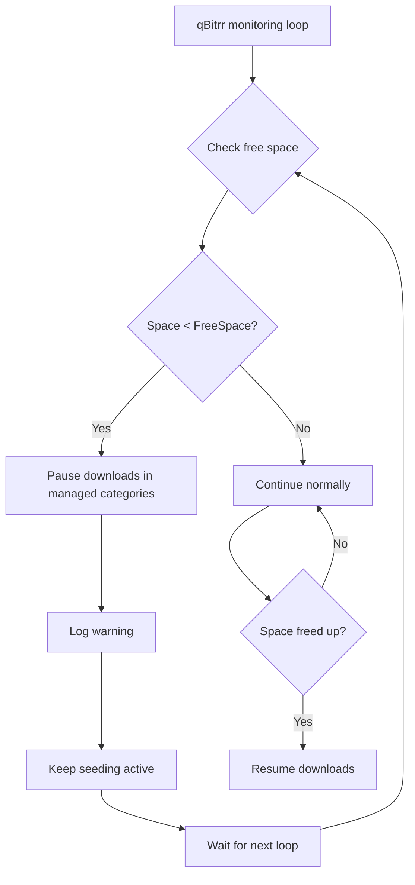

# Disk Space Management

qBitrr automatically monitors disk space and pauses downloads when free space drops below your configured threshold, preventing "disk full" errors and system instability.

---

## Overview

**The Problem:**

- Downloads fill up your disk
- System becomes unstable when disk is full
- Database corruption risk
- Import failures
- Torrent corruption

**qBitrr's Solution:**

- Monitors free space continuously
- Pauses downloads before disk fills
- Keeps seeding active
- Automatically resumes when space frees up
- Prevents system crashes and corruption

---

## How It Works



**Process:**

1. qBitrr checks free space every `LoopSleepTimer` seconds (default: 5)
2. Compares available space to `FreeSpace` threshold
3. If space < threshold:
   - Pauses **downloading** torrents in **managed** categories (Arr-managed and qBit-managed) so that free space would not fall below the threshold
   - Keeps seeding torrents active
   - Logs warning message
4. When space frees up (files imported/deleted):
   - Automatically resumes paused downloads
   - Continues normal operation

**Which torrents are monitored:**

The Free Space Manager monitors torrents in **all categories** that qBitrr manages:

- **Arr-managed categories** — The `Category` setting for each Radarr, Sonarr, and Lidarr instance (e.g. `radarr`, `sonarr`, `radarr4k`).
- **qBit-managed categories** — Categories listed in `[qBit].ManagedCategories` (e.g. `autobrr`).

Torrents in any of these categories are included in free-space checks and can be paused when disk is low. Torrents in other qBittorrent categories (not used by any Arr instance and not in `ManagedCategories`) are not monitored.

---

## Configuration

Disk space management is configured in the `[Settings]` section:

```toml
[Settings]
# Minimum free space threshold
FreeSpace = "50G"

# Folder to monitor
FreeSpaceFolder = "/data/downloads"

# Enable auto pause/resume
AutoPauseResume = true

# Download folder (must match qBittorrent)
CompletedDownloadFolder = "/data/downloads"
```

---

### FreeSpace

```toml
FreeSpace = "50G"
```

**Type:** String
**Default:** `"-1"` (disabled)
**Format:** Number + Unit (`K`, `M`, `G`, `T`)

Minimum free space to maintain.

**Units:**

- `K` - Kilobytes
- `M` - Megabytes
- `G` - Gigabytes **(recommended)**
- `T` - Terabytes

**Examples:**

```toml
FreeSpace = "50G"    # 50 gigabytes
FreeSpace = "100M"   # 100 megabytes
FreeSpace = "1T"     # 1 terabyte
FreeSpace = "-1"     # Disabled (no monitoring)
```

**Recommended values:**

| Disk Size | Recommended FreeSpace | Percentage |
|-----------|----------------------|------------|
| 100 GB | `10G` | 10% |
| 500 GB | `50G` | 10% |
| 1 TB | `100G` | 10% |
| 2 TB | `200G` | 10% |
| 4 TB | `400G` | 10% |
| 10 TB | `500G` | 5% |

**Calculation:**

```
FreeSpace = Disk Size × 0.10  (10% of total)
```

---

### FreeSpaceFolder

```toml
FreeSpaceFolder = "/data/downloads"
```

**Type:** String (path)
**Default:** `"CHANGE_ME"` in generated config; must be set when `FreeSpace != "-1"`

Folder to monitor for free space.

**Usually the same as:**

- `CompletedDownloadFolder` - Where qBittorrent saves files
- qBittorrent's "Default Save Path"

**Why might they differ?**

- Download folder on SSD, monitoring HDD
- Shared storage with multiple mount points
- Network storage

**Examples:**

```toml
# Standard - same folder
CompletedDownloadFolder = "/data/downloads"
FreeSpaceFolder = "/data/downloads"

# Different - monitor parent filesystem
CompletedDownloadFolder = "/mnt/storage/downloads"
FreeSpaceFolder = "/mnt/storage"

# Docker
CompletedDownloadFolder = "/downloads"
FreeSpaceFolder = "/downloads"
```

**Docker:** The path is **inside the container**. You must mount your host torrent directory at that path (e.g. `-v /host/torrents:/torrents`). If the path does not exist in the container, qBitrr falls back to `/` and reports the container root filesystem's free space (usually very small), which will trigger constant pausing. Ensure your compose/run mounts the volume at the same path as `FreeSpaceFolder`.

---

### AutoPauseResume

```toml
AutoPauseResume = true
```

**Type:** Boolean
**Default:** `true`

Enable automatic pausing and resuming of torrents.

**Required for disk space management!**

**When true:**

- qBitrr can pause downloads when disk is full
- qBitrr can resume downloads when space frees up
- Health checks can pause/resume torrents
- Full automation

**When false:**

- No automatic pause/resume
- Disk space monitoring has no effect
- Manual intervention required

**Recommendation:** Keep `true` unless you have specific reasons not to.

---

## Complete Configuration Examples

### Example 1: Standard Setup

```toml
[Settings]
# Monitor disk space
FreeSpace = "100G"
FreeSpaceFolder = "/data/downloads"
AutoPauseResume = true

# Must match qBittorrent's save path
CompletedDownloadFolder = "/data/downloads"

# Check every 5 seconds
LoopSleepTimer = 5
```

**Behavior:**

- Monitors `/data/downloads` filesystem
- Pauses downloads if < 100 GB free
- Resumes when space freed up
- Checks every 5 seconds

---

### Example 2: Docker Setup

```toml
[Settings]
FreeSpace = "50G"
FreeSpaceFolder = "/downloads"
AutoPauseResume = true
CompletedDownloadFolder = "/downloads"
```

**Docker Compose:**

```yaml
services:
  qbitrr:
    volumes:
      - /mnt/storage/downloads:/downloads
```

**Monitors:** `/mnt/storage` on host (seen as `/downloads` in container)

---

### Example 3: Large Storage

```toml
[Settings]
# 500 GB threshold for 10 TB disk
FreeSpace = "500G"
FreeSpaceFolder = "/mnt/bigdisk/downloads"
AutoPauseResume = true
CompletedDownloadFolder = "/mnt/bigdisk/downloads"
```

---

### Example 4: Disabled (Not Recommended)

```toml
[Settings]
FreeSpace = "-1"  # Disabled
AutoPauseResume = false
```

**Warning:** No protection against disk full errors!

---

## Workflow Examples

### Scenario 1: Normal Operation

```
Initial state:
- Disk: 1 TB total
- Free: 150 GB
- Threshold: 50 GB
- Status: Downloading

Action:
- 3 torrents downloading
- Free space: 150 GB → 120 GB → 80 GB → 60 GB
- Still above 50 GB threshold
- Continues downloading normally
```

---

### Scenario 2: Low Space - Pause

```
State:
- Free: 60 GB → 55 GB → 48 GB
- Threshold: 50 GB
- Free space drops below threshold!

qBitrr Actions:
1. Detects: 48 GB < 50 GB threshold
2. Pauses downloading torrents in managed categories (see "Which torrents are monitored" below)
3. Logs: "Disk space low, pausing downloads"
4. Keeps seeding torrents active
5. Waits for space to free up
```

---

### Scenario 3: Space Freed - Resume

```
State:
- Downloads paused (48 GB free < 50 GB threshold)
- Arr imports completed downloads
- Files moved to library
- Free space: 48 GB → 75 GB

qBitrr Actions:
1. Detects: 75 GB > 50 GB threshold
2. Resumes all paused downloads
3. Logs: "Disk space available, resuming downloads"
4. Normal operation continues
```

---

### Scenario 4: Repeated Pause/Resume

```
Timeline:
00:00 - Free: 120 GB → Downloading
00:10 - Free: 48 GB → Pauses (< 50 GB)
00:15 - Import completes, Free: 85 GB → Resumes
00:20 - Free: 47 GB → Pauses again
00:25 - Another import, Free: 90 GB → Resumes
...continues...

Explanation:
- Downloads consume space faster than imports free it
- Constant pause/resume cycle
- Solution: Increase FreeSpace threshold
```

---

## Monitoring

### Logs

Monitor disk space in logs:

```bash
# Main log
tail -f ~/logs/Main.log | grep -i "space\|pause\|resume"

# Docker
docker logs -f qbitrr | grep -i "space\|pause\|resume"
```

**Example log output:**

```
2025-11-27 10:00:00 - WARNING - Low disk space: 45 GB free < 50 GB threshold
2025-11-27 10:00:01 - INFO - Pausing downloads due to low disk space
2025-11-27 10:00:02 - INFO - Paused 3 downloading torrents
2025-11-27 10:05:00 - INFO - Disk space available: 78 GB free > 50 GB threshold
2025-11-27 10:05:01 - INFO - Resuming downloads
2025-11-27 10:05:02 - INFO - Resumed 3 torrents
```

---

### Check Current Free Space

```bash
# Linux
df -h /data/downloads

# Output
Filesystem      Size  Used Avail Use% Mounted on
/dev/sda1       1.0T  900G  100G  90% /data

# Docker - check host filesystem
df -h /mnt/storage
```

---

### qBittorrent Status

Check paused torrents in qBittorrent:

1. Open qBittorrent WebUI
2. Look for torrents with status "Paused"
3. Check if they were auto-paused by qBitrr

---

## Troubleshooting

### Downloads Keep Pausing

**Symptom:** Torrents pause repeatedly

**Cause:** Free space threshold too high or disk filling up

**Solutions:**

1. **Lower threshold:**
   ```toml
   # Was 100G, reduce to 50G
   FreeSpace = "50G"
   ```

2. **Increase disk space:**
   - Add more storage
   - Delete old files
   - Move library to larger disk

3. **Check import mode:**
   ```toml
   # Move files instead of copy
   [Radarr-Movies]
   importMode = "Move"  # Frees up space
   ```

4. **Cleanup old torrents:**
   - Configure seeding limits
   - Remove completed torrents
   - See [Seeding Configuration](../configuration/seeding.md)

---

### Never Pauses Despite Low Space

**Symptom:** Disk fills up, no pause

**Solutions:**

1. **Verify FreeSpace is set:**
   ```toml
   FreeSpace = "50G"  # Not "-1"
   ```

2. **Check AutoPauseResume:**
   ```toml
   AutoPauseResume = true  # Must be true
   ```

3. **Verify folder path:**
   ```bash
   # Check folder exists
   ls -la /data/downloads

   # Check free space
   df -h /data/downloads
   ```

4. **Ensure torrents are in monitored categories:**
   Free Space Manager only considers torrents in Arr-managed categories (each instance's `Category`) and in `[qBit].ManagedCategories`. If your torrents use a different qBittorrent category that is not in either set, they will not be paused. Add that category to an Arr instance's `Category` or to `qBit.ManagedCategories`.

5. **Check logs for errors:**
   ```bash
   grep -i "space\|error" ~/logs/Main.log
   # Or FreeSpaceManager log
   tail -f ~/config/logs/FreeSpaceManager.log
   ```

---

### Wrong Filesystem Monitored

**Symptom:** qBitrr reports plenty of space, but disk is full

**Cause:** Monitoring wrong filesystem

**Solutions:**

1. **Identify correct filesystem:**
   ```bash
   df -h | grep downloads

   # Output shows which partition /downloads is on
   ```

2. **Update FreeSpaceFolder:**
   ```toml
   # If downloads are on /mnt/storage
   FreeSpaceFolder = "/mnt/storage"
   ```

3. **Docker: Check volume mapping:**
   ```yaml
   services:
     qbitrr:
       volumes:
         # Host path : Container path
         - /mnt/storage:/downloads
   ```

   ```toml
   # Use container path
   FreeSpaceFolder = "/downloads"
   ```

4. **Windows: Use the actual drive path**
   If `FreeSpaceFolder` is set to a Unix-style path (e.g. `/torrents`) and qBitrr runs natively on Windows, that path is resolved to the current drive (e.g. `C:\torrents`). If that path does not exist, qBitrr falls back to the drive root (e.g. `C:\`) and reports that drive's free space. Set `FreeSpaceFolder` (and `CompletedDownloadFolder`) to the real path where torrents are stored, for example:
   ```toml
   CompletedDownloadFolder = "D:\\torrents"
   FreeSpaceFolder = "D:\\torrents"
   ```
   Check the FreeSpaceManager log (TRACE) for the line `Path: ...` to see which path is being used for the free-space check.

---

### Imports Failing Due to Space

**Symptom:** Imports fail with "No space left on device"

**Causes:**

1. **Library on different filesystem**
2. **Import mode is "Copy"** (needs 2x space)

**Solutions:**

1. **Use "Move" import mode:**
   ```toml
   [Radarr-Movies]
   importMode = "Move"  # Frees download space
   ```

2. **Monitor library filesystem too:**
   ```toml
   # Add second threshold for library
   # (Not directly supported, use external monitoring)
   ```

3. **Increase FreeSpace threshold:**
   ```toml
   # Ensure enough space for imports
   FreeSpace = "200G"  # Higher threshold
   ```

---

## Best Practices

### 1. Set Threshold to 10% of Disk

```bash
# For 1 TB disk
FreeSpace = "100G"

# For 500 GB disk
FreeSpace = "50G"

# For 2 TB disk
FreeSpace = "200G"
```

---

### 2. Account for Import Mode

**With "Copy" mode (2x space needed):**

```toml
# Need space for original + copy
FreeSpace = "200G"  # Higher threshold
importMode = "Copy"
```

**With "Move" mode (space freed immediately):**

```toml
# Original file moved, space freed
FreeSpace = "100G"  # Normal threshold
importMode = "Move"
```

---

### 3. Monitor Both Download and Library

```bash
# Check both filesystems
df -h /data/downloads
df -h /data/library

# Ensure both have adequate space
```

---

### 4. Use Move Mode When Possible

```toml
[Radarr-Movies]
importMode = "Move"

[Sonarr-TV]
importMode = "Move"
```

**Unless you need seeding:**

```toml
# Private trackers - must keep seeding
[Radarr-Private]
importMode = "Copy"
```

---

### 5. Configure Seeding Limits

Free up space by removing old torrents:

```toml
[Radarr-Movies.Torrent.SeedingMode]
MaxUploadRatio = 2.0
MaxSeedingTime = 604800  # 7 days
RemoveTorrent = 3  # Remove when either met
```

See [Seeding Configuration](../configuration/seeding.md).

---

### 6. Monitor Disk Usage

**Set up external monitoring:**

```bash
# Cron job to alert on low space
0 * * * * [ $(df /data | awk 'NR==2 {print $4}') -lt 100000000 ] && echo "Low disk space" | mail -s "Alert" you@example.com
```

**Or use monitoring tools:**
- Grafana + Prometheus
- Netdata
- Zabbix

---

## Integration with Other Features

### Instant Imports

When disk space is low:

1. qBitrr pauses downloads
2. Completed downloads still import (if `importMode = "Move"`)
3. Import frees up space
4. qBitrr resumes downloads
5. Cycle continues

---

### Health Monitoring

Disk space monitoring works with health checks:

- Health checks continue monitoring torrents
- Stalled torrents removed (frees space)
- Failed torrents removed (frees space)
- Space management happens in parallel

---

### Seeding Management

Coordinate disk space with seeding:

```toml
[Settings]
FreeSpace = "100G"

[Radarr-Movies.Torrent.SeedingMode]
# Remove torrents to free space
MaxUploadRatio = 2.0
MaxSeedingTime = 604800
RemoveTorrent = 3
```

**Workflow:**

1. Disk gets low
2. qBitrr pauses downloads
3. Seeding limit reached on old torrent
4. Old torrent removed
5. Space freed
6. Downloads resume

---

## Advanced Configuration

### Different Thresholds per Instance

Not directly supported, but workaround:

```toml
# Global threshold
FreeSpace = "100G"

# Adjust per-instance seeding to free space faster
[Radarr-Movies.Torrent.SeedingMode]
MaxSeedingTime = 86400  # 1 day (removes faster)

[Radarr-4K.Torrent.SeedingMode]
MaxSeedingTime = 604800  # 7 days (keeps longer)
```

---

### External Disk Space Management

Use external scripts with qBitrr:

```bash
#!/bin/bash
# cleanup-old-torrents.sh

FREE_SPACE=$(df /data | awk 'NR==2 {print $4}')
THRESHOLD=100000000  # 100 GB in KB

if [ $FREE_SPACE -lt $THRESHOLD ]; then
    echo "Low space, removing old torrents"
    # Remove oldest completed torrents via qBittorrent API
    # ...
fi
```

**Cron:**

```bash
*/5 * * * * /path/to/cleanup-old-torrents.sh
```

---

## See Also

- [Seeding Configuration](../configuration/seeding.md) - Free up space with seeding limits
- [Instant Imports](instant-imports.md) - Import behavior and space usage
- [Config File Reference](../configuration/config-file.md) - All configuration options
- [Troubleshooting](../troubleshooting/index.md) - Common issues
