# Health Monitoring

qBitrr continuously monitors the health of your torrents, detecting and handling issues automatically to ensure smooth media downloads.

---

## Overview

Health monitoring is one of qBitrr's core features. It watches all torrents managed by your Arr instances and takes automatic action when problems are detected.

### What Gets Monitored

- **Download speed** - Detects slow or stalled torrents
- **Completion progress** - Tracks download percentage
- **ETA (Estimated Time of Arrival)** - Predicts when downloads will finish
- **Tracker status** - Monitors tracker announces and errors
- **File validation** - Uses FFprobe to verify media files
- **Import status** - Tracks Arr instance import progress

### Torrent Health States


**State Descriptions:**

- **Detected** - qBitrr discovers torrent in qBittorrent
- **Downloading** - Active download in progress
- **Healthy** - Meeting all health thresholds
- **Slow** - Download speed below expectations
- **Stalled** - No progress, waiting for StalledDelay
- **Completed** - 100% downloaded, awaiting validation
- **Validating** - FFprobe checking media files
- **Importing** - Arr instance importing files
- **Imported** - Successfully imported to media library
- **Seeding** - Meeting seeding requirements
- **Failed** - Health check failed, blacklisting
- **Blacklisted** - Added to Arr blacklist
- **ReSearch** - Triggering new search for alternative
- **Cleanup** - Deleting from qBittorrent
- **Removed** - Lifecycle complete

---

## Stalled Torrent Detection

### What is a Stalled Torrent?

A torrent is considered "stalled" when:

- ✅ Download speed is 0 B/s
- ✅ No peers available
- ✅ Stuck at same completion percentage
- ✅ Exceeds configured `StalledDelay` time

### Configuration

```toml
[Radarr-Movies.Torrent]
# Maximum stalled time before action (minutes)
StalledDelay = 15  # Wait 15 minutes before marking as stalled

# Actions for stalled torrents
ReSearchStalled = false  # false = remove only, true = search then remove
```

### Stalled Delay Values

<div class="grid cards" markdown>

- :material-cancel:{ .lg .middle style="color: #868e96" } **`-1` Disabled**

    ---

    **Never remove stalled torrents**

    - ⚠️ Dead torrents remain forever
    - ⚠️ Wastes storage and bandwidth
    - ✅ Useful for debugging
    - **Use when:** Testing or troubleshooting

- :material-clock-fast:{ .lg .middle style="color: #ff6b6b" } **`0` Immediate**

    ---

    **Remove as soon as detected**

    - ❌ Very aggressive
    - ❌ May remove good torrents
    - ⚠️ Needs time to connect to peers
    - **Use when:** Never recommended

- :material-check-circle:{ .lg .middle style="color: #51cf66" } **`15` Default** ⭐

    ---

    **Wait 15 minutes**

    - ✅ Balanced approach
    - ✅ Gives peers time to connect
    - ✅ Quick failure detection
    - **Use for:** Movies, TV shows

- :material-clock-time-eight:{ .lg .middle style="color: #4dabf7" } **`30` Conservative**

    ---

    **Wait 30 minutes**

    - ✅ Patient with slow trackers
    - ✅ Reduces false positives
    - ⚠️ Slower failure response
    - **Use for:** Music, private trackers

- :material-clock-time-twelve:{ .lg .middle style="color: #ffa94d" } **`60` Very Patient**

    ---

    **Wait 1 hour**

    - ✅ Maximum patience
    - ✅ Best for rare content
    - ❌ Very slow failure detection
    - **Use for:** Niche/rare releases

</div>

**Recommended Settings:**

- **Movies/TV:** `15` minutes (default)
- **Music:** `30` minutes (slower trackers)
- **Private Trackers:** `30-45` minutes (conservative)
- **Rare Content:** `60` minutes (very patient)

---

### Stalled Torrent Workflow


**Actions taken:**

1. ⏰ qBitrr waits `StalledDelay` minutes
2. 🔍 If `ReSearchStalled = true`, triggers Arr search **before** removal
3. ❌ Marks torrent as failed in qBittorrent
4. 🚫 Blacklists release in Arr instance
5. 🗑️ Removes torrent and files
6. 📢 Notifies Arr instance of failure
7. 🔄 Arr searches for new release (if `ReSearch = true`)

---

## Slow Torrent Handling

### What is a Slow Torrent?

A torrent is considered "slow" when:

- Download speed is very low (< 100 KB/s)
- Predicted ETA exceeds `MaximumETA`
- Progress is minimal over time

### Configuration

```toml
[Radarr-Movies.Torrent]
# Ignore slow torrents (don't remove them)
DoNotRemoveSlow = true

# Maximum allowed ETA before considering failed (seconds)
MaximumETA = 604800  # 7 days
```

### MaximumETA Calculation

qBitrr calculates ETA based on:

```
ETA = (Total Size - Downloaded Size) / Current Download Speed
```

**Example:**

- File size: 10 GB
- Downloaded: 2 GB
- Speed: 100 KB/s
- ETA: (8 GB) / (100 KB/s) = **23 hours**

If `MaximumETA = 18000` (5 hours), this torrent would be marked as failed.

---

### Recommended MaximumETA Values

<div class="grid cards" markdown>

- :material-movie-open:{ .lg .middle style="color: #4dabf7" } **Movies - `86400` (24h)**

    ---

    **Standard movies, decent availability**

    - ✅ Typical size: 2-8 GB
    - ✅ Good tracker coverage
    - ✅ Balanced timeout
    - **Example:** 1080p Blu-ray rips

- :material-television:{ .lg .middle style="color: #51cf66" } **TV Episodes - `43200` (12h)**

    ---

    **Smaller files, good availability**

    - ✅ Typical size: 500 MB - 2 GB
    - ✅ Fast release times
    - ✅ Many seeders
    - **Example:** 1080p TV episodes

- :material-ninja:{ .lg .middle style="color: #ffa94d" } **Anime - `86400` (24h)**

    ---

    **Slower trackers, niche content**

    - ⚠️ Fewer seeders
    - ⚠️ Specialized trackers
    - ✅ Fansubbed content
    - **Example:** Seasonal anime releases

- :material-music:{ .lg .middle style="color: #ae3ec9" } **Music - `172800` (48h)**

    ---

    **Rare albums, private trackers**

    - ⚠️ Often rare/niche
    - ⚠️ Slower propagation
    - ✅ High quality formats
    - **Example:** FLAC albums, vinyl rips

- :material-video-4k-box:{ .lg .middle style="color: #ff6b6b" } **4K Content - `172800` (48h)**

    ---

    **Very large files, limited seeders**

    - ⚠️ Size: 20-100 GB
    - ⚠️ Fewer sources
    - ✅ Longer download times
    - **Example:** 4K UHD remuxes

- :material-cancel:{ .lg .middle style="color: #868e96" } **Disabled - `-1`**

    ---

    **Never fail based on ETA**

    - ⚠️ Torrents may run indefinitely
    - ✅ Useful for rare content
    - ❌ May waste bandwidth
    - **Use when:** Willing to wait forever

</div>

**Formula:** `MaximumETA = Expected Download Time × 2` (safety margin)

**Quick Reference:**

| Content | Seconds | Hours | Days |
|:--------|--------:|------:|-----:|
| TV Episodes | `43200` | 12h | 0.5d |
| Movies/Anime | `86400` | 24h | 1d |
| Music/4K | `172800` | 48h | 2d |
| Very Rare | `604800` | 168h | 7d |

---

## Completion Percentage Protection

### Maximum Deletable Percentage

Protects near-complete downloads from accidental removal:

```toml
[Radarr-Movies.Torrent]
# Don't delete torrents above this percentage
MaximumDeletablePercentage = 0.99  # 99%
```

**How it works:**

- Torrent at **98% complete** → Can be removed if stalled
- Torrent at **99.5% complete** → Protected from removal
- Allows failed imports to be retried

**Values:**

- `0.99` - **(Default)** Protect torrents above 99%
- `0.95` - Protect torrents above 95%
- `1.0` - Protect 100% complete only
- `0.0` - No protection (not recommended)

---

## Torrent Age Filtering

### Ignore Young Torrents

Prevents processing torrents that were just added:

```toml
[Radarr-Movies.Torrent]
# Ignore torrents younger than this (seconds)
IgnoreTorrentsYoungerThan = 180  # 3 minutes
```

**Why?**

- Torrents need time to connect to peers
- Metadata may not be fully loaded
- Prevents false "stalled" detection
- Gives qBittorrent time to start downloading

**Recommended values:**

- `180` - **(Default)** 3 minutes
- `120` - 2 minutes (aggressive)
- `300` - 5 minutes (conservative)

---

## Tracker Health Monitoring

### Dead Tracker Detection

qBitrr monitors tracker announce status:

```toml
[Radarr-Movies.Torrent.SeedingMode]
# Automatically remove dead trackers
RemoveDeadTrackers = false

# Remove trackers with these error messages
RemoveTrackerWithMessage = [
  "skipping tracker announce (unreachable)",
  "No such host is known",
  "unsupported URL protocol",
  "info hash is not authorized with this tracker"
]
```

**When enabled:**

- ✅ Detects tracker errors
- ✅ Removes non-responsive trackers
- ✅ Keeps working trackers
- ✅ Improves peer discovery

!!! warning "Caution with Private Trackers"
    Be careful enabling `RemoveDeadTrackers` with private trackers. Some trackers have temporary outages and removing them may violate rules.

---

## File Validation (FFprobe)

### Automatic Media Verification

qBitrr uses FFprobe to validate downloaded media files:

```toml
[Settings]
# Auto-download and update FFprobe binary
FFprobeAutoUpdate = true
```

**What FFprobe checks:**

- ✅ File is playable
- ✅ Codec is valid
- ✅ Duration matches expected
- ✅ No corruption detected
- ✅ Audio tracks present

**Validation workflow:**

1. 📥 Torrent completes download
2. 🔍 qBitrr scans media files
3. 🎬 FFprobe validates each file
4. ✅ If valid → Trigger import
5. ❌ If invalid → Mark as failed, blacklist, re-search

---

### FFprobe Binary Management

**Automatic (recommended):**

```toml
FFprobeAutoUpdate = true
```

- qBitrr downloads FFprobe from https://ffbinaries.com/downloads
- Automatically updates to latest version
- Stored in `/config/qBitManager/ffprobe` (native) or `/config/qBitManager/ffprobe` (Docker)

**Manual:**

```toml
FFprobeAutoUpdate = false
```

- Place your own FFprobe binary at `/config/qBitManager/ffprobe.exe` (Windows) or `/config/qBitManager/ffprobe` (Linux/macOS)
- qBitrr will use your provided binary

**Disable validation:**

- Remove FFprobe binary from `/config/qBitManager/`
- qBitrr will skip validation (not recommended)

---

## Monitoring via WebUI

### Real-Time Status

The qBitrr WebUI provides real-time health monitoring:

**Processes Tab:**

- View active torrent processing
- See health check results
- Monitor ETA calculations
- Track stalled torrent detection

**Arr Tabs (Radarr/Sonarr/Lidarr):**

- List all managed torrents
- Color-coded status indicators
- Progress bars
- ETA display
- Download speed

**Status Colors:**

- 🟢 **Green** - Downloading normally
- 🟡 **Yellow** - Slow download
- 🟠 **Orange** - Warning (approaching limits)
- 🔴 **Red** - Failed or stalled

---

## Health Monitoring Best Practices

### Tuning for Your Setup

**For fast internet connections:**

```toml
[Radarr-Movies.Torrent]
IgnoreTorrentsYoungerThan = 120  # 2 minutes
StalledDelay = 10  # 10 minutes
MaximumETA = 43200  # 12 hours
DoNotRemoveSlow = false  # Remove slow torrents
```

**For slow/shared connections:**

```toml
[Radarr-Movies.Torrent]
IgnoreTorrentsYoungerThan = 300  # 5 minutes
StalledDelay = 30  # 30 minutes
MaximumETA = 172800  # 48 hours
DoNotRemoveSlow = true  # Keep slow torrents
```

**For private trackers:**

```toml
[Radarr-Movies.Torrent]
IgnoreTorrentsYoungerThan = 300  # 5 minutes
StalledDelay = 45  # 45 minutes
MaximumETA = 259200  # 72 hours
DoNotRemoveSlow = true  # Very conservative
MaximumDeletablePercentage = 0.99  # Protect near-complete
```

---

### Balancing Aggressiveness

```mermaid
%%{init: {'theme':'base', 'themeVariables': { 'primaryColor':'#ff6b6b','primaryTextColor':'#000','primaryBorderColor':'#c92a2a','lineColor':'#868e96','secondaryColor':'#51cf66','tertiaryColor':'#4dabf7'}}}%%
graph LR
    subgraph Aggressive["⚡ Aggressive (Fast Replacement)"]
        direction TB
        A1["✅ Faster media availability"]
        A2["✅ Less time wasted on dead torrents"]
        A3["✅ Quick failure detection"]
        A4["❌ May remove salvageable downloads"]
        A5["❌ Higher indexer API usage"]
        A6["❌ More re-searches needed"]
    end

    subgraph Balanced["⚖️ Balanced (Default)"]
        direction TB
        B1["✅ Good availability speed"]
        B2["✅ Reasonable timeout periods"]
        B3["✅ Moderate API usage"]
        B4["✅ Works for most setups"]
        B5["⚠️ May need tuning"]
    end

    subgraph Conservative["🐢 Conservative (Patient Approach)"]
        direction TB
        C1["✅ Gives torrents more time"]
        C2["✅ Lower indexer API usage"]
        C3["✅ Fewer false positives"]
        C4["❌ Slower media availability"]
        C5["❌ May waste time on dead torrents"]
        C6["❌ Storage used longer"]
    end

    Aggressive -.->|tune based on results| Balanced
    Balanced -.->|tune based on results| Conservative

    style Aggressive fill:#ffe3e3,stroke:#c92a2a,stroke-width:2px
    style Balanced fill:#d3f9d8,stroke:#2f9e44,stroke-width:2px
    style Conservative fill:#e7f5ff,stroke:#1971c2,stroke-width:2px
```



**Configuration Comparison:**

<div class="grid cards" markdown>

- :material-flash:{ .lg .middle style="color: #ff6b6b" } **Aggressive**

    ---

    ```toml
    StalledDelay = 10
    MaximumETA = 21600  # 6 hours
    DoNotRemoveSlow = false
    MaximumDeletablePercentage = 0.95
    IgnoreTorrentsYoungerThan = 120
    ```

    **Best for:**

    - Fast internet connections
    - Public trackers with many alternatives
    - Users who prioritize speed over patience
    - High-availability content (new movies/TV)

- :material-scale-balance:{ .lg .middle style="color: #51cf66" } **Balanced** ⭐

    ---

    ```toml
    StalledDelay = 15
    MaximumETA = 86400  # 24 hours
    DoNotRemoveSlow = true
    MaximumDeletablePercentage = 0.99
    IgnoreTorrentsYoungerThan = 180
    ```

    **Best for:**

    - Most users (default)
    - Mixed public/private trackers
    - Standard internet speeds
    - General media libraries

- :material-tortoise:{ .lg .middle style="color: #4dabf7" } **Conservative**

    ---

    ```toml
    StalledDelay = 30
    MaximumETA = 172800  # 48 hours
    DoNotRemoveSlow = true
    MaximumDeletablePercentage = 0.99
    IgnoreTorrentsYoungerThan = 300
    ```

    **Best for:**

    - Slow/shared internet connections
    - Private trackers only
    - Rare/niche content
    - Limited indexer API quotas

</div>

**Decision Guide:**

1. **Start with Balanced** (default settings)
2. **Monitor for 1 week** - Check logs for premature removals
3. **Adjust based on results:**
   - Too many good torrents removed → **Move toward Conservative**
   - Too many dead torrents sitting → **Move toward Aggressive**
4. **Fine-tune individual settings** as needed

---

## Troubleshooting Health Monitoring

### Torrents Removed Too Quickly

**Symptoms:** Good torrents are being marked as failed

**Solutions:**

1. **Increase stalled delay:**
   ```toml
   StalledDelay = 30  # Up from 15
   ```

2. **Increase ETA tolerance:**
   ```toml
   MaximumETA = 172800  # Up from 86400
   ```

3. **Enable slow torrent protection:**
   ```toml
   DoNotRemoveSlow = true
   ```

4. **Increase young torrent threshold:**
   ```toml
   IgnoreTorrentsYoungerThan = 300  # Up from 180
   ```

---

### Torrents Never Removed

**Symptoms:** Dead torrents sit forever, never cleaned up

**Solutions:**

1. **Decrease stalled delay:**
   ```toml
   StalledDelay = 10  # Down from 15
   ```

2. **Set maximum ETA:**
   ```toml
   MaximumETA = 86400  # 24 hours (was -1 disabled)
   ```

3. **Disable slow torrent protection:**
   ```toml
   DoNotRemoveSlow = false
   ```

4. **Check logs for detection:**
   ```bash
   tail -f ~/logs/Radarr-Movies.log | grep -i stall
   ```

---

### FFprobe Validation Failures

**Symptoms:** Valid files marked as corrupted

**Solutions:**

1. **Check FFprobe binary:**
   ```bash
   # Native
   ls -l ~/config/qBitManager/ffprobe

   # Docker
   docker exec qbitrr ls -l /config/qBitManager/ffprobe
   ```

2. **Test FFprobe manually:**
   ```bash
   ffprobe /path/to/media/file.mkv
   ```

3. **Update FFprobe:**
   ```toml
   FFprobeAutoUpdate = true
   ```
   Restart qBitrr to download latest version

4. **Review validation logs:**
   ```bash
   grep -i ffprobe ~/logs/Main.log
   ```

---

## Related Documentation

- [qBittorrent Configuration](../configuration/qbittorrent.md)
- [Torrent Settings](../configuration/torrents.md)
- [Seeding Configuration](../configuration/seeding.md)
- [Troubleshooting Common Issues](../troubleshooting/common-issues.md)
