# Instant Imports

qBitrr's instant import feature triggers media imports in your Arr instances immediately upon download completion, eliminating the wait for periodic scans.

---

## Overview

Traditional workflow (without qBitrr):

1. qBittorrent finishes downloading
2. **Wait for Arr's periodic scan** (usually 1-5 minutes)
3. Arr detects completed download
4. Arr imports to library

With qBitrr's instant imports:

1. qBittorrent finishes downloading
2. **qBitrr detects completion instantly** (within seconds)
3. qBitrr validates files (optional FFprobe check)
4. **qBitrr tells Arr to import immediately**
5. Media appears in library within seconds

---

## How It Works

### Detection Process


---

### Key Components

**1. Loop-based Detection**

qBitrr checks torrent status every `LoopSleepTimer` seconds (default: 5):

```toml
[Settings]
LoopSleepTimer = 5  # Check every 5 seconds
```

**2. Completion Detection**

Torrent is considered complete when:

- Progress = 100%
- State = "uploading" or "seeding"
- Not in a special category (`failed`, `recheck`)
- Files are accessible

**3. File Validation (Optional)**

If FFprobe is enabled, qBitrr validates files before import:

```toml
[Settings]
FFprobeAutoUpdate = true
```

**Validation checks:**

- File is playable
- Codecs are valid
- Duration is reasonable
- No corruption detected

**4. Import Trigger**

qBitrr sends an appropriate API command to Arr based on the media type:

- **Radarr (Movies):** `DownloadedMoviesScan`
- **Sonarr (TV):** `DownloadedEpisodesScan`
- **Lidarr (Music):** `DownloadedAlbumsScan`

This forces Arr to immediately check its download queue and import completed items.

---

## Benefits

### Faster Media Availability

**Without qBitrr:**

- Download completes: `00:00:00`
- Arr scan interval: `5 minutes`
- Media available: `00:05:00`

**With qBitrr (LoopSleepTimer=5):**

- Download completes: `00:00:00`
- qBitrr detects: `00:00:05` (max)
- Media available: `00:00:10`

**Improvement:** From 5 minutes to ~10 seconds = **30x faster**

---

### Lower API Load

Traditional approach:

- Arr polls download client every minute
- Checks ALL torrents every scan
- High API call volume

qBitrr approach:

- qBitrr monitors torrents continuously
- Sends targeted import commands
- Arr only processes when needed

**Result:** Reduced API calls, lower resource usage

---

### Better User Experience

For media request systems (Overseerr/Ombi):

1. User requests a movie
2. Radarr searches and downloads
3. **qBitrr imports instantly**
4. User gets notification within seconds
5. Movie appears in Plex/Jellyfin/Emby immediately

**No more:** "Where's my movie? It finished downloading 5 minutes ago!"

---

## Configuration

Instant imports are **automatic** when qBitrr manages an Arr instance. No special configuration needed.

### Basic Setup

```toml
[Radarr-Movies]
# Enable qBitrr management
Managed = true

# Connection details
URI = "http://localhost:7878"
APIKey = "your-radarr-api-key"
Category = "radarr-movies"

# Import mode
importMode = "Auto"
```

That's it! Instant imports are now active.

---

### Tuning Responsiveness

Adjust `LoopSleepTimer` for faster detection:

```toml
[Settings]
# Check every 3 seconds (more responsive)
LoopSleepTimer = 3

# Check every 10 seconds (lower resource usage)
LoopSleepTimer = 10

# Check every 1 second (very responsive, higher CPU)
LoopSleepTimer = 1
```

**Trade-off:** Lower values = faster detection but higher CPU usage.

---

### Import Modes

Control how Arr imports files:

```toml
[Radarr-Movies]
# Let Arr decide based on its settings
importMode = "Auto"

# Move files (faster, frees disk space)
importMode = "Move"

# Copy files (preserves torrents for seeding)
importMode = "Copy"
```

**Recommendation:**

- `Copy` for private trackers (preserve seeding)
- `Move` for public trackers (save space)
- `Auto` to defer to Arr's configuration

---

### FFprobe Validation

Enable pre-import file validation:

```toml
[Settings]
# Auto-download FFprobe binary
FFprobeAutoUpdate = true
```

**When enabled:**

- qBitrr validates media files before triggering import
- Invalid/corrupt files are rejected
- Automatic re-search for valid releases

**When disabled:**

- Files imported without validation
- Faster imports (no validation delay)
- Risk of importing fake/corrupt files

**Recommendation:** Keep enabled for quality assurance.

---

## Complete Import Workflow

### Full Sequence with Validation

```mermaid
sequenceDiagram
    participant User
    participant Arr as Radarr
    participant qBT as qBittorrent
    participant qBitrr
    participant FFprobe
    participant FS as File System

    Note over User,FS: Complete Movie Download Workflow

    User->>Arr: Add "The Matrix (1999)"
    Arr->>Arr: Search indexers
    Arr->>qBT: Send .torrent file
    qBT->>qBT: Start downloading

    loop Every LoopSleepTimer seconds
        qBitrr->>qBT: Check torrent status
        alt Still downloading
            qBT-->>qBitrr: Progress: 45%, Speed: 5 MB/s
            Note over qBitrr: Continue monitoring
        end
    end

    qBT->>qBT: Download complete (100%)
    qBT->>FS: Write files to disk

    qBitrr->>qBT: Check status (next loop)
    qBT-->>qBitrr: State: seeding, Progress: 100%

    alt FFprobe Enabled
        qBitrr->>FS: Read media file
        qBitrr->>FFprobe: Validate codec/duration

        alt File Valid
            FFprobe-->>qBitrr: ✅ Valid MKV, 2h 16m, H.264
            Note over qBitrr: Proceed to import
        else File Corrupt
            FFprobe-->>qBitrr: ❌ Corruption detected
            qBitrr->>Arr: POST /api/v3/queue/blacklist
            qBitrr->>qBT: Delete torrent + files
            qBitrr->>Arr: POST /api/v3/command (MoviesSearch)
            Note over Arr: Search for alternative
        end
    end

    qBitrr->>Arr: POST /api/v3/command<br/>{"name": "DownloadedMoviesScan"}
    Arr->>qBT: Query download queue
    qBT-->>Arr: Completed: The Matrix (1999)

    alt Import Mode: Copy
        Arr->>FS: Copy files to /movies/The Matrix (1999)/
        Note over qBT: Torrent continues seeding
    else Import Mode: Move
        Arr->>FS: Move files to /movies/The Matrix (1999)/
        Arr->>qBT: Remove torrent (files moved)
    end

    Arr->>Arr: Rename, add metadata
    Arr-->>User: ✅ Movie available in library

    Note over User,FS: Total time: ~10 seconds after download
```



**Key Steps:**

1. **Monitoring Loop**: qBitrr polls qBittorrent every `LoopSleepTimer` seconds
2. **Completion Detection**: Detects 100% progress + seeding state
3. **Validation**: FFprobe checks file integrity (if enabled)
4. **Import Trigger**: Sends `DownloadedMoviesScan` (Radarr) / `DownloadedEpisodesScan` (Sonarr) / `DownloadedAlbumsScan` (Lidarr) command to Arr
5. **File Transfer**: Arr copies or moves files based on `importMode`
6. **Finalization**: Arr renames, adds metadata, updates library

---

## Import Workflow Examples

### Example 1: Movie Download (Radarr)

```toml
[Radarr-Movies]
Managed = true
URI = "http://localhost:7878"
APIKey = "abc123"
Category = "radarr-movies"
importMode = "Auto"
```

**Process:**

1. User adds "The Matrix (1999)" to Radarr
2. Radarr searches and sends torrent to qBittorrent
3. qBittorrent downloads `The.Matrix.1999.1080p.mkv`
4. Download completes
5. **qBitrr detects completion** (within 5 seconds)
6. qBitrr validates file with FFprobe (2-3 seconds)
7. **qBitrr triggers Radarr import**
8. Radarr imports to `/movies/The Matrix (1999)/`
9. **Total time: ~10 seconds after download**

---

### Example 2: TV Episode (Sonarr)

```toml
[Sonarr-TV]
Managed = true
URI = "http://localhost:8989"
APIKey = "def456"
Category = "sonarr-tv"
importMode = "Copy"
```

**Process:**

1. Sonarr monitors "Breaking Bad" for new episodes
2. S05E16 releases, Sonarr downloads torrent
3. qBittorrent downloads episode
4. Download completes
5. **qBitrr detects completion**
6. qBitrr validates file
7. **qBitrr triggers Sonarr import**
8. Sonarr **copies** file to `/tv/Breaking Bad/Season 5/`
9. Torrent continues seeding (because `importMode = "Copy"`)
10. Episode available immediately

---

### Example 3: Album Download (Lidarr)

```toml
[Lidarr-Music]
Managed = true
URI = "http://localhost:8686"
APIKey = "ghi789"
Category = "lidarr-music"
importMode = "Copy"
```

**Process:**

1. User adds "Pink Floyd - Dark Side of the Moon" to Lidarr
2. Lidarr searches, downloads FLAC torrent
3. qBittorrent downloads 11 tracks
4. Download completes
5. **qBitrr detects completion**
6. qBitrr validates all 11 FLAC files
7. **qBitrr triggers Lidarr import**
8. Lidarr copies album to `/music/Pink Floyd/The Dark Side of the Moon/`
9. Album available in music player within seconds
10. Torrent continues seeding

---

## Integration with Other Features

### Health Monitoring

If a file fails validation:

1. qBitrr marks torrent as failed
2. Removes torrent and files
3. Blacklists release in Arr
4. **Triggers re-search** (if enabled)
5. Arr downloads alternative release
6. Process repeats until valid file is found

See: [Health Monitoring](health-monitoring.md)

---

### Automated Re-searching

When imports fail:

```toml
[Radarr-Movies]
ReSearch = true
```

qBitrr automatically:

- Detects import failure
- Tells Radarr to search again
- Downloads new release
- Triggers instant import for new release

---

### Request Integration

For Overseerr/Ombi setups:

```toml
[Radarr-Movies.Overseerr]
OverseerrURL = "http://localhost:5055"
OverseerrAPIKey = "overseerr-key"
ApprovedOnly = true
```

**Workflow:**

1. User requests movie in Overseerr
2. Admin approves request
3. Radarr downloads movie
4. **qBitrr imports instantly**
5. **Overseerr detects availability**
6. **User gets notification** (within seconds)
7. Movie ready to watch

**Result:** Nearly instant gratification for media requests!

---

## Timing Breakdown

### Fast Connection (100 Mbps)


**Comparison:**

<div class="grid cards" markdown>

- :material-close-circle:{ .lg .middle style="color: #ff6b6b" } **Without qBitrr**

    ---

    - Search & select: 5s
    - Start download: 2s
    - Download 5GB: 400s (6m 47s)
    - **⏰ Wait for Arr scan: 300s (5m)** ← WASTED TIME
    - Arr imports: 5s
    - **TOTAL: 712s (11m 52s)**

- :material-check-circle:{ .lg .middle style="color: #51cf66" } **With qBitrr**

    ---

    - Search & select: 5s
    - Start download: 2s
    - Download 5GB: 400s (6m 47s)
    - **⚡ qBitrr detects: 5s**
    - **FFprobe validation: 3s**
    - **Trigger import: 1s**
    - Arr imports: 4s
    - **TOTAL: 420s (7m)**

</div>

**Savings:** `712s - 420s = 292s` → **4 minutes 52 seconds faster** (41% reduction)

---

### Slow Connection (10 Mbps)


**Comparison:**

| Metric | Without qBitrr | With qBitrr | Savings |
|:-------|---------------:|------------:|--------:|
| Search & select | 5s | 5s | - |
| Download 5GB movie | 4000s (66m 40s) | 4000s (66m 40s) | - |
| **Post-download wait** | **300s (5m)** | **10s** | **290s (4m 50s)** |
| **TOTAL** | **4305s (71m 45s)** | **4015s (66m 55s)** | **290s (4m 50s)** |

**Key Insight:** Time savings are **constant (~5 minutes)** regardless of download speed!

---

## Monitoring Imports

### WebUI

View import status in real-time:

1. Open WebUI: `http://localhost:6969/ui`
2. Navigate to Arr tab (Radarr/Sonarr/Lidarr)
3. Watch progress bars and status updates

**Status indicators:**

- 🟢 **Downloading** - Torrent actively downloading
- 🟡 **Complete** - Download finished, waiting for import
- 🔵 **Importing** - Arr is importing the file
- ✅ **Imported** - Successfully imported to library

---

### Logs

Monitor imports in log files:

```bash
# Main log
tail -f ~/logs/Main.log

# Specific Arr instance
tail -f ~/logs/Radarr-Movies.log

# Filter for import events
grep -i "import" ~/logs/Radarr-Movies.log
```

**Example log output:**

```
2025-11-26 15:30:45 - INFO - Detected completed download: The Matrix (1999)
2025-11-26 15:30:48 - INFO - FFprobe validation passed
2025-11-26 15:30:49 - INFO - Triggering import command in Radarr
2025-11-26 15:30:53 - INFO - Import successful: The Matrix (1999)
```

---

## Troubleshooting

### Imports Not Triggering

**Symptom:** Download completes but Arr doesn't import immediately

**Solutions:**

1. **Verify Arr is managed:**
   ```toml
   [Radarr-Movies]
   Managed = true  # Must be true
   ```

2. **Check category match:**
   ```toml
   # qBitrr config
   [Radarr-Movies]
   Category = "radarr-movies"

   # Must match Radarr's qBittorrent download client category
   ```

3. **Check LoopSleepTimer:**
   ```toml
   [Settings]
   LoopSleepTimer = 5  # Lower for faster detection
   ```

4. **Review logs:**
   ```bash
   grep -i "import\|complete" ~/logs/Radarr-Movies.log
   ```

---

### Slow Imports

**Symptom:** qBitrr detects but import takes a long time

**Causes:**

1. **FFprobe validation delay**
   - Large files take longer to validate
   - Solution: Disable FFprobe for faster imports (less safe)

2. **Arr is busy**
   - Arr processing many imports
   - Solution: Increase Arr's task concurrency

3. **Network latency**
   - High latency to Arr API
   - Solution: Optimize network, use Docker networking

4. **Disk I/O bottleneck**
   - Slow disk write speeds
   - Solution: Upgrade storage, use SSD

---

### Imports Failing

**Symptom:** qBitrr triggers import but Arr rejects it

**Solutions:**

1. **Check Arr logs:**
   - Radarr → System → Logs
   - Look for import errors

2. **Verify path mapping (Docker):**
   - Ensure Arr and qBittorrent see same path
   - Radarr → Settings → Download Clients → Remote Path Mappings

3. **Check file permissions:**
   ```bash
   ls -l /path/to/download
   ```

4. **Verify quality profile:**
   - File must meet Arr's quality requirements

---

### Duplicate Imports

**Symptom:** Arr imports the same file multiple times

**Solutions:**

1. **Check for duplicate Arr instances:**
   - Only one instance should manage each category

2. **Verify category uniqueness:**
   ```toml
   [Radarr-Movies]
   Category = "radarr-movies"  # Unique per instance

   [Radarr-4K]
   Category = "radarr-4k"  # Different category
   ```

3. **Check Arr's import mode:**
   - Use "Move" instead of "Copy" if duplicates persist

---

## Performance Optimization

### Low-Resource Systems

For systems with limited CPU/RAM:

```toml
[Settings]
# Slower polling (lower CPU)
LoopSleepTimer = 10

# Disable FFprobe (saves CPU)
FFprobeAutoUpdate = false
```

---

### High-Throughput Systems

For systems handling many downloads:

```toml
[Settings]
# Faster polling (higher CPU, more responsive)
LoopSleepTimer = 2

# Enable FFprobe for quality assurance
FFprobeAutoUpdate = true

# Lower queue size in Arr settings
# Prevents import queue backlog
```

---

### Docker Networking

Optimize Docker container communication:

```yaml
services:
  qbitrr:
    networks:
      - media

  radarr:
    networks:
      - media

  qbittorrent:
    networks:
      - media

networks:
  media:
    driver: bridge
```

**Then use container names in config:**

```toml
[Radarr-Movies]
URI = "http://radarr:7878"  # Container name, not localhost

[qBit]
Host = "qbittorrent"  # Container name
```

**Benefit:** Lower latency, faster imports

---

## Comparison: With vs Without qBitrr

```mermaid
%%{init: {'theme':'base', 'themeVariables': { 'primaryColor':'#ff6b6b','primaryTextColor':'#000','primaryBorderColor':'#c92a2a','lineColor':'#868e96','secondaryColor':'#51cf66','tertiaryColor':'#4dabf7'}}}%%
sequenceDiagram
    participant User
    participant Arr as Radarr/Sonarr
    participant qBT as qBittorrent
    participant qBitrr

    rect rgb(255, 243, 191)
        Note over User,Arr: Traditional Setup (No qBitrr)
        User->>Arr: Request movie
        Arr->>Arr: Search (30s)
        Arr->>qBT: Send torrent
        qBT->>qBT: Download (400s)
        qBT->>qBT: Complete ✅
        Note over qBT,Arr: ⏰ WAITING 300s for periodic scan
        Arr->>qBT: Periodic scan (every 5min)
        Arr->>Arr: Import (5s)
        Arr-->>User: Movie available
        Note over User,Arr: TOTAL: 735s (12m 15s)
    end

    rect rgb(211, 249, 216)
        Note over User,qBitrr: With qBitrr (Instant Import)
        User->>Arr: Request movie
        Arr->>Arr: Search (30s)
        Arr->>qBT: Send torrent
        qBT->>qBT: Download (400s)
        qBT->>qBT: Complete ✅
        qBitrr->>qBT: ⚡ Detect completion (5s)
        qBitrr->>qBitrr: FFprobe validate (3s)
        qBitrr->>Arr: Trigger import NOW (1s)
        Arr->>Arr: Import (4s)
        Arr-->>User: Movie available
        Note over User,qBitrr: TOTAL: 443s (7m 23s)
    end
```



**Visual Comparison:**

<div class="grid cards" markdown>

- :material-close-octagon:{ .lg .middle style="color: #ff6b6b" } **Traditional Setup**

    ---

    **Without qBitrr**

    - ❌ User requests → 30s search
    - ⏬ Download → 400s
    - **⏰ IDLE WAIT → 300s** (avg)
    - ✅ Import → 5s
    - **TOTAL: ~735s (12m 15s)**

    ---

    **Bottleneck:** Periodic scanning interval

- :material-lightning-bolt:{ .lg .middle style="color: #51cf66" } **qBitrr Setup**

    ---

    **With instant imports**

    - ✅ User requests → 30s search
    - ⏬ Download → 400s
    - **⚡ Instant detect → 5s**
    - **🔍 Validate → 3s**
    - **📥 Trigger → 1s**
    - ✅ Import → 4s
    - **TOTAL: ~443s (7m 23s)**

    ---

    **Advantage:** No waiting, instant action

</div>

**Improvement Analysis:**

- **Time Saved:** `735s - 443s = 292s` → **4 minutes 52 seconds**
- **Percentage Faster:** `(292 / 735) × 100 = 39.7%` → **~40% faster**
- **Per-download Benefit:** Constant 5-minute savings (regardless of download speed)
- **Annual Impact (100 downloads/year):** `100 × 292s = 29,200s` → **8.1 hours saved per year**

---

## Best Practices

### 1. Tune LoopSleepTimer for Your Needs

```toml
# High-traffic server (many downloads)
LoopSleepTimer = 3

# Personal setup (few downloads)
LoopSleepTimer = 5

# Low-power device (Raspberry Pi)
LoopSleepTimer = 10
```

---

### 2. Use FFprobe for Quality Assurance

```toml
# Recommended for all setups
FFprobeAutoUpdate = true
```

Prevents importing fake/corrupt files.

---

### 3. Match Import Modes to Use Case

```toml
# Private trackers (must seed)
importMode = "Copy"

# Public trackers (save space)
importMode = "Move"

# Mixed trackers
importMode = "Auto"
```

---

### 4. Monitor Logs Initially

Watch logs for the first few days to ensure imports work correctly:

```bash
tail -f ~/logs/Main.log ~/logs/Radarr-Movies.log ~/logs/Sonarr-TV.log
```

---

### 5. Coordinate with Request Systems

For Overseerr/Ombi:

```toml
[Radarr-Movies.Overseerr]
OverseerrURL = "http://overseerr:5055"
OverseerrAPIKey = "your-key"
ApprovedOnly = true
```

Ensures users get instant notifications.

---

## See Also

- [Health Monitoring](health-monitoring.md) - Torrent health checks
- [Automated Search](automated-search.md) - Missing content search
- [Configuration Reference](../configuration/config-file.md) - All config options
- [Radarr Configuration](../configuration/arr/radarr.md) - Radarr setup
- [Sonarr Configuration](../configuration/arr/sonarr.md) - Sonarr setup
- [Lidarr Configuration](../configuration/arr/lidarr.md) - Lidarr setup
