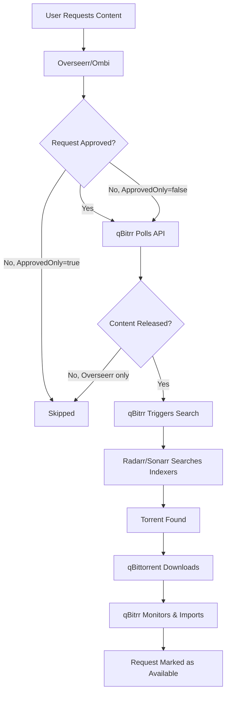

# Request Integration

qBitrr integrates with popular request management systems (Overseerr and Ombi) to automatically search for user-requested content. This seamless integration ensures your users get their requested movies and TV shows as quickly as possible.

## Overview

Request integration allows qBitrr to:

- **Monitor Request Systems**: Periodically poll Overseerr or Ombi for new requests
- **Trigger Automated Searches**: Command Radarr/Sonarr to search for requested content
- **Respect Approval Workflows**: Only process approved requests (configurable)
- **Filter by Status**: Skip already-fulfilled or denied requests
- **Support Multiple Instances**: Configure different request systems per Arr instance

---

## Supported Request Systems

### Overseerr

**Modern, feature-rich request management for Plex/Jellyfin/Emby**

- ✅ **Full Support**: Approved and unavailable request modes
- ✅ **4K Instances**: Separate handling for 4K requests
- ✅ **Release Date Filtering**: Skips unreleased content automatically
- ✅ **Advanced Status Handling**: Processing, approved, available states
- ✅ **Efficient API**: Batch requests with caching

**Use Case:** Modern setups, public servers, 4K libraries

[**→ Overseerr Configuration Guide**](../configuration/search/overseerr.md)

---

### Ombi

**Established request management system**

- ✅ **Full Support**: Approved and all-requests modes
- ✅ **Simple API**: Straightforward integration
- ✅ **Denial Filtering**: Skips denied requests
- ⚠️ **No 4K Support**: No native 4K request separation
- ⚠️ **No Release Filtering**: Cannot skip unreleased content

**Use Case:** Existing Ombi setups, simpler requirements

[**→ Ombi Configuration Guide**](../configuration/search/ombi.md)

---

## How It Works

### Request Flow



### Polling Mechanism

qBitrr polls request systems at regular intervals:

1. **Check Interval**: Controlled by `SearchRequestsEvery` (default: 300 seconds / 5 minutes)
2. **Batch Requests**: Fetches all pending requests in a single API call
3. **Filter Requests**: Applies approval status, release date, availability filters
4. **Trigger Searches**: Commands Radarr/Sonarr to search for matching content
5. **Delay Between Requests**: Waits `SearchLoopDelay` seconds between individual search commands (default: 30s)
6. **Repeat Cycle**: After processing all requests, waits `SearchRequestsEvery` seconds before checking for new requests

---

## Configuration Overview

### Basic Setup

Enable request integration in your Arr instance configuration:

```toml
[Radarr-Movies]
Managed = true
URI = "http://localhost:7878"
APIKey = "your-radarr-api-key"
Category = "radarr-movies"

[Radarr-Movies.EntrySearch]
SearchMissing = true  # REQUIRED: Enables search functionality
SearchRequestsEvery = 300  # Check for new requests every 5 minutes (300 seconds)
SearchLimit = 5  # Max concurrent searches

# Choose ONE request system:

# Option 1: Overseerr
[Radarr-Movies.EntrySearch.Overseerr]
SearchOverseerrRequests = true
OverseerrURI = "http://localhost:5055"
OverseerrAPIKey = "your-overseerr-api-key"
ApprovedOnly = true
Is4K = false

# Option 2: Ombi
[Radarr-Movies.EntrySearch.Ombi]
SearchOmbiRequests = true
OmbiURI = "http://localhost:3579"
OmbiAPIKey = "your-ombi-api-key"
ApprovedOnly = true
```

### Required Parent Settings

Request integration **requires** these settings in `[EntrySearch]`:

| Setting | Required | Purpose |
|---------|----------|---------|
| `SearchMissing` | ✅ Yes | Enables search functionality |
| `SearchRequestsEvery` | ❌ Optional | Request check interval in seconds (default: 300) |
| `SearchLimit` | ❌ Optional | Max concurrent searches (default: 5) |

---

## Request Processing Modes

### Approved-Only Mode (`ApprovedOnly = true`)

**Recommended for public servers**

- ✅ **Only Approved Requests**: qBitrr searches only admin-approved requests
- ❌ **Pending Requests Ignored**: Users must wait for admin approval
- ❌ **Denied Requests Ignored**: Rejected requests are skipped

**When to Use:**
- Public Plex/Jellyfin/Emby servers
- Controlled content libraries
- Limited storage/bandwidth

**Example:**
```toml
[Radarr-Movies.EntrySearch.Overseerr]
SearchOverseerrRequests = true
OverseerrURI = "http://localhost:5055"
OverseerrAPIKey = "your-api-key"
ApprovedOnly = true  # Require admin approval
```

---

### All Requests Mode (`ApprovedOnly = false`)

**Recommended for private servers**

- ✅ **Approved Requests**: Searched immediately
- ✅ **Pending Requests**: Searched immediately (auto-approval)
- ❌ **Denied Requests Ignored**: Rejected requests are still skipped

**When to Use:**
- Family/friends servers
- Trusted user base
- Ample storage/bandwidth

**Example:**
```toml
[Radarr-Movies.EntrySearch.Overseerr]
SearchOverseerrRequests = true
OverseerrURI = "http://localhost:5055"
OverseerrAPIKey = "your-api-key"
ApprovedOnly = false  # Auto-approve all requests
```

!!! warning "Security Consideration"
    `ApprovedOnly = false` effectively auto-approves all user requests. Use only on trusted, private servers.

---

## Multi-Instance Configuration

### Separate Radarr and Sonarr Requests

Configure both movie and TV show request integration:

```toml
# Movies (Radarr)
[Radarr-Movies]
Managed = true
URI = "http://localhost:7878"
APIKey = "radarr-api-key"
Category = "radarr-movies"

[Radarr-Movies.EntrySearch]
SearchMissing = true
SearchRequestsEvery = 3

[Radarr-Movies.EntrySearch.Overseerr]
SearchOverseerrRequests = true
OverseerrURI = "http://localhost:5055"
OverseerrAPIKey = "shared-api-key"
ApprovedOnly = true
Is4K = false  # Standard quality

# TV Shows (Sonarr)
[Sonarr-Series]
Managed = true
URI = "http://localhost:8989"
APIKey = "sonarr-api-key"
Category = "sonarr-series"

[Sonarr-Series.EntrySearch]
SearchMissing = true
SearchRequestsEvery = 3

[Sonarr-Series.EntrySearch.Overseerr]
SearchOverseerrRequests = true
OverseerrURI = "http://localhost:5055"  # Same Overseerr instance
OverseerrAPIKey = "shared-api-key"  # Same API key
ApprovedOnly = true
Is4K = false
```

!!! tip "API Key Reuse"
    Both Radarr and Sonarr can use the **same Overseerr/Ombi API key**. qBitrr automatically filters requests by media type.

---

### 4K + Standard Instances (Overseerr Only)

Configure separate instances for 4K and standard quality:

```toml
# Standard Quality Radarr
[Radarr-Movies]
Managed = true
URI = "http://localhost:7878"
APIKey = "standard-api-key"
Category = "radarr-movies"

[Radarr-Movies.EntrySearch.Overseerr]
SearchOverseerrRequests = true
OverseerrURI = "http://localhost:5055"
OverseerrAPIKey = "api-key"
Is4K = false  # Standard quality requests

# 4K Quality Radarr
[Radarr-4K]
Managed = true
URI = "http://localhost:7879"
APIKey = "4k-api-key"
Category = "radarr-4k"

[Radarr-4K.EntrySearch.Overseerr]
SearchOverseerrRequests = true
OverseerrURI = "http://localhost:5055"  # Same Overseerr
OverseerrAPIKey = "api-key"  # Same API key
Is4K = true  # 4K quality requests
```

---

## Integration with Other Features

### Combined with Missing Content Search

Request integration works **alongside** regular missing content searches:

```toml
[Radarr-Movies.EntrySearch]
SearchMissing = true  # Search for missing monitored content
SearchLimit = 10  # Total searches across all sources

[Radarr-Movies.EntrySearch.Overseerr]
SearchOverseerrRequests = true  # Also search Overseerr requests
ApprovedOnly = true
```

**Behavior:**
1. qBitrr searches monitored missing content in Radarr
2. qBitrr searches approved Overseerr requests
3. Total concurrent searches respect `SearchLimit` (10 in this example)

---

### Quality Upgrades with Requests

Combine request integration with quality upgrades:

```toml
[Radarr-Movies.EntrySearch]
SearchMissing = true
DoUpgradeSearch = true  # Search for quality upgrades
QualityUnmetSearch = true  # Search for unmet quality profiles

[Radarr-Movies.EntrySearch.Overseerr]
SearchOverseerrRequests = true
ApprovedOnly = true
```

**Behavior:**
- New Overseerr requests trigger immediate searches
- Existing content is checked for quality upgrades
- Quality profile requirements are enforced

---

### Custom Format Enforcement

Enforce custom format scores for requested content:

```toml
[Radarr-Movies.EntrySearch]
SearchMissing = true
CustomFormatUnmetSearch = true  # Search for CF score improvements
ForceMinimumCustomFormat = true  # Block releases below threshold

[Radarr-Movies.EntrySearch.Overseerr]
SearchOverseerrRequests = true
ApprovedOnly = true
```

**Behavior:**
- Requested content must meet custom format requirements
- Releases below the minimum CF score are rejected
- Searches continue until suitable release is found

---

## Performance Optimization

### Polling Frequency

Adjust `SearchRequestsEvery` based on request volume:

| Request Volume | `SearchRequestsEvery` | Check Frequency |
|----------------|------------------------|-----------------|
| Low (<10/day) | 600 | Every 10 minutes |
| Medium (10-50/day) | 300 | Every 5 minutes (default) |
| High (50+/day) | 120 | Every 2 minutes |
| Very High (100+/day) | 60 | Every minute |

**Example:**
```toml
[Radarr-Movies.EntrySearch]
SearchMissing = true
SearchRequestsEvery = 600  # Check for new requests every 10 minutes
```

!!! tip "Balance Responsiveness vs Load"
    - **Lower values** = More responsive to new requests, but more API calls
    - **Higher values** = Less API load, but slower to process new requests
    - Consider your user expectations and system resources

---

### Search Limits

Balance `SearchLimit` to avoid overwhelming indexers:

| Indexer Plan | Recommended `SearchLimit` |
|--------------|---------------------------|
| Free tier | 3-5 |
| Paid tier | 10-15 |
| VIP tier | 20+ |

**Example:**
```toml
[Radarr-Movies.EntrySearch]
SearchMissing = true
SearchLimit = 5  # Max 5 concurrent searches
```

---

## Monitoring & Logging

### Log Entries

Request integration produces these log entries:

```
INFO - Overseerr requests: 5 pending, 3 approved
INFO - Triggering search for Overseerr request: Movie Title (2024)
DEBUG - Overseerr URI: http://localhost:5055
DEBUG - Overseerr API Key: ***
INFO - Search completed for request: Movie Title
```

### Viewing Logs

**Docker:**
```bash
docker logs -f qbitrr 2>&1 | grep -i "overseerr\|ombi"
```

**Native:**
```bash
tail -f ~/logs/Radarr-Movies.log | grep -i "overseerr\|ombi"
```

**WebUI:**
Navigate to **Logs** tab and filter by "overseerr" or "ombi"

---

## Troubleshooting

### Common Issues

#### Requests Not Being Searched

**Symptoms:** Approved requests remain in "Requested" state

**Solutions:**
1. ✅ Verify `SearchMissing = true` in `[EntrySearch]`
2. ✅ Check request system integration is enabled
3. ✅ Ensure content has been **released** (not scheduled for future)
4. ✅ Verify API key is correct
5. ✅ Check request system is accessible from qBitrr

#### Connection Errors

**Symptoms:** "Couldn't connect to Overseerr/Ombi" in logs

**Solutions:**
1. ✅ Verify request system is running
2. ✅ Check `URI` uses correct protocol (`http://` vs `https://`)
3. ✅ Ensure no trailing slashes in URI
4. ✅ Test API manually with `curl`
5. ✅ Check firewall/network connectivity

#### Wrong Requests Processed

**Symptoms:** 4K requests going to standard instance (or vice versa)

**Solutions:**
1. ✅ Verify `Is4K` setting matches instance type (Overseerr only)
2. ✅ Check Overseerr has separate 4K instances configured
3. ✅ Review qBitrr logs for request filtering

---

## Best Practices

### Security

- **Protect API Keys**: Store in environment variables, never commit to repositories
- **Use HTTPS**: Enable HTTPS for request systems exposed to internet
- **Reverse Proxy**: Place request systems behind Nginx/Caddy/Traefik
- **Limit Access**: Use `ApprovedOnly = true` for public servers

### Performance

- **Adjust Polling**: Set `SearchRequestsEvery` based on request volume
- **Monitor Indexers**: Watch for rate limiting or API restrictions
- **Optimize Search Limits**: Balance `SearchLimit` with indexer capabilities

### User Experience

- **Approval Workflow**: Use `ApprovedOnly = true` for public servers
- **Auto-Approval**: Use `ApprovedOnly = false` for trusted users/family
- **Notifications**: Configure Overseerr/Ombi to notify users when content is available

---

## Comparison: Overseerr vs Ombi

| Feature | Overseerr | Ombi |
|---------|-----------|------|
| **User Interface** | Modern, React-based | Older, Angular-based |
| **Media Discovery** | Advanced (TMDB integration) | Basic |
| **Request Workflow** | Full (approve/decline/comment) | Basic approval |
| **4K Support** | ✅ Native | ❌ Limited |
| **Release Date Filtering** | ✅ Yes | ❌ No |
| **User Permissions** | ✅ Granular (quotas, limits) | Basic roles |
| **Performance** | ✅ Fast, lightweight | Can be slow with many users |
| **qBitrr Support** | ✅ Full (approved/unavailable, 4K) | ✅ Full (approved mode only) |

**Recommendation:** Use **Overseerr** for new setups (better UX, active development, 4K support). Ombi is suitable for existing setups.

---

## Next Steps

- **Configure Overseerr:** [Overseerr Integration Guide](../configuration/search/overseerr.md)
- **Configure Ombi:** [Ombi Integration Guide](../configuration/search/ombi.md)
- **General Search Configuration:** [Search Configuration](../configuration/search/index.md)
- **Radarr Setup:** [Radarr Configuration](../configuration/arr/radarr.md)
- **Sonarr Setup:** [Sonarr Configuration](../configuration/arr/sonarr.md)
- **Troubleshooting:** [Common Issues](../troubleshooting/common-issues.md)
