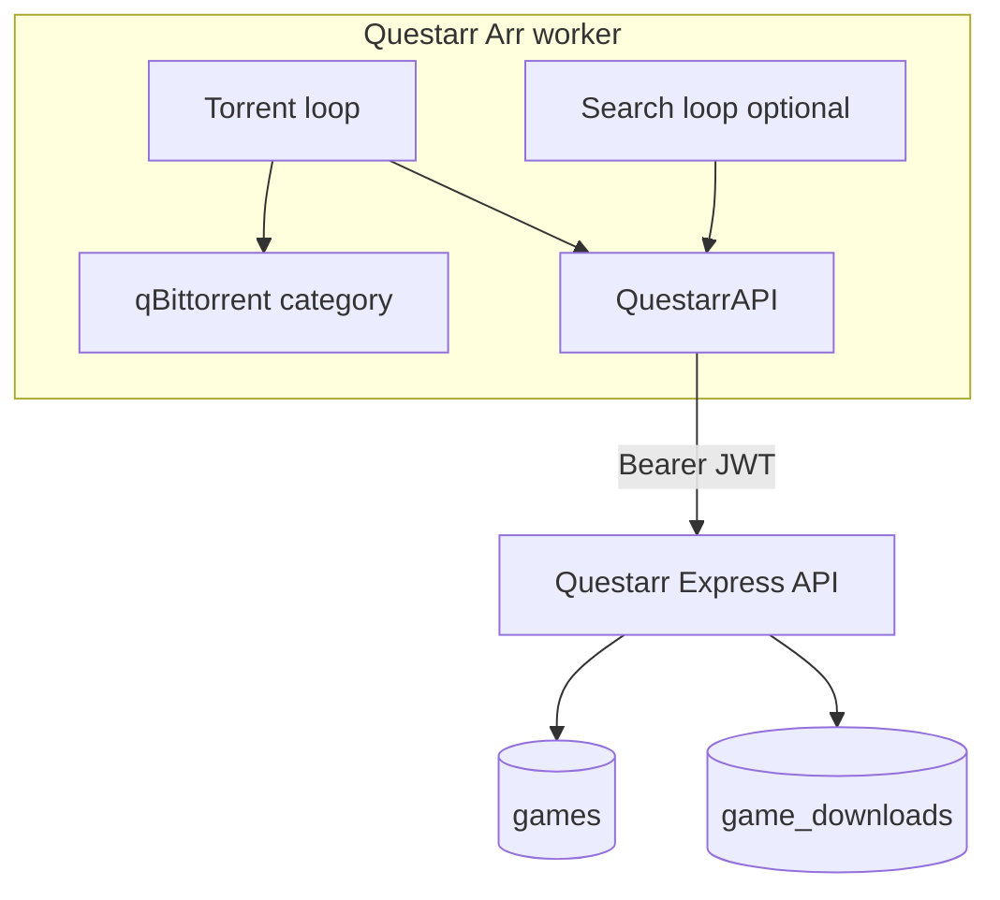

# Questarr integration plan

> **Status:** Planned (not started)
> **Branch:** `feature/questarr-integration` (create from `master` before any implementation)
> **Last updated:** 2026-05-19

## Overview

Add Questarr as a first-class Arr type in qBitrr by introducing a JWT-aware REST client, game-centric DB models, and targeted branches in the shared `Arr` worker—mapping Servarr concepts (import scan, queue, search commands) to Questarr's game/download APIs while hiding features Questarr does not support.

**Explicitly not in scope:** `WebUI.GroupQuestarr` or any Questarr instance-grouping toggle (catalog uses per-instance views like other Arr types).

---

## Context

Questarr ([Doezer/Questarr](https://github.com/Doezer/Questarr)) is a **game library manager** inspired by *arr apps, but it is **not Servarr-compatible**:

| Aspect | Radarr/Sonarr/Lidarr | Questarr |
|--------|----------------------|----------|
| API | `/api/v3/*` + API key | Custom `/api/*` + **JWT** (`POST /api/auth/login`) |
| Library unit | Movie / episode / album | **Game** (UUID `id`, IGDB metadata) |
| "Import" | `Downloaded*Scan` + root folders | **Claim/link** download → game (`POST /api/downloads/claim`) |
| Queue | Servarr `queue` records | `game_downloads` + downloader status |
| Missing search | `MoviesSearch` / etc. | Cron + indexer APIs (see Phase 0b) |
| Quality profiles / CF / Ombi / Overseerr | Yes (varies) | **No equivalent** |

qBitrr today has **zero** Questarr references. Integration follows the existing pattern: one `Arr` class (`qBitrr/arss.py`), `self.type` branching, config sections `Questarr-*`, Peewee models in `qBitrr/tables.py`, WebUI catalog in `webui/src/pages/arrCatalog/`, routes in `qBitrr/webui.py`.



---

## Feature parity definition

### In scope

- Instance registration (`[Questarr-Games]`), managed processes, hot reload, connection test
- Torrent health: stalled/slow/ETA, tracker rules, auto-delete, category matching (`MatchSubcategories`)
- **Completion handling:** link torrent to game + status update (claim API; idempotent—see Operational notes)
- **Re-search** (`ReSearch`): blacklist release, remove download record, trigger search/grab
- **Missing search loop** (`EntrySearch.SearchMissing`): sync `wanted` games; search on interval
- Queue refresh + hash→game mapping for failed-torrent handling
- WebUI: Questarr tab, browse library, filters, thumbnails, open-in-Questarr link
- Config editor group, `config.example.toml`, docs + OpenAPI
- **v1 torrent-only** (qBittorrent); usenet (SABnzbd/NZBGet) out of scope for initial release

### Out of scope / no-op (hide in UI)

- Quality upgrade search, custom format unmet, temp quality profiles
- Ombi / Overseerr request search
- `RssSync` / `RefreshMonitoredDownloads` Servarr commands
- Servarr-style `ArrErrorCodesToBlocklist` (use release blacklist + qBit removal where applicable)
- **FFprobe:** disabled by default for Questarr; game-oriented `FileExtensionAllowlist` (`.iso`, `.nsp`, `.xci`, `.rar`, `.zip`, etc.)
- **`WebUI.GroupQuestarr`:** do not add

---

## Phase 0 — Feature branch (required first)

```bash
git checkout master
git pull origin master
git checkout -b feature/questarr-integration
```

- All work on this branch; no commits to `master`
- PR from feature branch when ready

---

## Phase 0b — Upstream alignment (recommended, parallel)

Draft discussion/PR text in [`docs/upstream/questarr-api-requests.md`](upstream/questarr-api-requests.md) (paste into [Questarr Discussions](https://github.com/Doezer/Questarr/discussions)).

### 1. Auth for external tools

- Long-lived **API key** header (Servarr-style `X-Api-Key`) or scoped service token
- Avoids qBitrr storing username/password and JWT refresh logic long-term

### 2. Single-game search + grab (high value)

Questarr already implements the pipeline in `server/cron.ts` + `server/search.ts` (`searchAndCategorizeItemsForGame`, preferred groups/platform, blacklist, `addDownloadWithFallback`). Today only **cron** and **manual UI** trigger it.

**Proposed:**

- `POST /api/games/:id/search` or `/api/games/:id/search-and-grab`
- Body: `{ "grab": true | false }` — reuse existing logic; no duplicate implementation in qBitrr
- Response: items found, grab attempted, download id/hash, indexer errors

**Why:** Re-search + missing search loop map to one call (Servarr `MoviesSearch`-style).

### 3. Path/hash import hook (nice to have)

- `POST /api/downloads/import` with `downloadHash` + optional `path` after qBit completes
- Mirrors Servarr `Downloaded*Scan`; reduces title-matching fragility

**Fallback if upstream declines:** `GET /api/indexers/search` + `POST /api/downloads` with `gameId` (Phases 2–3).

---

## Phase 0c — Remove obsolete WebUI group toggles

`WebUI.GroupSonarr` and `WebUI.GroupLidarr` are **reserved/no-op** today (docs: browse already uses series/artist rows + modal in catalog definitions; toggles do not change behavior). Remove as part of this effort—**do not** add `GroupQuestarr`.

| Area | Remove / update |
|------|-----------------|
| `qBitrr/gen_config.py` | `GroupSonarr`, `GroupLidarr` keys + defaults |
| `config.example.toml` | Same |
| `qBitrr/webui.py` | Status payload + save allowlist |
| `webui/src/context/WebUIContext.tsx` | State, setters, API mapping |
| `webui/src/pages/ConfigView.tsx` | Toggle UI + tooltips |
| `webui/src/config/tooltips.ts` | Entries |
| `docs/configuration/config-file.md`, `webui.md`, `config-editor.md`, `arr-views.md`, `api.md`, `features/index.md`, `getting-started/migration.md` | References |
| Config migration | Drop keys from existing configs (or ignore deprecated keys with one release note) |

---

## Milestones (two-part delivery on feature branch)

### M1 — Usable daily driver

- Phase 0 + 0c (branch + remove group toggles)
- Phase 1: client, registration, connection test
- Phase 2 (partial): models, queue emulation, torrent health, idempotent claim
- Minimal docs: setup, category alignment, service account

### M2 — Full parity + polish

- Phase 2 (remainder): re-search, failed handling
- Phase 3: search loop
- Phase 4: WebUI catalog + API
- Phase 5: full documentation
- Mock HTTP tests for `QuestarrAPI` (optional but recommended)
- Phase 0b upstream doc (can ship before M2)

---

## Phase 1 — API client and registration

### `QuestarrAPI` — `qBitrr/questarr_client.py`

- Login: `POST /api/auth/login`; cache JWT; refresh on `401`
- **Dedicated Questarr user** (e.g. `qbitrr`) — games are per-`userId`; do not use a personal account
- Document **minimum Questarr version** (e.g. `>= 1.3.x`); warn if health/version check fails

```toml
[Questarr-Games]
URI = "http://localhost:5000"
Username = "qbitrr"      # dedicated service account
Password = "..."         # plaintext in config.toml — same as other Arr keys; restrict file perms
APIKey = ""              # future upstream token
SkipTLSVerify = false
Category = "games"       # MUST match Questarr downloader category (see Operational notes)
DownloaderId = ""        # optional; auto-discover enabled downloader with matching category
Managed = true
```

**Methods (Servarr-shaped where helpful):**

- `get_system_status()` → `/api/ready` or `/api/health`
- `get_queue()` → normalize downloads into `{ "records": [...] }` (lowercase hash keys)
- `del_queue()` → delete game_download + optional blacklist + qBit remove
- `post_command()` → adapter dispatch to Questarr REST
- `get_movie()` / `upd_movie()` → game GET/PATCH wrappers
- Search/grab: prefer upstream endpoint; else indexer search + `POST /api/downloads`

**Title matching:** Reimplement `normalizeTitle` / `releaseMatchesGame` behavior in Python from **spec** only—do not paste Questarr TS (GPL-3.0 vs qBitrr license).

### Wire-in

| Location | Change |
|----------|--------|
| `ArrManager.build_arr_instances` | Regex `(rad\|son\|anim\|lid\|quest)arr.*` → `QuestarrAPI` |
| `Arr.__init__` | `self.type = "questarr"`; disable Ombi/CF/temp profiles |
| `webui.py` | Restart/test-connection for `Questarr` |
| `gen_config.py` | Example section, `arr_types`, questarr defaults |
| `config_version.py` | Migration for `Username`/`Password`; **create new Peewee tables** on startup |

---

## Phase 2 — Database models and torrent loop

### Models (`tables.py`)

- `GamesFilesModel`: `EntryId` = **TextField** (game UUID), `Title`, `IgdbId`, `Status`, `Monitored`, `HasFile`, `Searched`, etc.
- `GameQueueModel`: active downloads per game
- Register in `Arr._get_models` for `questarr`
- Ensure DB migration creates tables if missing (`config.py` / startup)

### Handlers (`qBitrr/questarr_handlers.py`)

Extract Questarr branches from `arss.py` (~61 `self.type` sites).

| Feature | Implementation |
|---------|----------------|
| `_process_imports` | Claim with `category: "main"`; handle `409` already linked; tag `qBitrr-imported` |
| `refresh_download_queue` | Pseudo-queue from Questarr; `cache[hash]`, `requeue_cache` |
| Failed / re-search | Blacklist + delete download + search/grab |
| `custom_format_unmet_check` | Always false |
| DLC/update/extra | Awareness of Questarr `category` on claim when matching multi-file releases |

**Downloader ID:** config `DownloaderId` or auto-pick enabled downloader whose `category` matches instance `Category`.

---

## Phase 3 — Search loop

- `SearchMissing` → wanted games without satisfactory download
- `EntrySearch.GrabOnSearch = false` **by default** (avoid double-grab with Questarr `autoSearchEnabled` / `autoDownloadEnabled`)
- Prefer `POST /api/games/:id/search-and-grab` when upstream exists; else fallback indexer + download routes
- Skip: upgrades, CF, Ombi, Overseerr, temp profiles, `SearchByYear`

---

## Phase 4 — WebUI and REST API

### Backend

- `_arr_list_payload`: `type: "questarr"`
- `GET /api/questarr/<category>/games` (+ `/web/...`)
- Thumbnail route; OpenAPI updates

### Frontend

- `questarrDefinition.tsx`, registry, `App.tsx` tab, `ConfigView` group, `ProcessesView`
- **No** `GroupQuestarr` toggle

---

## Phase 5 — Documentation

- `docs/configuration/arr/questarr.md` — **critical:** two-sided qBittorrent setup (qBitrr category = Questarr downloader category)
- Update arr index, webui arr-views, api.md, features index
- `config.example.toml`, `AGENTS.md`, README
- Credentials security note (dedicated user, file permissions)
- Coordinate Questarr auto-search settings with qBitrr `GrabOnSearch`

---

## Phase 6 — Validation (manual)

1. Questarr service account + matching qBit/Questarr categories
2. Wanted game → search loop (search-only default)
3. Complete torrent → idempotent claim; no fight with Questarr cron `owned` update
4. Stalled → blacklist + re-search
5. WebUI Questarr tab (per-instance, not grouped)
6. JWT refresh / connection test
7. Two `Questarr-*` instances, different categories
8. **Torrent-only** path (no usenet regression)

### Mock tests (recommended)

Small `QuestarrAPI` unit tests: login, 401 refresh, queue normalization (e.g. `responses` / `httpx` mock).

---

## Operational notes

| Topic | Guidance |
|-------|----------|
| **Two-sided qBittorrent** | Questarr must have a downloader pointing at the **same** qBittorrent; **category** must match `[Questarr-*].Category` |
| **Service account** | Dedicated Questarr user for API automation |
| **Idempotent claim** | Questarr cron may already mark `owned`; treat claim as safe no-op on conflict |
| **v1 scope** | Torrent/qBittorrent only; usenet later |
| **Questarr version** | Pin minimum tested version in docs |
| **GrabOnSearch** | Default `false`; document disabling Questarr auto-download if qBitrr grabs |
| **FFprobe** | Off by default; game archive extensions in allowlist docs |
| **License** | No copied Questarr source; behavioral reimplementation only |

---

## Risk summary

| Risk | Mitigation |
|------|------------|
| JWT expiry | Refresh on 401; proactive re-login |
| UUID `EntryId` | Dedicated models; no integer arithmetic |
| Double grab | `GrabOnSearch` default false + docs |
| Title match failures | Upstream import-by-hash; careful Python matcher |
| `arss.py` size | `questarr_handlers.py` |
| Dead group config confusion | Phase 0c removal |

---

## Implementation checklist (todos)

- [ ] **feature-branch** — `feature/questarr-integration` from `master`
- [ ] **remove-group-configs** — Remove `GroupSonarr` / `GroupLidarr` (no `GroupQuestarr`)
- [ ] **upstream-discussion-doc** — `docs/upstream/questarr-api-requests.md`
- [ ] **questarr-client** — `QuestarrAPI` + JWT
- [ ] **register-config** — ArrManager, gen_config, migration, webui
- [ ] **db-models** — `GamesFilesModel` / `GameQueueModel` + table creation
- [ ] **torrent-loop** — M1: health + idempotent claim
- [ ] **torrent-loop-m2** — re-search, failed handling
- [ ] **search-loop** — M2; `GrabOnSearch` default false
- [ ] **webui-api** — catalog tab, routes, OpenAPI
- [ ] **mock-tests** — `QuestarrAPI` HTTP mocks
- [ ] **docs** — questarr.md, setup, version pin
- [ ] **upstream-auth** — Optional Questarr API key + search-and-grab PR

---

## Suggested order

0. Branch + remove `GroupSonarr`/`GroupLidarr`
1. M1: client, registration, models, torrent health, claim
2. M2: re-search, search loop, WebUI, docs, mock tests
3. Parallel: upstream discussion doc + Questarr PR

**Estimated touch:** ~20–30 files (includes group-config removal).
